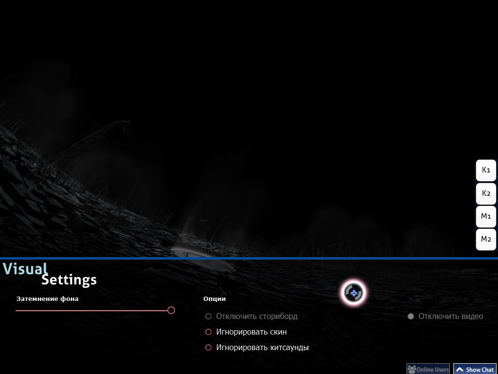

# Визуальные настройки

**Визуальные настройки** - скрытый оверлей для настроек, расположенных в нижней части игрового поля. Доступ к нему можно получить во время загрузки карты или когда игра приостановлена. Когда отображается оверлей для визуальных настроек, карта будет задерживаться до того момента, пока курсор не покинет эту зону.

*Примечание: визуальные изменения настроек сохраняются для каждой карты, но будут потеряны после закрытия osu!. Чтобы установить их глобально (и навсегда), используйте боковую панель [опций](/wiki/options).*

В качестве альтернативы, можно получить доступ к оверлею для визуальных настроек, приостановив игру. Однако этот метод не работает в матчах [Мультиплеера](/wiki/Multi), так как это будет рассматриваться как попытка выйти из матча и покинуть комнату.

## Настройки

| Имя | Эффект | Примечание |
| :-- | :-- | :-- |
| `Затемнение фона` | Затемняет игровое поле (в том числе сториборды и/или фоновые видеоролики). | Во время перерывов затемнение уменьшается на 30% (максимум 0%) (это можно отключить в настройках). |
| `Отключить сториборды` | Удаляет все элементы сториборда. Это не влияет на [Киаи Зоны](/wiki/Kiai_Time) и фоновое видео, если оно есть | Это рекомендуется для игроков с эпилепией, в случаях, когда во время карты показывается предупреждение об эпилепсии. Эта опция отключена, если нет сторибордов для игры. |
| `Игнорировать скин карты` | Будет использоваться выбранный скин игрока вместо скина карты. | Это требует перезапуска карты для вступления в силу. |
| `Игнорировать хитсаунды карты` | Будут оспользоваться хитсаунды выбранного скина игрока вместо хитсаундов карты, если таковые имеются. | Это требует перезапуска карты для вступления в силу. |
| `Отключить видео` | Не воспроизводит фоновое видео. Это не удаляет сториборды. | Это требует перезапуска карты, если активировано после начала игрового процесса. Эта опция отключена, если нет фонового видео для воспроизведения. |
