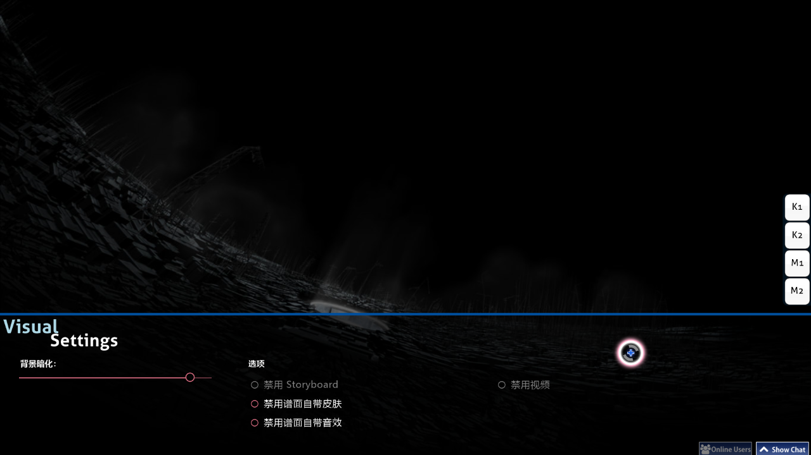

# 视觉设置

**视觉设置菜单** 是一个位于游戏界面最下面的隐藏自定义界面。 可以在谱面加载或游戏暂停时使用。 当视觉设置界面显示时, 游戏将不会开始直到你将光标移开视觉设置菜单。

*注意: 视觉设置的的更改会保存在每张谱面上，但是部分设置会在关闭osu!后还原。 请在[设置](/wiki/Options)侧边栏中进行全局 （永久） 设置*

或者, 你也可以在游戏中暂停以显示视觉菜单。 但是, 这个操作在[多人游戏](/wiki/Multi)中会被视为退出游戏并退出房间。

## 设置

| 名称 | 效果 | 备注 |
| --- | --- | --- |
| `背景暗化` | 使游戏背景变暗 （包括故事板和背景视频） | 休息时间时，会减少30%的暗化 （最低 0%） （可以在设置中禁用）。 *注意: 背景暗化的设置会暂时保存在每张谱面上，但是会在关闭osu!后还原。* |
| `禁用 Storyboard` | 如果存在故事板，将移除所有故事板元素。 这个选项不会影响 [Kiai Time](/wiki/Kiai_time) 效果和背景视频。 | 如果显示癫痫警告，推荐有癫痫问题的玩家启用这个选项。 如果这个谱面没有故事板，这个选项将被禁用。 |
| `忽略谱面皮肤` | 使用玩家的皮肤来代替谱面自带的皮肤。 | 这需要重新开始来生效。 |
| `忽略谱面音效` | 如果存在谱面音效，将会使用玩家皮肤的音效来代替谱面音效。 | 这需要重新开始来生效。 |
| `禁用视频` | 不播放背景视频。 这个选项不会影响故事板 | 如果在游戏开始后这个选项已经启用，那么这个选项需要重新开始来生效。 如果没有背景视频，这个设置将被禁用。 |
