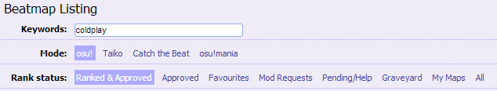
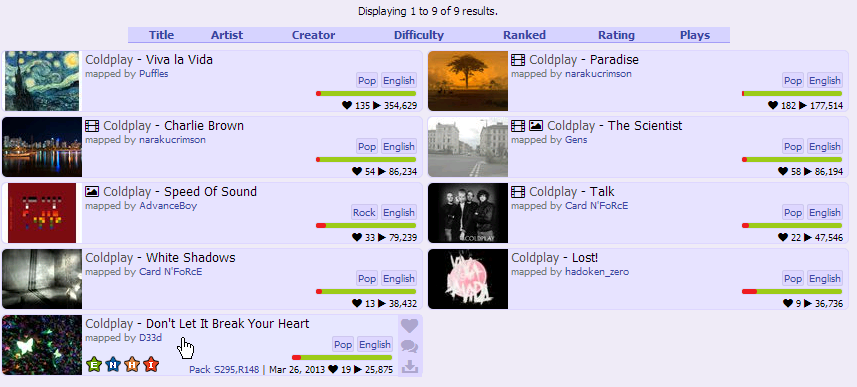
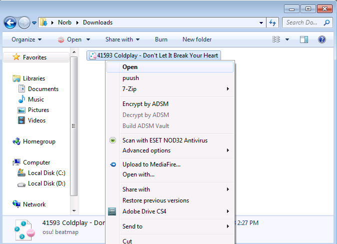
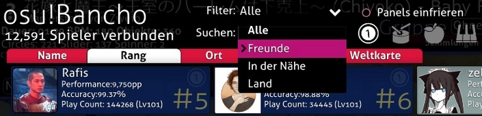

# Willkommen

Zuallererst möchten wir dich herzlichst empfangen und eine Umarmung für die Teilnahme an unserer Community geben. Lass uns erst ein paar Dinge durchgehen, bevor wir mit der Reise beginnen. 

## Das Tutorial

Nachdem du das Spiel heruntergeladen und installiert hast, sollte beim ersten Starten sich das Spiel automatisch updaten. Im Startmenü siehst du einen großen *osu!* Knopf in der Mitte des Bildschirmes. Klicke zweimal darauf und wähle den `Solo` Modus. Bevor du irgendeine Beatmap in *osu!* zu spielen beginnst, ist es empfehlenswert, zuerst das [Peter Lambert - osu! Tutorial](http://osu.ppy.sh/s/3756 "Peter Lambert - osu! Tutorial") zu spielen. Du kannst auch mit Hilfe der Suchfunktion eine Beatmap in der Songauswahl finden, wir beschäftigen uns jedoch erst mit dem *osu!* Tutorial. Die Beatmap bringt dir das Wesentliche über die *Hit-Circles*, *Slider* und *Spinner* in *osu!* Standard bei. Um gewisse Spieltechniken - wie das *Alternaten* oder *Streamen* - zu erlernen, hilft nur spielen, spielen und noch mehr spielen. Verbaler Wissensaustausch hilft einem in diesem Punkt nicht weiter. Die dazugepackten Beatmaps neben den *osu!* Tutorial sollen auch als Lernhilfe dienen.

**Achtung:** Wenn man aus irgendwelchen Gründen das *osu!* Tutorial nicht haben sollte, dann kann man es [hier](http://osu.ppy.sh/b/22538) erneut herunterladen. Nach dem Tutorial ist man bereit eine Vielzahl von unterschiedlichen Beatmaps herunterzuladen!

## Wie du dein Lieblingslied spielen kannst!

*Vollständige Erklärung: [Beatmaps](/wiki/Beatmaps/ "Beatmaps")*

### Schritt 1 - Das Lied finden!

Du wirst dich bestimmt fragen, was eine Beatmap ist. Wie so in jedem Spiel gibt es verschiedene Level und manchmal auch Maps. Nagut, wir in *osu!* besitzen *Beatmaps*, welche exakt das sind, was du dir bestimmt gerade denkst. Es sind Maps, die Beats (Rhythmus) beinhalten. Die Beatmaps sind einfach zu finden. Du kannst jede hochgeladene Beatmap [hier](http://osu.ppy.sh/p/beatmaplist) finden. Um eine gewisse Beatmap schnell zu finden, kannst du die Suchfunktion verwenden. Gebe einfach den Namen vom Artisten, den Titel vom Lied, den Albumnamen oder irgendeinen Genre ein, um deine Suche einzugrenzen.

### Schritt 2 - Es herunterladen!

Wenn du nach einer freigegebenen Beatmap eines Liedes Ausschau halten solltest, werden dir alle vorhanden angezeigt. Wie auch immer, sei nicht sauer, wenn ein Lied nicht mit dabei sein sollte. Es sind jede Menge Unranked Beatmaps vorhanden, die derzeit noch in Bearbeitung sind, worunter auch dein Lieblingslied dabei sein könnte. Bitte **erstelle keine Anfragen für Beatmaps, die du gerne hättest**, die meisten Mapper werden das Mappen, was **sie** mögen und nicht was du magst. Dies könnte jedoch ein perfekter Start für dich sein, um deine Karriere als Mapper zu starten!

Du findest mindestens einmal einen großen `Download Beatmap` Knopf auf jeder Seite der Beatmaps (du musst mit deinem Account angemeldet sein, ansonsten wird dir ein gelber Knopf zur Anmeldung angezeigt).

**Achtung:** Es spielt keine Rolle, wo die Datei gespeichert wird, solange du die Beatmap nach dem Download noch findest. Darüber hinaus kannst du die Datei direkt öffnen lassen, wodurch *osu!* zum Starten gezwungen wird, wenn es nicht eingeschaltet sein sollte.

### Schritt 3 - Lade es auf osu!

 

Nachdem du die Beatmap fertig heruntergeladen hast, solltest du ohne Weiteres in der Lage sein die `.osz` Datei zu öffnen. Zum Öffnen der Datei klick entweder darauf oder zieh die Datei in *osu!* hinein.

### Schritt 4 - Spiel aus Spaß oder konkurriere gegen andere!

Nach dem Öffnen sollte *osu!* die Beatmap im Songauswahl direkt anzeigen (und möglicherweise updaten). Zur Songauswahl gelangst du auch, indem du auf dem großen *osu!* Knopf drückst, dann auf `Play` und dann auf `Solo`. Deine neue Beatmap wird dann neben den schon bereits vorhandenen Beatmaps miteingereiht. Wähle als nächstes eine der angezeigten Schwierigkeitsstufen aus, die du spielen willst und werde ein *osu!* Spieler. Du kannst auch den `Multi` anstelle vom `Solo` betreten, in dem du dich dann gegen andere Spieler live vor Ort messen kannst.

Da sind wir jetzt! Jetzt bist du in der Lage *osu!* zu spielen und deine Lieblingslieder zu finden. Wenn du gewisse Fragen haben solltest, zögere nicht nach Hilfe im Forum oder im Channel `#help` (drücke im Spiel `F8`, um das Chatfenster zu öffnen) zu fragen.

**Viel Spaß!**

## Spielmodi

### Solo

Was genau ist dieser `Solo` Spielmodus? Grundsätzlich kann man in diesem Modus zum einen online und zum anderen offline spielen. Dieser Modus ist nicht limiert, du kannst jede Beatmap spielen, die du besitzt. Es kann jeden Spielmodifizierer benutzt werden, den du willst. Das Spiel kann pausiert werden, wenn deine Hand aus der Puste sein sollte und es jederzeit neustarten, wenn dir dein Accuracy oder Score zu schlecht ist. Du kannst auch die lokale oder online Bestenliste austesten und die Ergebnisse begutachten oder dir die Aufnahme (eng.: Replay) anschauen. Durch das Betätigen der `F2` Taste werden die Aufnahmen extern gespeichert, wodurch du deine Aufnahmen, ohne erst danach suchen zu müssen, sofort genießen kannst.

### Multiplayer

*Vollständige Erklärung: [Multiplayer](/wiki/Multi/ "Multiplayer")*

Wenn du dich im `Solo` Modus einsam fühlen solltest, kannst du auch einer Multiplayer Lobby beitreten. Die einzige Voraussetzung, um den Multiplayer Lobby betreten zu können, ist der Besitz eines *osu!* Accounts, mit dem man im Spiel eingeloggt ist, der mit einer dezenten Internetverbindung zum Server verbunden ist. Um Zugang zu erhalten, drücke auf den `Multi` Knopf. Dort wird dir dann eine Menge an Räumen angezeigt, die von `Easy` bis `Expert` gehen können. Der Multiplayer eignet sich am besten dazu, um neue Freundschaften zu schließen und um seine Fähigkeiten mit anderen Spielern zu vergleichen. Nachdem du dann einen Raum betreten bist, wirst du dann in der Regel die Beatmap herunterladen müssen, welche vom Host ausgewählt wurde. Klicke auf `Klicke hier, um die Map herunterzuladen` (es sollte an der rechten Seite in einem Knallrot anzeigt werden), dadurch sollte sich eine Seite von der gewählten Beatmap in deinem Browser öffnen. Klicke danach auf den `Download Beatmap` Knopf (du musst mit deinem Account angemeldet sein) und öffne dann die heruntergeladene `.osz` Datei! Du musst dir um die Downloadzeiten keine Sorgen machen, die meisten Hosts werden auf dich warten und fragen ab und zu nach, wie weit der Download fortgeschritten ist. Sei nicht schüchtern und werde kommunikativ! Wenn es deiner Meinung nach zu lange dauern sollte, kannst du deinen Mitspielern sagen, dass du die jetzige Runde aussetzen wirst und ohne dich starten können (dem Host steht ein spezieller Kommando zur Verfügung `Force Start Game`, wodurch die Runde gestartet wird, auch wenn nicht jeder bereit sein sollte). Die Spielweise im Multiplayer unterscheidet sich leicht im Solo. Du bist nicht in der Lage das Spiel zu pausieren. Außerdem stehen dir nur bestimmte Mods zur Verfügung, wenn du nicht der Host bist (Host besitzen den vollen Privileg und sie können Berechtigungen erteilen, indem sie `Free Mods` freigeben, damit die Mitspieler ihre Mods frei auswählen können). Die größte Besonderheit am Multiplayer ist der Tag Co-Op, Tag Team Vs. und der Team Vs. Modus. Du kannst sogar die Scores deines Gegners/Mitspielers während dem Spielen sehen, wodurch eine intensive Atmosphäre erschaffen wird, während du versuchst deine Topposition zu halten.

## Wettbewerbsfähigkeit

Hier handelt es sich vielleicht nur um ein simples Spiel, in der man `Circle` drücken und `Slider` halten muss, jedoch kann es ziemlich intensiv und ernst werden! Hier sind ein paar Dinge, die du über das *osu!* Ranking System wissen solltest.

### Level

Das Level vom Spieler wiederspiegelt die Menge an Scores, die der Spieler beim Spielen von Beatmaps, unhängig davon ob die Beatmap beendet wurde oder nicht, erzielt hat. Kurz und knapp, je höher, desto erfahrener. Anderes wie in anderen Spielen (z. B. MMO Spielen) bringt dir das Spielen von Beatmaps in *osu!* keine spielerrischen Vorteile. Ein begabter Level 10 Spieler kann theoretisch einen Level 100 besiegen (dies bedeutet jedoch, dass der Level 100 Spieler überwiegend im `Online-Modus` gespielt hat). Denke auch daran, dass je höher die Combo ist (Hit-Objekte in einer Reihe ohne einen Miss treffen), desto mehr Punkte bekommst du.

### Performance Points

*Vollständige Erklärung: [Performance Points](/wiki/Performance_Points/ "Performance_Points")*

[Performance Points](/wiki/Performance_Points/ "Performance_Points") sind grundsätzlich Punkte, deren Ziel es ist, das Können bzw. Talent der einzelnen Spieler zu bewerten. Je mehr Punkte du im Vergleich zu anderen Spielern hast, desto höher bist du im Rank aufgelistet. Die Kalkulation der Performance Points hängt von mehreren Faktoren ab - Aim, Speed, Accuracy und/oder Strain, je nach Modi kommen nur bestimmte Faktoren in Betrachtung. Durch Mods wird die Schwierigkeit der Map hochgeschraubt, wodurch du bei einem erfolgreichen Abschluss mit mehr Performance Points rechnen kannst, als wenn du die Map ohne Mods gespielt hättest. Grundlegend kann man sagen, dass du versuchen solltest, die schweren Maps mit einer möglichst hohen Accuracy und der gesamten Beatmap Kombo (FC = Full Combo) zu absolvieren. Je weniger 100er/50er, desto besser.

### Accuracy

*Vollständige Erklärung: [Accuracy](/wiki/Accuracy/ "Accuracy ")* 

Es gibt drei verschiedenen Arten von Accuracy - \[1\] Accuracy der jeweiligen Beatmap, \[2\] der Gesamtaccuracy und \[3\] pp-Accuracy. In einfachen Worten, die Accuracy der Beatmap hängt von den erhaltenen Hit-Scores ab, der Gesamtaccuracy ist der Durchschnitt aus allen gerankten Scores und die pp-Accuracy von den gerankten Scores, welche einem pp geben. In osu! zählt neben den exakten Treffen des Hit-Objektes auch noch der Zeitpunkt, wann der Hit-Objekte angeklickt wird. Sie sollten daher stark auf den Approach-Circle achten!

### Achievements

*Vollständige Erklärung: [Achievements](/wiki/Achievements/ "Achievements")*

Achievements sind kleine Abzeichen im Profil, wenn außergewöhnliche Ziele erreicht wurden. Achievements können auf verschiedene Art und Weisen freigeschaltet werden, wie z. B. durch vieles Spielen und das Erzielen eines hohen Combos in einer Beatmap. Wenn du die Bedingungen erfüllt haben solltest, wird dir das erhaltene Abzeichen im Ranking Panel - nach Abschluss einer Beatmap - und im Achievementbereich auf dem Profil angezeigt. Deine geheime Mission besteht jedoch darin die versteckten Hush-Hush Achievements herauszufinden, wobei die Bedingungen nicht bekannt sind und es daher an dir liegt es selbst herauszufinden. Sie sind ziemlich schwer zu bekommen, es ist jedoch immer wieder toll zu sehen, wenn man etwas selbst herausgefunden hat.

**Achtung:** Achievementabzeichen können nur freigeschalten werden, wenn man mit seinen eigenen Account angemeldet ist.

## Chat

*Vollständige Erklärung: [Chat Konsole](/wiki/Chat_Console/ "Chat Konsole")*

Die Grundlagen zur Bedingung der [Chat Konsole](/wiki/Chat_Console/ "Chat Konsole") ist all denen wichtig, die daran interessiert sind neue Freundschaften in unserer freundlichen Umgebung zu schließen. Es ist auch noch wichtig zu verstehen, wie man es bei gewissen Fällen anwendet, wenn jemand dir Nachrichten schickt, Tipps erzählt oder nach Hilfe fragt. Unten rechts gibt's einen Knopf mit der Aufschrift `Show Chat`, wodurch sich das Chat öffnen lässt. Es ginge jedoch schneller, wenn Sie stattdesen die F8 Taste verwenden. Ihnen werden dann mehrere Chats, wie z. B. `#osu!`, `#announce`, `#userlog` und möglicherweise ein weiteres Fenster mit dem Namen des Spielers mit dem man sich gerade unterhaltet. Ungeachtet davon, unterlassen es bitte zu spammen (kontinuierlich sehr kurze Nachrichten in den Chat einzugeben), ansonsten kann es passieren, dass der Account für ein paar Minuten automatisch stummgeschaltet wird und all deine, bis dahin gesendeten Nachrichten, werden aus allen Chats entfernt. Du kannst durch das Drücken der `F9` Taste zur Benutzerliste gelangen (auch genannt als `erweiterte Chat Console`) und mit Hilfe des Filters die Suche beeinschränken.

Dies waren die Grundlagen, scheue dich nicht davor nach Hilfe im Spiel oder im Forum zu bitten, das osu!wiki sollen dir auch beim Verständnis des Spieles behilflich sein.

## Beatmapping (Edit)

*Vollständige Erklärung: [Beatmapping](/wiki/Beatmapping/ "Beatmapping")*

*osu!* bietet für jeden Spieler die Möglichkeit an seine eigenen Beatmaps zu erstellen. Wenn du denkst, dass du kreativ bist und keine Angst vor dem Lernen hast, dann solltest du vielleicht damit beginnen deine eigenen Maps zu Liedern zu kreieren. Um zu beginnen, starte einfach den `Edit` Modus und ziehen das Lied direkt im `.mp3` Format in *osu!* Danach sollte eine leere Map ohne Namen angezeigt werden. Wie auch immer, Beatmapping ist ein **sehr** komplizierter Prozess, welches ein gewisses Maß an Einsatz fordert. Der beste Weg es zu lernen ist immernoch es selbst auszuprobieren. Du kannst dir auch diverse Anleitungen über das Mapping [hier](http://osu.ppy.sh/forum/viewtopic.php?f=56&t=60228) durchlesen. Der `Edit` Modus ist auch ziemlich nützlich, um einen genaueren Blick auf die Map zu werfen bzw. schon vorhandene Beatmaps mit deinen selbsterstellten Beatmaps zu vergleichen. Du solltest es auch **vermeiden gerankte Maps zu editieren**, da sie sonst wieder in den **Unranked** zurückverfallen (natürlich nur lokal). Du wirst dann auch nicht mehr in der Lage sein einen Score zu submitten bzw. PP zu erhalten, solange die Map nicht wieder in ihrem gerankten Zustand zurückgekehrt ist.

## Nützliche Hilfsmittel

-   [Anfänger Training](https://osu.ppy.sh/forum/viewtopic.php?f=14&t=5456 "Anfänger Training") - von Hand hinzugefügte Beatmaps um loszulegen.
-   [Beatmap Packs](https://osu.ppy.sh/p/packlist "Beatmap Packs") - holen dir gebrauchsfertige Pakete aus Beatmaps für bestimmte Themen.
-   [Beatmap Listing](https://osu.ppy.sh/p/beatmaplist "Beatmap Listing") - lade Beatmaps (Lieder) zum Spielen herunter.
-   [Häufig gestellte Fragen](/wiki/FAQ/ "Häufig gestellte Fragen") - finde die Grundlagen vom Spiel heraus.
-   [osu!academy](/wiki/Announcements/osu!academy/ "osu!academy") - Videos, die dir dabei helfen soll, sich an allen Aspekten von *osu!* zu gewöhnen.
-   [Glossary](/wiki/Glossary/ "Glossary") - Eigne dir das einzigartige *osu!* Vokabular an.
-   [Tipps und Tricks für Anfänger](/wiki/Beginner/ "Beginner") - Du brauchst Hilfe? Dann lies hier weiter!
