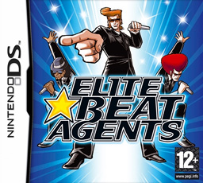

# iNiS games

*Voir aussi : [osu! (disambiguation)](/wiki/Disambiguation/osu!)*

Le [mode de jeu](/wiki/Game_mode) [osu!standard](/wiki/Game_mode/osu!) et osu! lui-même étaient à l'origine basés sur des jeux de rythme développés par **[iNiS](https://fr.wikipedia.org/wiki/INiS)** pour la [Nintendo DS](https://fr.wikipedia.org/wiki/Nintendo_DS) au début des années 2000. ::{ flag=AU }:: [peppy](https://osu.ppy.sh/users/2) a construit osu! pour être un simulateur et un éditeur de niveaux pour les jeux iNiS, et les premiers membres de la communauté en étaient généralement fans aussi. Les anciennes [beatmaps](/wiki/Beatmap) ont été fortement influencées par la conception des niveaux d'iNiS.

Les jeux auxquels il fait référence sont :

- [Osu! Tatakae! Ouendan!](https://fr.wikipedia.org/wiki/Osu!_Tatakae!_%C5%8Cendan) (*Ouendan*)
- [Elite Beat Agents](#elite-beat-agents) (*EBA*)
- [Moero! Nekketsu Rhythm Damashii Osu! Tatakae! Ouendan! 2 (*Ouendan 2*)](https://fr.wikipedia.org/wiki/Moero!_Nekketsu_Rhythm_Damashii_Osu!_Tatakae!_%C5%8Cendan_2)

## Elite Beat Agents

***[Elite Beat Agents](https://fr.wikipedia.org/wiki/Elite_Beat_Agents)*** est la suite occidentale de *Osu! Tatakae! Ouendan!* sortie en 2006. Certains de ses personnages étaient présents en tant que mascottes d'osu! dans les illustrations et les skins officiels.

<!--TODO: Insert lots of links and sections for Ouendan games, talk about which game mechanics are old and new -->
