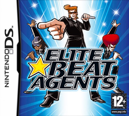

# iNiS 游戏

*另请参阅：[osu! (消歧义)](/wiki/Disambiguation/osu!)*

[osu!](/wiki/Game_mode/osu!) [模式](/wiki/Game_mode)以及 osu! 这个游戏本身最初是基于 **[iNiS 公司](https://en.wikipedia.org/wiki/INiS_Corporation)** 于 2000 年代初期在 [任天堂 DS](https://zh.wikipedia.org/wiki/任天堂DS) 平台上开发的一些节奏游戏。::{ flag=AU }:: [peppy](https://osu.ppy.sh/users/2) 开发出 osu! 的目的是作为 iNiS 游戏的模拟器和谱面编辑器，并且最早的社区成员通常也是这些游戏的粉丝。早期的[谱面](/wiki/Beatmap)深受 iNiS 的关卡设计影响。

这些游戏包括：

- [押忍！战斗！应援团](https://zh.wikipedia.org/wiki/押忍！戰鬥！應援團) (简称*应援团*)
- [精英节拍特工](#精英节拍特工) (简称 *EBA*)
- [燃烧！热血韵律魂 押忍！战斗！应援团 2](https://zh.wikipedia.org/wiki/燃烧！热血韵律魂_押忍！战斗！应援团2) (简称 *应援团 2*)

## 精英节拍特工

***[精英节拍特工](https://zh.wikipedia.org/wiki/精英节拍特工)*** 是《押忍！战斗！应援团！》面向西方市场的续作，于 2006 年发行。其中的一些角色作为 osu! 的吉祥物出现在官方艺术作品和皮肤中。

<!--TODO: 添加大量关于应援团游戏的链接和章节，讨论哪些游戏机制是旧的、哪些是新的 -->
