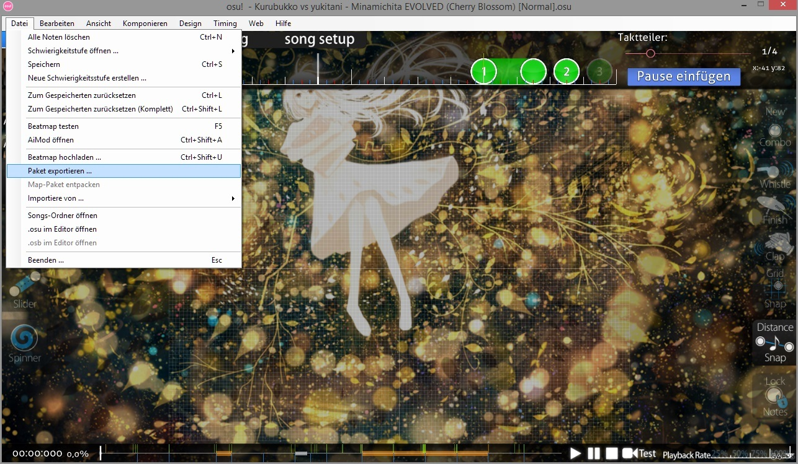

# .osz (Dateiformat)

**.osz** ist ein Beatmapdateiformat, welches Hitsounds, .osu Datei, Skin Elemente, .osb Datei und Storyboard Elemente enthalten kann.

Um eine .osz Datei zu erstellen, öffnet man einfach die Beatmap, die man als .osz exportieren möchte, im Editor und klickt oben-links auf "Datei" und dann auf "Paket exportieren", siehe Bild.

Die exportierte Datei wird dann im osu! Verzeichnis im "Export" Ordner gespeichert und aufbewahrt.
