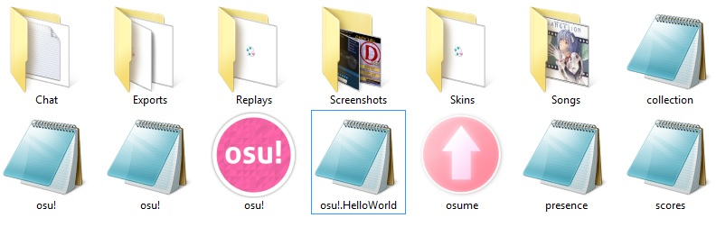

# osu! Program Files

## Emplacement

Par défaut `C:Program Files (x86)osu!` où "C:" est votre disque dur où osu! est installé.

## Dossiers

### \_MACOSX

**osu! pour Macintosh OS.** Pour les utilisateurs de Windows OS, ignorez-le.

### Chat

Apparaît seulement quand "/savelog" est utilisé au moins une fois dans la console de Chat ou si vous avez activé "Conserver une copie des messages privés" dans les Options. Le dossier affiche vos **enregistrements des commentaires de l'onglet de la console de chat.**

Le format est `{Nom_de_l'onglet}-{AAAAMMJJ}-{HHMMSS}` en format .txt, qui peut normalement être ouvert avec n'importe quel logiciel d'édition de texte (Bloc-notes).
**Exemple:** #french-20140624-084245 (/savelog dans l'onglet #french 24th Juin 2014 à 08 heures 42 minutes et 45 secondes).

### Data

**Fichiers de données d'osu!.** Ne doit pas être modifié.

### Downloads

Apparaît quand vous avez utilisé le service de téléchargement "osu!direct" au moins une fois. **Contient les fichiers .osz que vous téléchargez actuellement depuis osu!direct**, qui seront transférés dans le dossier Songs d'osu! en tant que beatmaps légitimes à l'achèvement.

### Exports

Apparaît quans vous exportez une beatmap ou un skin depuis osu! au moins une fois. **Le dossier contient les .osz et les .osk exportés depuis le jeu.**

Le format des beatmaps est `{Artiste} - {Titre}` en format .osz, qui peut être ouvert avec osu! ou un programme d'archivage comme WinRAR. Le format des skins est `{Nom_du_skin}` en format .osk, et utilise le nom affiché dans osu!, réglable dans le [skin.ini](/wiki/Skinning/Skin.ini). **Exemples:** "Various Artists - osu! Stream Compilation.osz" ou osu! new skin template.osk".

### Localisation

Apparaît quand vous avez changé la langue d'osu! au moins une fois. **Conteint des fichiers textes qui peuvent être utilisés pour remplacer le texte anglais habituel selon la langue choisie.**

### Replays

Contient des **fichiers externes de replay d'osu! exécutables (.osr)**. Ne fonctionne pas quand la beatmap associé au replay est manquant. Garde les résultats et reproduit les mouvements pendant le replay. Pour créer un .osr, appuyez sur "**[F2]**" sur l'écran des résultats ou cliquez sur "Export replay as .osr" sur l'écran des résultats en ligne (sous l'écran des résultats en Solo uniquement). Ne sauvegarde pas les éléments de multi-play. La taille du fichier varie entre 100Ko et 1Ko. [Pour les joueurs qui sont intéressés par l'upload du replay sur Youtube, regardez ce sujet de forum (anglais seulement)](https://osu.ppy.sh/community/forums/topics/108092).

Le format est `{Nom du joueur local} - {Artiste} - {Titre} {[Difficulté]}{(AAAA-MM-JJ)} {Mode de jeu}`
**Exemple:** dummytest1 - Loituma - Ievan Polkka [SPINNER-MADNESS]  (2013-08-12) OsuMania

### Screenshots

**Captures d'écran (F12 by default) d'osu!**. L'extension de la capture d'écran (.jpg/.png) dépend de ce que vous avez choisi dans le menu Options.

Le format est `screenshot###` où "###" est le numéro de la capture d'écran.

### Skins

Contient des **skins crées par des utilisateurs qui peuvent être utilisés pour personnaliser l'Interface Utilisateur dans osu!.** Vous pouvez télécharger des skins depuis la section [skinning](https://osu.ppy.sh/community/forums/15) du forum. Il y a deux sorties possibles: le .osk ou le .zip/.rar. Si vous obtenez un fichier osu!skin exécutable (.osk), ouvrez-le directement pour ouvrir osu! et vous diriger vers l'écran de sélection d'un skin avec votre nouveau skin dans la liste. Si vous obtenez un dossier, vous devez le placer manuellement dans le dossier "Skins". Si c'est un .zip/.rar, vous devez d'abord l'extraire. Vous pouvez changer de skin dans le [menu des Options section Skin (Sélectionner un skin)](/wiki/Options). Veuillez garder en mémoire que le skin que vous utilisez n'est utilisable que dans votre propre osu! uniquement.

Pour plus de détails, veuillez vous référer à la page [Skinning](/wiki/Skinning). De plus, osu! par peppy est le seul skin sans son dossier et donc ne peut pas être supprimé directement.

### Songs

**Votre recueil des beatmaps d'osu!**.

Le format est `{Beatmap number} {Artist} - {Song Title}`.
**Example:** [57950 SOUND HOLIC - Drive My Life](https://osu.ppy.sh/beatmapsets/57950)

Veuillez noter que les *anciens* dossiers de beatmaps lors des débuts d'osu! ne possèdent pas cette numérotation et donc ne suivent pas ce format. Certains exemples sont "[discoprince](https://osu.ppy.sh/beatmapsets/1)" ou "[avgn](https://osu.ppy.sh/beatmapsets/66)". Mention spéciale pour "[tutorial](https://osu.ppy.sh/beatmapsets/3756)" puisque tous les joueurs d'osu! l'obtiendront en installant osu! avec le osu!installer. Aussi, les dossiers .osz/.zip crées manuellement peuvent aussi être comptés.

## Fichiers programmes

### .dll (Extension de l'application)

Les fichiers .dll sont des composants d'osu!.exe donc ignorez-les.

**Composants de base** (Pour Microsoft .NET)

-   avcodec-51.dll
-   avformat-52.dll
-   avutil-49.dll
-   bass.dll
-   bass_fx.dll
-   d3dx9_31.dll
-   Microsoft.Ink.dll
-   Microsoft.Xna.Framework.dll
-   pthreadGC2.dll
-   x3daudio1_1.dll

**Composants d'osu!**

-   ~~osu!framework.dll~~
-   osu!gameplay.dll
-   osu!ui.dll
-   osu.dll

### .db (Data Base File)

Les fichiers .db sont les données des beatmaps que seul osu!.exe peut utiliser. Le Bloc-notes peut ouvrir les fichiers .db mais ils seront majoritairement remplis de caractères encryptés.

**Base de données d'osu!**

-   collection.db (Vos "Collections" dans le jeu. Vous pouvez le poster dans le forum pour que les autres puissent regarder vos "Collections". Beatmaps non incluses.)
-   osu!.db (Cache des beatmaps d'osu!. Vous savez, ce long écran de démarrage avant que vous puissiez voir la sélection de la musique)
-   presence.db
-   scores.db (Sauvegarde l'historique des scores locaux)

### .cfg (Fichiers de configuration)

Les fichiers de configurations ou fichiers CFG configurent les paramètres initiaux pour que osu! fonctionne. Ces fichiers peuvent être ouverts avec le Bloc-notes.

-   osu!.cfg (Configuration d'osu!.)
-   osu!.user.cfg ("Écran des [Options](/wiki/Options)")

## .exe (Application)

Le composant principal. Cliquez sur eux pour démarrer. Les fichiers .exe sont sûrs à ouvrir en assumant vous avez utilisé le osu!installer pour installer osu!.

- osu!.exe (Démarre osu!)
