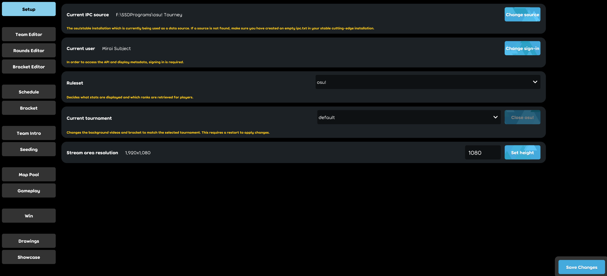

# Klien turnamen osu!

**Klien turnamen osu!** merupakan klien resmi yang meng-*overlay* [osu!tourney](/wiki/osu!_tournament_client/osu!tourney) dengan berbagai adegan tambahan dan informasi yang berhubungan dengan turnamen dalam tayangan siaran langsung.

Para pengguna yang mengalami masalah dengan klien ini dapat [membuka isu baru di GitHub](https://github.com/ppy/osu/issues) atau mengirimkan email ke [tournaments@ppy.sh](mailto:tournaments@ppy.sh).

## Pengaturan

Untuk menjalankan klien turnamen osu!, kamu perlu untuk menentukan argumen peluncuran (*launch argument*) ke dalam berkas program [osu!(lazer)](/wiki/Client/Release_stream/Lazer). Untuk melakukan hal ini, buat *shortcut* baru pada desktop dan tentukan lokasi *shortcut* ini ke `%LOCALAPPDATA%/osulazer/osu!.exe --tournament`. Hal ini akan memerintahkan *shortcut* tersebut untuk membuka osu(lazer) pada mode klien turnamen ketika dijalankan.

Karena klien turnamen osu! hanya merupakan *overlay* untuk osu!tourney, klien ini juga perlu untuk disiapkan. Atur Versi Rilis osu!tourney ke `Cutting Edge (Experimental)` dan buat berkas kosong bernama `ipc.txt` di dalam folder instalasi osu!tourney. Setelahnya, ikuti [panduan pengaturan osu!tourney](/wiki/osu!_tournament_client/osu!tourney/Setup).

Apabila sudah, kamu akan disambut dengan layar pengaturan berikut pada saat kamu membuka klien turnamen osu!:

- Pastikan lokasi `Current IPC source` sesuai dengan lokasi jawatan osu!tourney yang akan kamu gunakan.
- Masuk ke osu!(lazer) dengan mengeklik `Change Login`.
- Tentukan ruleset yang sesuai melalui menu *dropdown* yang tertera.
- Ubah tinggi layar permainan agar sesuai dengan nilai `Height` yang diatur pada berkas `tournament.cfg` milik osu!tourney.

## Mengelola Turnamen

Konfigurasi turnamen [osu!(lazer)](/wiki/Client/Release_stream/Lazer) tersimpan di `%APPDATA%/osu/tournaments`. Pada saat klien turnamen osu! pertama kali dijalankan, sebuah direktori dengan nama `default` akan dihasilkan di dalam folder ini. Masing-masing pengguna dapat menyimpan lebih dari satu konfigurasi dan saling berpindah antar konfigurasi ketika dibutuhkan.

Untuk membuat konfigurasi turnamen baru, buat direktori baru di dalam folder `tournaments` dengan nama yang sesuai dengan nama turnamenmu.

Di dalam konfigurasi ini, berbagai jenis aset dapat disimpan untuk menampilkan bendera, video, dan ikon mod khusus pada mappool. Masing-masing aset ini memiliki foldernya tersendiri sebagai berikut:

- nama-turnamen-kamu
  - Flags
  - Mods
  - Videos

## Kustomisasi

Klien turnamen osu! dapat disesuaikan dengan cara menempatkan bendera, ikon mod, dan berkas video khusus ke dalam folder milik klien. Nantinya, rangkaian aset ini akan muncul pada adegan yang terkait sebagaimana yang dibutuhkan.

### Bendera

Secara bawaan, klien turnamen osu! menyediakan aset bendera untuk berbagai negara di seluruh dunia secara *built-in*. Aset ini dapat dipanggil dengan memasukkan kode negara [ISO 3166 Alpha-2](https://www.iso.org/iso-3166-country-codes.html) yang sesuai pada Team Editor.

Untuk menampilkan bendera milik sendiri, gunakan berkas berupa `.jpg` atau `.png`. Gambar bendera disarankan untuk berukuran setidaknya 140x94 dengan aspek rasio yang serupa untuk hasil yang terbaik.

Seluruh gambar bendera harus disimpan pada folder `<your-tournament>/Flags`. Bendera yang telah disimpan akan kemudian dapat dipanggil pada Team Editor dengan nama berkasnya masing-masing tanpa disertai ekstensi berkas.

### Mod

Untuk menampilkan ikon mod milik sendiri, gunakan berkas berupa `.jpg` atau `.png`. Gambar ikon ini dapat berukuran berapa pun, di mana klien turnamen nantinya akan menyesuaikan gambar ini agar masuk ke dalam panel beatmap. Sebagai rujukan, panel beatmap akan berukuran 563x60 pixel pada resolusi layar 1920x1080.

Seluruh ikon mod harus disimpan pada folder `<your-tournament>/Mods`. Mod yang telah disimpan akan kemudian dapat dipanggil pada Rounds Editor dan Seeding Results Editor dengan nama berkasnya masing-masing tanpa disertai ekstensi berkas.

### Video

Klien turnamen osu! dapat menampilkan video yang berulang (*looping*) sebagai latar pada masing-masing adegan.

Catatan: Klien turnamen menguraikan berkas video menggunakan *software decoding*, sehingga performa yang diperoleh dapat bervariasi tergantung bagaimana berkas ini digunakan.

Berkas video yang digunakan harus memenuhi rangkaian spesifikasi berikut:

- Aspek rasio 16:9, semisal 1280x720 atau 1920x1080
- Ekstensi berkas `mp4`, `m4v`, atau `avi`
- Codec video: H.264, Codec audio: tidak ada

Berkas video ini harus disimpan pada folder `<your-tournament>/Videos` dan harus dinamai dengan nama yang spesifik agar dapat berfungsi sebagaimana mestinya.

| Adegan | Berkas |
| :-- | :-- |
| Schedule | `schedule` |
| TeamIntro | `teamintro` |
| Seeding | `seeding` |
| MapPool | `mappool` |
| Gameplay | `gameplay` |
| Win | `teamwin-red`, `teamwin-blue` |
| Drawings | `main` |
| Showcase | `showcase` |
