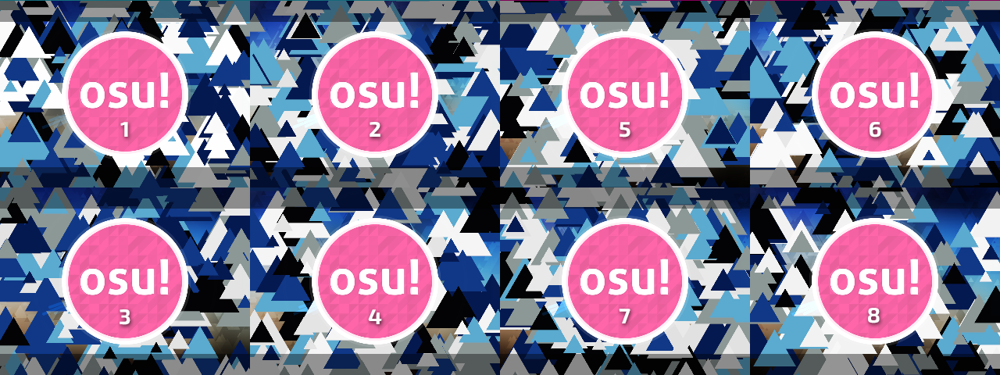
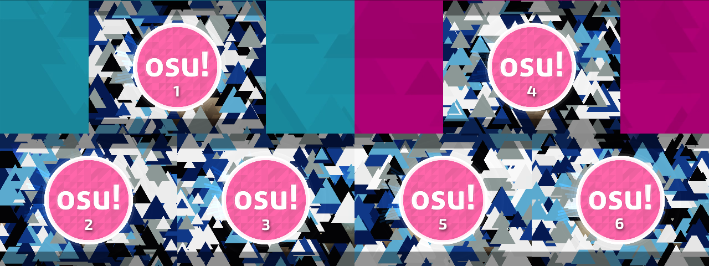

# Управление мультиплеером через osu!tourney

## Создание матча

Турнирная комната должна быть названа в соответствии с шаблоном, показанным на панели управления osu!tourney.

Шаблон выглядит следующим образом:

```
Acronym_in_tournament.cfg: (Team Name 1) vs (Team Name 2)
```

`Acronym_in_tournament.cfg` целиком заменяется на значение параметра `acronym` из файла `tournament.cfg` (см. [Настройка osu!tourney](/wiki/osu!_tournament_client/osu!tourney/Setup)). Например, названию `Test Tourney` соответствует шаблон `Test Tourney: (Team Name 1) vs (Team Name 2)`.

Вместо `Team Name 1` и `Team Name 2` можно указывать любые названия команд, главное — чтобы каждое из них было **заключено в круглые скобки `()`**.

## Управление комнатой

### Команды управления турниром

*Основная статья: [Команды управления турниром](/wiki/osu!_tournament_client/osu!tourney/Tournament_management_commands)*

Разместите игроков по нужным слотам с помощью команд `!mp move` и `!mp team`.

Как следует из статьи про [режим зрителя](/wiki/osu!_tournament_client/osu!tourney/Spectator_usage), каждое окно клиента связано с отдельным слотом в комнате мультиплеера. После того, как вы настроите параметр `TeamSize` в файле `tournament.cfg`, первые `TeamSize` слотов в комнате будут выделены под синюю команду, а следующие `TeamSize` слотов — под красную.

Например, при `TeamSize = 4` синяя команда будет занимать слоты с 1 по 4, а красная — с 5 по 8. При `TeamSize = 3` синяя команда будет занимать слоты 1, 2 и 3, а красная — слоты 4, 5 и 6.


**osu!tourney не учитывает цвета команд в комнате** — только их порядковые номера. Ниже приведены примеры расстановки окон osu!tourney при различных размерах команд. Числа в окнах обозначают номера слотов в комнате мультиплеера. Они добавлены на скриншоты для наглядности и не отображаются при работе osu!tourney:






