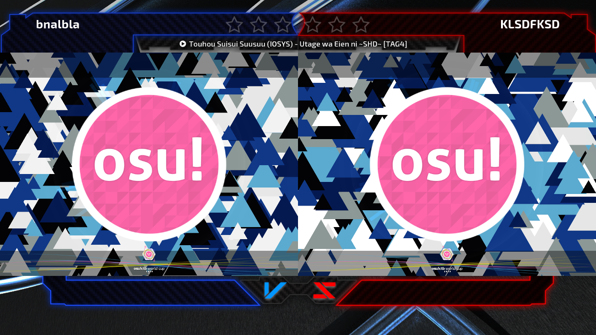
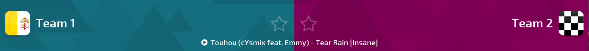

# Skinning d'osu!tourney

Le client prend en charge plusieurs modifications pour que vous puissiez le customisez pour le tournoi. Pour ce faire, vous devrez créer la structure de fichier `/Skins/User/tournament` dans le dossier d'installation du client. Les éléments du skin peuvent être placés dans le dossier et supportent les fichiers `.jpg` et `.png`.

Les éléments suivants peuvent être skinnés :

- `background` - L'arrière-plan utilisé par le client. L'arrière-plan par défaut pour osu!tourney peut être trouvé [ici](https://s.ppy.sh/images/tournament/default.png).
- `background-win1` (optionnel) - l'image qui sera affichée en fondu si l'équipe bleue gagne, pendant que les résultats du match sont affichés.
- `background-win2` (optionnel) - l'image qui sera affichée en fondu si l'équipe rouge gagne, pendant que les résultats du match sont affichés.
- `tourney-title` (optionnel) - l'image affichée en bas du client, devant l'image de fond
  - Cela peut être utilisé pour montrer le logo du tournois par exemple.

Le client affichera les icônes se trouvant sous le chemin `/Skins/User/tournament/icons` pour les mettre à côté du nom des équipes. Ce peut être utilisé pour montrer le drapeau du pays ou des avatars.

Le nom des icônes doivent correspondre aux noms des équipes. Par exemple, si la salle est nommée `Tournoi de Test : (Équipe 1) vs (Équipe 2)`, les icônes doivent être nommées `Équipe 1.jpg` et `Équipe 2.jpg`. Ces icônes peuvent être des `.jpg` ou des `.png` et avoir une résolution optimale de `50x50px`.

[Téléchargez le modèle de skin](https://s.ppy.sh/images/tournament/template.zip) pour skinner le client.
