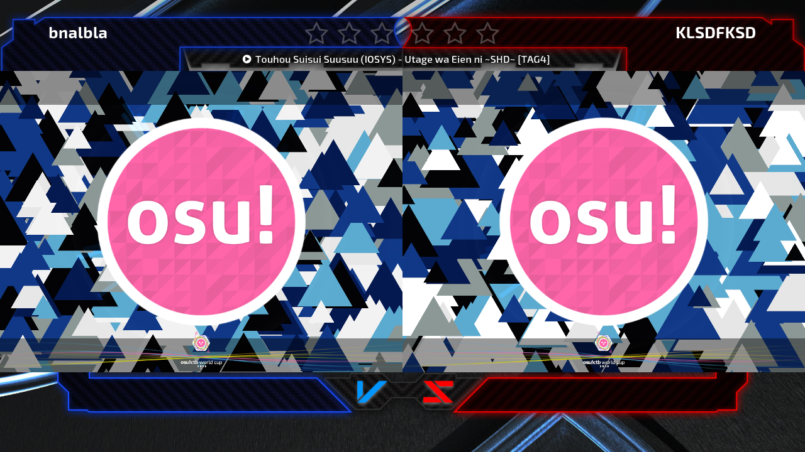
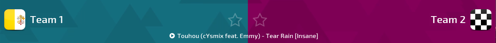

# การสกิน osu!tourney

ไคลเอนต์รองรับการปรับแต่งหลายอย่าง เพื่อให้คุณปรับให้เข้ากับทัวร์นาเมนต์ได้ วิธีทำคือต้องสร้างโครงสร้างโฟลเดอร์ `/Skins/User/tournament` ใน installation directory ของไคลเอนต์ skin elements สามารถวางไว้ในโฟลเดอร์นี้ และรองรับนามสกุลไฟล์ `.jpg` กับ `.png`

elements ต่อไปนี้สามารถสกินได้:

- `background` - รูปพื้นหลังที่ไคลเอนต์ใช้ พื้นหลังเริ่มต้นของ osu!tourney หาได้[ที่นี่](https://s.ppy.sh/images/tournament/default.png)
- `background-win1` (ไม่บังคับ) - พื้นหลังที่จะ fade ไปหลังทีมสีน้ำเงินชนะขณะแสดงผลลัพธ์แมตช์
- `background-win2` (ไม่บังคับ) - พื้นหลังที่จะ fade ไปหลังทีมสีแดงชนะขณะแสดงผลลัพธ์แมตช์
- `tourney-title` (ไม่บังคับ) - รูปที่แสดงด้านล่างของไคลเอนต์ บนพื้นหลัง
  - ใช้แสดงอย่างเช่นโลโก้ของทัวร์นาเมนต์ได้

ไคลเอนต์จะแสดง icons ที่อยู่ใน path `/Skins/User/tournament/icons` ข้างชื่อทีม สิ่งเหล่านี้อาจใช้แสดงอย่างเช่นธงประเทศหรือ avatars

ชื่อ icon ต้องตรงกับชื่อทีม ตัวอย่างเช่น หากห้องชื่อ `Test Tourney: (Team 1) vs (Team 2)` icons ต้องชื่อ `Team 1.jpg` และ `Team 2.jpg` icons เป็นได้ทั้ง `.jpg` หรือ `.png` และ resolution ที่เหมาะที่สุดคือ `50x50px`

[ดาวน์โหลด skin template](https://s.ppy.sh/images/tournament/template.zip) เพื่อสกินไคลเอนต์
