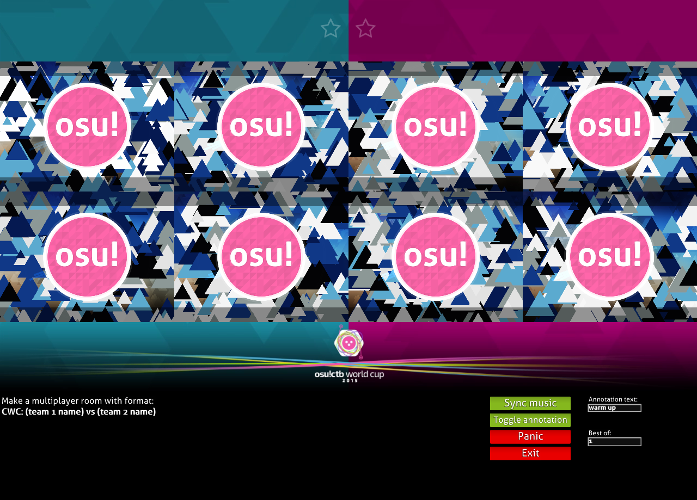
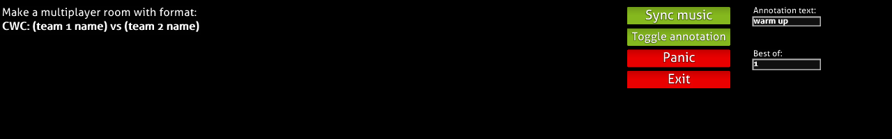
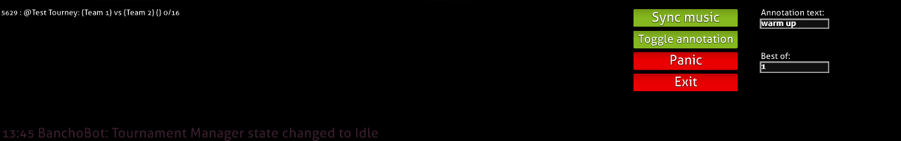
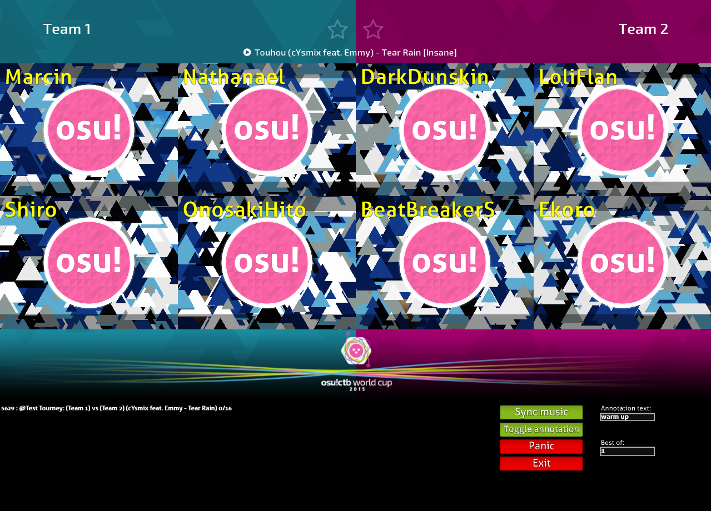
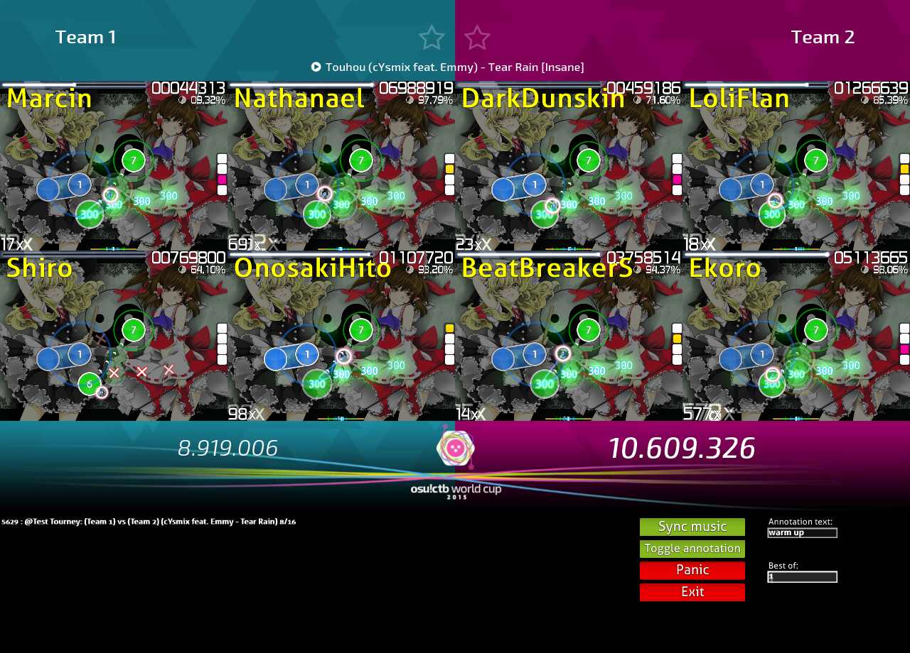
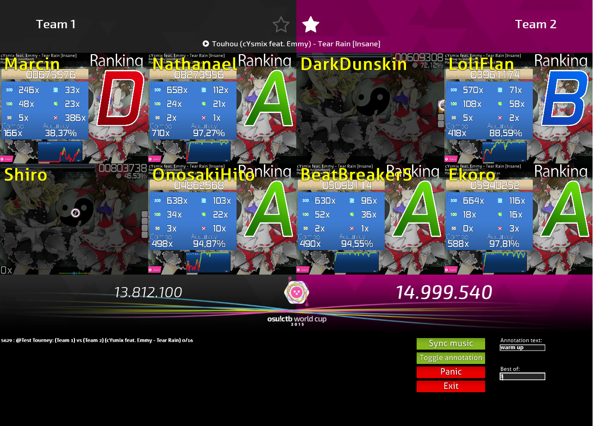
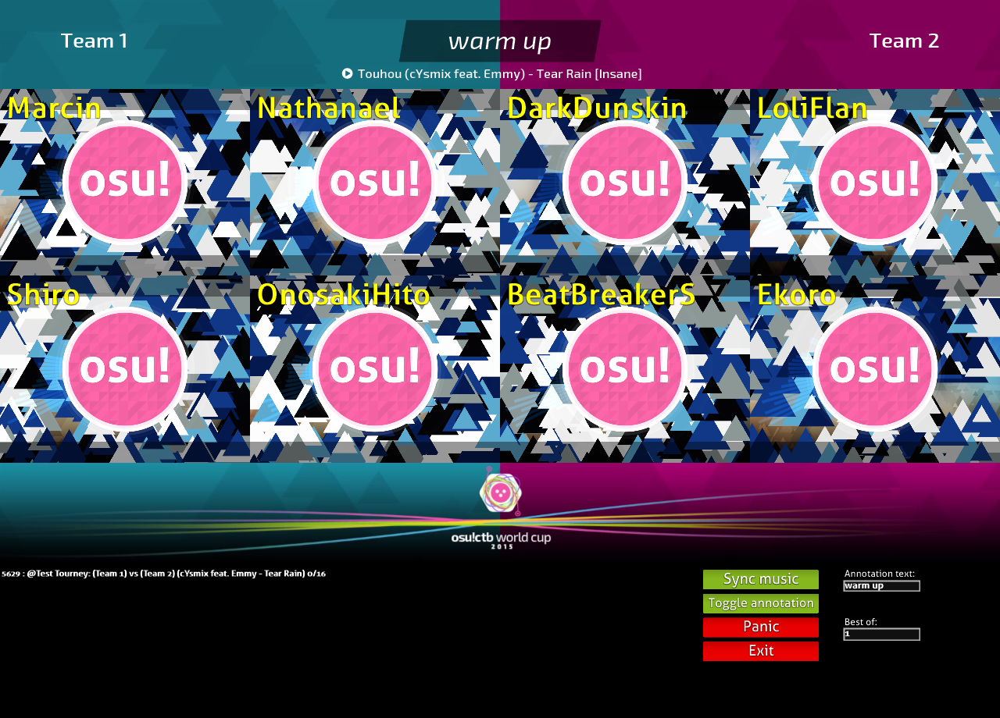

# Uso del espectador en osu!tourney

Esta es la interfaz del cliente osu!tourney. La parte superior de la pantalla está dividida en dos mitades, que representan los dos equipos de la sala multijugador.
Cada ventana de osu! se asigna a un espacio de la sala.

Los jugadores deben ocupar los espacios adecuados en la sala para que el cliente funcione correctamente. Se pueden encontrar más detalles en la [guía de uso en multijugador](/wiki/osu!_tournament_client/osu!tourney/Multiplayer_usage).

El panel de control se muestra en la parte inferior del cliente. De forma predeterminada, muestra el nombre requerido para que las salas aparezcan en el panel de control. Puedes encontrar más información en la [guía de uso en multijugador](/wiki/osu!_tournament_client/osu!tourney/Multiplayer_usage).

La funcionalidad de cada botón se describe a continuación:

- `Sync music`: El cliente intentará resincronizar la música con los hitsounds.
- `Toggle annotation`: Activa/desactiva la anotación. Esto se describe más adelante.
- `Panic`: Presiónalo cuando algo vaya mal, por ejemplo, una ventana no está viendo a un usuario o una ventana se bloquea. Esto reiniciará todas las instancias de osu!.
- `Exit`: Cierra el cliente.

La funcionalidad de cada cuadro de texto se describe a continuación:

- `Anotación`: El texto que se mostrará en la anotación.
- `Al mejor de`: Actualiza el recuento de estrellas en la parte superior con la cantidad de partidas que cada equipo necesita para ganar.

Se puede hacer clic en las salas creadas correctamente, activando el cliente osu!tourney para observar esa sala.

También puedes hacer clic izquierdo para aumentar o hacer clic derecho para disminuir las estrellas y cambiar manualmente la puntuación del equipo.

Cuando se activa, el mensaje en el cuadro de texto correspondiente del panel de control se mostrará en la parte superior de la pantalla y la puntuación del equipo no se modificará una vez finalizado el beatmap.
