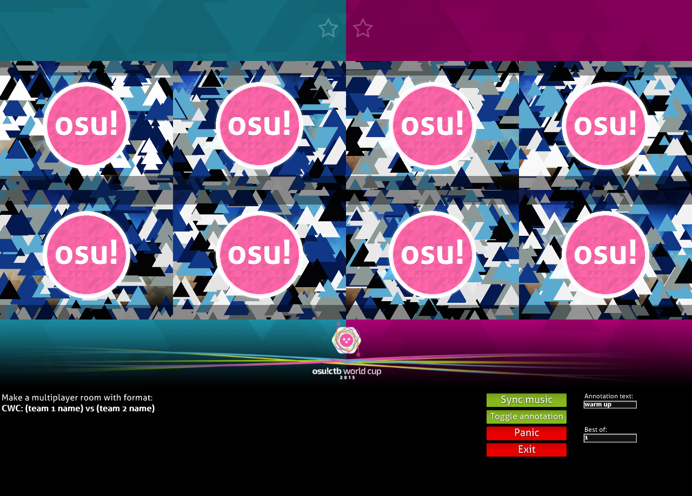
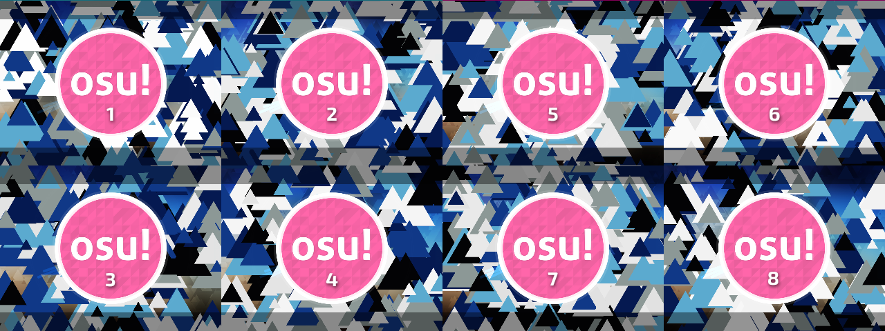
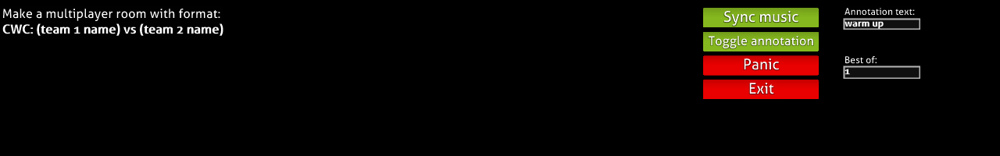
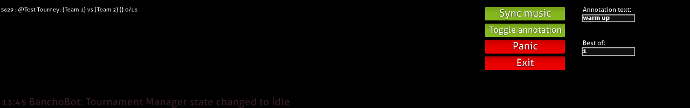
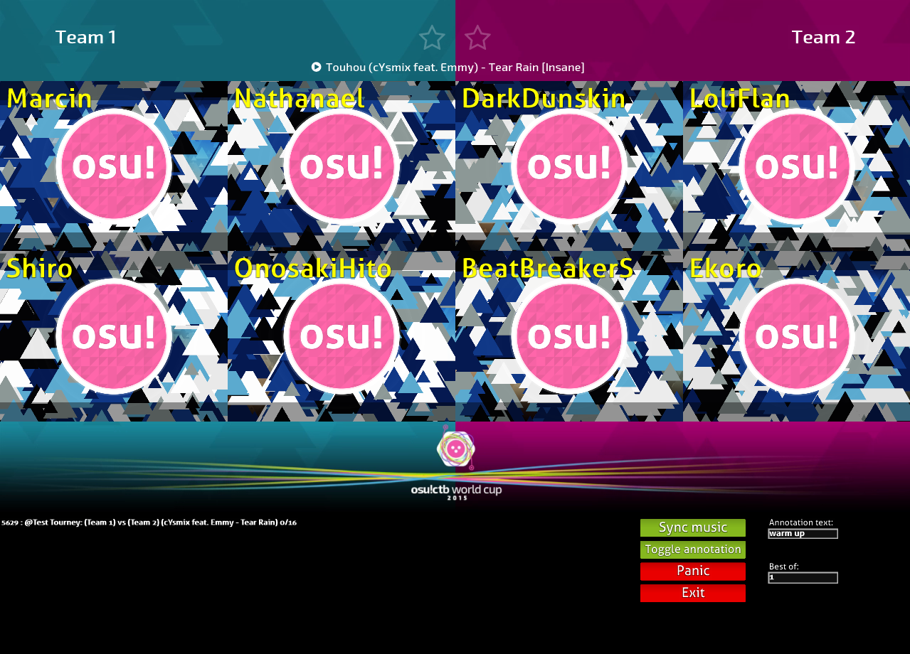
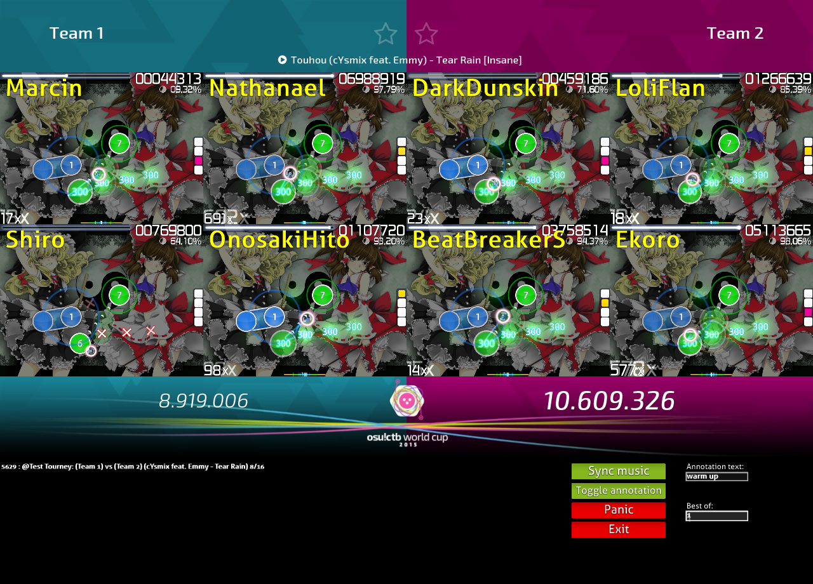
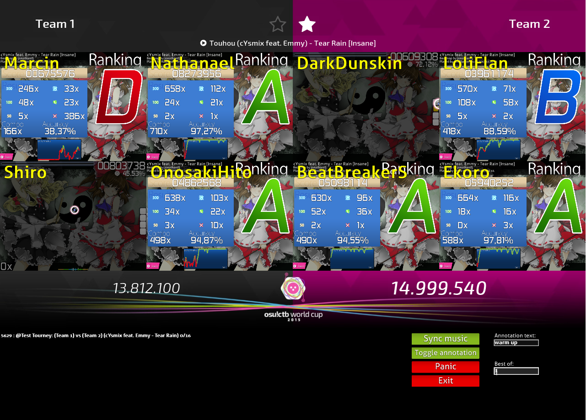
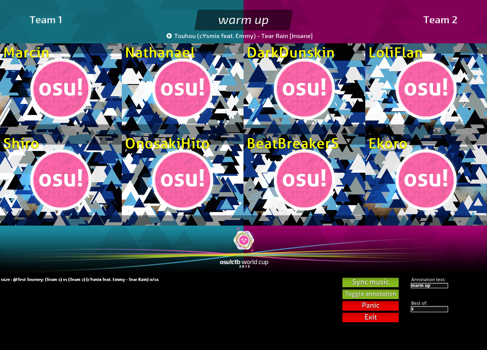

# การใช้งาน spectator ใน osu!tourney

นี่คือ interface ของไคลเอนต์ osu!tourney ด้านบนของหน้าจอแบ่งเป็นสองครึ่ง แทนสองทีมของห้อง multiplayer
หน้าต่าง osu! แต่ละอันจะถูกผูกกับ slot ในห้อง

ผู้เล่นต้องอยู่ใน slot ที่เหมาะสมในห้องเพื่อให้ไคลเอนต์ทำงานถูกต้อง ดูรายละเอียดเพิ่มเติมได้ใน[คู่มือการใช้งาน multiplayer](/wiki/osu!_tournament_client/osu!tourney/Multiplayer_usage)

control panel จะแสดงอยู่ด้านล่างของไคลเอนต์ โดยค่าเริ่มต้นจะแสดงชื่อที่จำเป็นเพื่อให้ห้องปรากฏใน control panel ดูข้อมูลเพิ่มเติมได้ใน[คู่มือการใช้งาน multiplayer](/wiki/osu!_tournament_client/osu!tourney/Multiplayer_usage)

ฟังก์ชันของแต่ละปุ่มอธิบายไว้ด้านล่าง:

- `Sync music`: ไคลเอนต์จะพยายาม resync เพลงให้ตรงกับ hitsounds
- `Toggle annotation`: เปิด/ปิด annotation อธิบายเพิ่มเติมด้านล่าง
- `Panic`: กดปุ่มนี้เมื่อมีอะไรผิดพลาด เช่น หน้าต่างหนึ่งไม่ได้ spectate ผู้ใช้ หรือหน้าต่าง crash ปุ่มนี้จะ reinitialise instances osu! ทั้งหมด
- `Exit`: ปิดไคลเอนต์

ฟังก์ชันของแต่ละ text box อธิบายไว้ด้านล่าง:

- `Annotation text`: ข้อความที่จะแสดงบน annotation
- `Best Of`: อัปเดตจำนวน star ด้านบนตามจำนวนแมตช์ที่แต่ละทีมต้องชนะ

สามารถคลิกห้องที่สร้างถูกต้องได้ และจะทำให้ไคลเอนต์ osu!tourney spectate ห้องนั้น

คุณยังสามารถคลิกซ้ายเพื่อเพิ่ม หรือคลิกขวาเพื่อลด star เพื่อเปลี่ยนคะแนนทีมด้วยมือได้

เมื่อเปิดใช้งาน ข้อความใน text box ที่เกี่ยวข้องใน control panel จะแสดงที่ด้านบนของหน้าจอ และคะแนนทีมจะไม่เปลี่ยนหลังบีตแมปจบ
