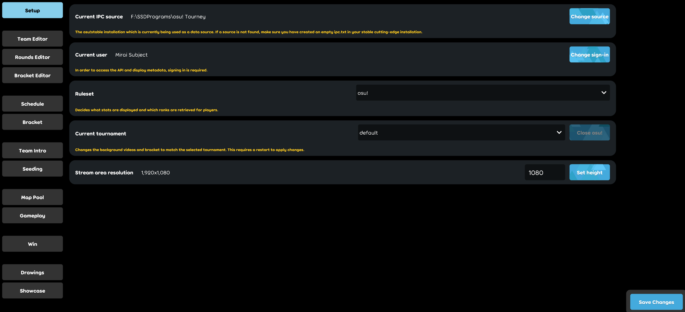

# osu! tournament client

**osu! tournament client** คือไคลเอนต์ทางการที่วาง [osu!tourney](/wiki/osu!_tournament_client/osu!tourney) ซ้อนกับ scene และข้อมูลเสริมที่เกี่ยวข้องกับทัวร์นาเมนต์ osu! ระหว่างไลฟ์สตรีม

ผู้ใช้ที่เจอปัญหากับไคลเอนต์สามารถ[สร้าง issue บน GitHub](https://github.com/ppy/osu/issues) หรือส่งอีเมลไปที่ [tournaments@ppy.sh](mailto:tournaments@ppy.sh)

## การตั้งค่า {#setup}

หากต้องการเริ่ม osu! tournament client คุณต้องระบุ launch argument ให้ executable ของ [osu!(lazer)](/wiki/Client/Release_stream/Lazer) วิธีทำคือสร้าง shortcut ใหม่บน desktop แล้วตั้ง location เป็น `%LOCALAPPDATA%/osulazer/osu!.exe --tournament` shortcut อันนี้จะเปิด osu!(lazer) ในโหมด tournament client

เนื่องจาก osu! tournament client เป็นเพียง overlay สำหรับ osu!tourney จึงต้องตั้งค่า osu!tourney ด้วยเช่นกัน ตั้ง Release stream ใน osu!tourney เป็น `Cutting Edge (Experimental)` และสร้างไฟล์ว่างชื่อ `ipc.txt` ในโฟลเดอร์ติดตั้งของ osu!tourney หลังจากนั้นทำตาม [คู่มือตั้งค่า osu!tourney](/wiki/osu!_tournament_client/osu!tourney/Setup)

เปิด osu! tournament client แล้วคุณจะเห็นหน้าจอตั้งค่านี้:

- ตรวจให้แน่ใจว่า `Current IPC source` ตรงกับตำแหน่ง instance osu!tourney ที่คุณจะใช้
- เข้าสู่ระบบ osu!(lazer) โดยคลิก `Change sign-in`
- ตั้ง ruleset ให้ถูกต้องด้วย dropdown menu
- เปลี่ยน height ให้ตรงกับค่า `Height` ที่ตั้งไว้ในไฟล์ `tournament.cfg` ของ osu!tourney

## การจัดการทัวร์นาเมนต์

การตั้งค่าทัวร์นาเมนต์สำหรับ [osu!(lazer)](/wiki/Client/Release_stream/Lazer) ถูกเก็บไว้ที่ `%APPDATA%/osu/tournaments` เมื่อเปิดไคลเอนต์ครั้งแรก จะมีการสร้าง directory ชื่อ `default` ในโฟลเดอร์นี้ ผู้ใช้สามารถดูแล tournament configurations ได้หลายชุดและสลับใช้ตามต้องการเพื่อให้ customisations ที่เหมาะสมถูกนำไปใช้

หากต้องการสร้าง tournament configuration ใหม่ ให้สร้าง directory ใหม่ใน directory `tournaments` โดยใช้ชื่อทัวร์นาเมนต์ของคุณ

ภายใน tournament configuration สามารถใส่ assets ที่จำเป็นเพื่อแสดง flags, videos และ mod icons สำหรับ mappool ได้ asset แต่ละประเภทมีโฟลเดอร์ของตัวเอง:

- your-tournament
  - Flags
  - Mods
  - Videos

หากต้องการจัดการรายละเอียดทัวร์นาเมนต์ ให้ใช้เครื่องมือใน tournament client:

- `Team Editor`: แก้ไขทีมและผู้เล่น
- `Rounds Editor`: จัดการ rounds และ mappools
- `Bracket Editor`: สร้างแมตช์ใหม่และจัดการทีม rounds และเวลาของแต่ละแมตช์

## การปรับแต่ง

osu! tournament client สามารถปรับแต่งได้โดยใส่ custom flags, mod icons และ video files สิ่งเหล่านี้จะแสดงใน scene ที่เกี่ยวข้องเมื่อจำเป็น

### Flags

โดยค่าเริ่มต้น osu! tournament client มี flags ในตัวสำหรับประเทศต่าง ๆ ทั่วโลก สามารถอ้างอิงด้วย [ISO 3166 Alpha-2 Country Codes](https://www.iso.org/iso-3166-country-codes.html) ใน Team Editor

สำหรับ custom flags รองรับไฟล์ `.jpg` และ `.png` รูป flag ควรมีขนาดอย่างน้อย 140x94 และคง aspect ratio ให้ใกล้เคียงกับค่านี้เพื่อผลลัพธ์ที่ดีที่สุด

ต้องวาง flags ไว้ใน `<your-tournament>/Flags` จากนั้นสามารถอ้างอิง flags ใน Team Editor ด้วยชื่อไฟล์โดยไม่ต้องใส่นามสกุลไฟล์

### Mods

สำหรับ custom mod icons รองรับไฟล์ `.jpg` และ `.png` resolution เป็นอะไรก็ได้ และไคลเอนต์จะ fit รูปเข้าไปใน beatmap panel สำหรับอ้างอิง beatmap panel ที่ 1920x1080 มีขนาด 563x60 pixels

ต้องวาง mod icons ไว้ใน `<your-tournament>/Mods` จากนั้นสามารถอ้างอิง mods ด้วยชื่อไฟล์โดยไม่ต้องใส่นามสกุลไฟล์ใน Rounds Editor และ Seeding Results Editor

### Videos

สามารถแสดง looping videos เป็นพื้นหลังของแต่ละ scene ได้

หมายเหตุ: ไคลเอนต์ decode video files ด้วย software decoding ดังนั้น performance อาจต่างกันไปตามสถานการณ์การใช้งาน

ไฟล์ต้องเป็นไปตามข้อกำหนดต่อไปนี้:

- aspect ratio 16:9 เช่น 1280x720 หรือ 1920x1080
- นามสกุลไฟล์ `mp4`, `m4v` หรือ `avi`
- Video codec: H.264, Audio codec: none

ต้องวาง video files ไว้ใน `<your-tournament>/Videos` และต้องใช้ชื่อเฉพาะเพื่อให้ทำงานถูกต้อง

| Scene | File(s) |
| :-- | :-- |
| Schedule | `schedule` |
| Bracket | `ladder` |
| Team Intro | `teamintro` |
| Seeding | `seeding` |
| Map Pool | `mappool` |
| Gameplay | `gameplay` |
| Win | `teamwin-red`, `teamwin-blue` |
| Drawings | `drawings` |
| Showcase | `showcase` |

video file ที่ชื่อ `main` จะถูกใช้เป็นพื้นหลังเริ่มต้นจนกว่าจะถูกแทนที่ด้วย video files รายการใดรายการหนึ่งด้านบน
