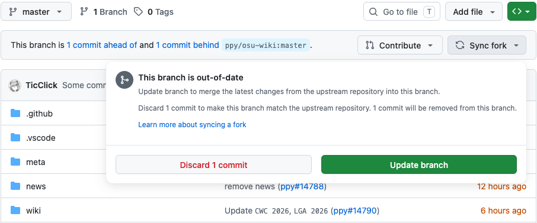

# Best practices

This page covers some of the tasks that you may face while contributing. The approaches mentioned here are designed to make the process easier and may be applied to other projects hosted on GitHub or similar platforms.

## Introduction

*For more information on Git and GitHub, see [GitHub Documentation](https://docs.github.com)*

**Git** is a version control system which helps manage changes to files. The osu! wiki's data and history of changes are stored in a Git repository. **GitHub** is a platform for development that provides a web interface for Git repositories and offers a set of tools for project management.

## Syncing the fork

::: Infobox

:::

A *fork* is a snapshot of the original repository which doesn't update itself automatically. To always work with the latest version of the osu! wiki, you need to sync it before making changes. This can be done directly from GitHub:

1. Go to your fork of the `osu-wiki` repo.
2. Select the `master` branch from the dropdown.
3. Click `Sync fork`.
   - If you made any changes directly in the `master` branch that you would rather keep, press `Update branch` to preserve them.
   - If you want the clean slate and don't need your changes anymore, press `Discard n commit(s)`.

## Making edits

*See also: [Forking Workflow | Atlassian Git Tutorial](https://www.atlassian.com/git/tutorials/comparing-workflows/forking-workflow)*

Within your fork of the osu! wiki, you are free to make any changes and save them. **Commits** are individual "save points" of the repository. **Branches** are workspaces, which let you switch between multiple versions of the repository. To make your workflow easier and keep the history of the wiki clean and free from noise, follow these guidelines:

- [Sync the `master` branch](#syncing-the-fork).
- Always start the work by creating a new branch off `master`, and only keep your changes in there. Give it a meaningful name, such as `update-staff-log`.<!-- https://www.atlassian.com/git/tutorials/comparing-workflows/forking-workflow is the explanation, but it doesn't really fit in here -->
- Commit your work when you've made reasonably sized changes. It's better to commit an article as a whole rather than 10 small edits.
- **Use short and meaningful commit messages**, as they let others know what's in the box. Something like `Rewrite the section about jump patterns` says a lot more than `Update en.md`.

## Opening a pull request

A pull request shows other people how your edits will affect the files. Add some information to your pull request to explain your intentions:

- `Title`: a very short descriptive title for your changes in English, together with the article's name. In case of a translation, start with the two-letter language name of your translations in brackets. Examples:
  - ``[FR] Add `BBCode` ``
  - ``Update `Beatmapping` and `Beatmap/Difficulty` ``
- `Description`: anything you want to signal to the maintainers and other potential reviewers. Examples:
  - A short summary of the changes, especially if they affect several articles
  - The pull request's completeness, or ideas related to it
  - [Automatic resolution of relevant issues](https://docs.github.com/en/issues/tracking-your-work-with-issues/linking-a-pull-request-to-an-issue)
- Make sure to tick the `Allow edits from maintainers` checkbox, as it will allow the wiki maintainers to help you improve the pull request when necessary

## Applying reviews

Reviews are best applied directly through the GitHub web interface. Use the `Add suggestion to batch` button when in the `Files changed` tab to apply multiple reviews simultaneously.

You may also use the `Commit suggestion` button to apply a single suggestion individually, provided that you make commits sparingly and [with informative messages](#making-edits).

Using this system will automatically mark suggestions as resolved. When applying reviews manually (e.g. when the reviewer didn't add a direct suggestion), mark them as resolved *after committing the change* to prevent forgetting any. Letting GitHub apply reviews automatically is preferred, as it ensures that suggestions are applied correctly and prevents any manual copy errors.

## Resolving conflicts

There are two reasons for why a conflict could have happened:

- You edited a file when your branch was out of date.
- There was a lack of communication between you and another person, so you both were editing the same article. The other person's changes were merged before yours, which caused your edited files to become out of date.

Depending on the severity of the conflicts, you have two options on how to fix this:

1. If your pull request has the `Resolve conflicts` button, click on that. This will open a slightly different version of the web editor.
   1. GitHub will highlight the conflicting areas. Find one of them.
   2. Everything from `<<<<<<<` to the `=======` is your changes, whereas everything from `=======` to `>>>>>>> master` is what's in the `ppy/master` branch.
   3. From here, you will need to manually fix the conflict and delete the lines with the `<<<<<<<`, `=======`, and `>>>>>>> master` markings.
   4. Repeat the process for all conflicts.
   5. When completed, click `Mark as resolved` (this is only available when all conflicting parts of the file are resolved).
2. If the `Resolve conflicts` button is blocked due to the conflicts being too complicated for GitHub, you are out of luck and will need to [update your branch](#syncing-the-fork) and make your changes again.
   - *Note: This is only true if you are limited to using the GitHub web interface.* There are still ways to fix it, but they don't belong to the scope of this article. Moreover, it is probably not worth the effort to do so, because you will overwrite and revert the conflicting changes.
