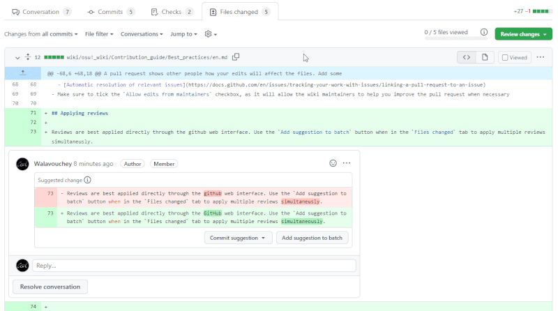
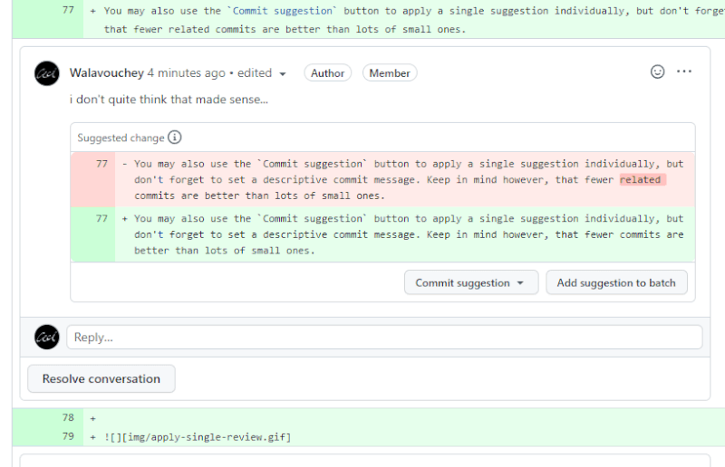

# Prácticas recomendadas

Esta página cubre algunas de las tareas que puedes enfrentar mientras contribuyes. Los enfoques mencionados aquí están diseñados para facilitar el proceso y pueden aplicarse a otros proyectos alojados en GitHub o plataformas similares.

## Introducción

*Para obtener más información sobre Git y GitHub, véase [Documentación de GitHub](https://docs.github.com/es)*

**Git** es un sistema de control de versiones que ayuda a administrar los cambios en los archivos. Los datos de la osu! wiki y el historial de cambios se almacenan en un repositorio de Git. **GitHub** es una plataforma de desarrollo que proporciona una interfaz web para repositorios Git y ofrece un conjunto de herramientas para la gestión de proyectos.

## Sincronizar la bifurcación

::: Infobox

:::

Una *bifurcación* es una copia del repositorio original que no se actualiza automáticamente. Para trabajar siempre con la versión más reciente de la osu! wiki, debes sincronizarla antes de realizar cambios. Esto se puede hacer directamente desde GitHub:

1. Ve a tu bifurcación del repositorio `osu-wiki`.

2. Selecciona la rama `master` del menú desplegable.

3. Haz clic en `Sync fork`.
   - Si has realizado algún cambio directamente en la rama `master` y prefieres conservarlo, haz clic en `Update branch` para guardarlo.
   - Si quieres empezar de cero y ya no necesitas tus cambios, haz clic en `Discard n commit(s)`.

## Hacer cambios

*Véase también: [Forking Workflow | Atlassian Git Tutorial](https://www.atlassian.com/git/tutorials/comparing-workflows/forking-workflow)*

Dentro de tu bifurcación de la osu! wiki, eres libre de hacer cualquier cambio y guardarlo. Los **commits** son «puntos de guardado» individuales del repositorio. Las **ramas (branches)** son espacios de trabajo que te permiten alternar entre varias versiones del repositorio. Para facilitar tu flujo de trabajo y mantener el historial de la wiki limpio y libre de ruido, sigue estas pautas:

- [Sincroniza la rama `master`](#sincronizar-la-bifurcación).
- Comienza siempre el trabajo creando una nueva rama a partir de `master`, y solo mantén allí tus cambios. Dale un nombre significativo, como `update-staff-log`.
- Envía tu trabajo cuando hayas realizado cambios de tamaño razonable. Es mejor enviar un artículo completo en lugar de 10 ediciones pequeñas.
- **Usa mensajes de commits breves y significativos**, ya que permiten que los demás sepan lo que hay en el cuadro. Algo como `Rewrite the section about jump patterns` dice mucho más que `Update es.md`.

## Abrir una solicitud de cambios

Una solicitud de cambios muestra a otras personas cómo afectarán tus ediciones a los archivos. Agrega información a tu solicitud de cambios para explicar tus intenciones:

- `Título`: un título descriptivo muy breve para tus cambios en inglés, junto con el nombre del artículo. En el caso de una traducción, comienza con el nombre del idioma de dos letras de tus traducciones entre paréntesis. Ejemplos:
  - ``[ES] Add `BBCode` ``
  - ``Update `Beatmapping` and `Beatmap/Difficulty` ``
- `Descripción`: cualquier cosa que quieras señalar a los mantenedores y otros posibles revisores. Ejemplos:
  - Un breve resumen de los cambios, especialmente si afectan a varios artículos
  - La integridad de la solicitud de cambios o las ideas relacionadas con ella
  - [Resolución automática de problemas relevantes](https://docs.github.com/es/issues/tracking-your-work-with-issues/linking-a-pull-request-to-an-issue)
- Asegúrate de marcar la casilla de verificación `Allow edits from maintainers` ya que permitirá que los mantenedores de la wiki te ayuden a mejorar la solicitud de cambios cuando sea necesario

## Aplicar revisiones

Las revisiones se aplican mejor directamente a través de la interfaz web de GitHub. Usa el botón `Add suggestion to batch` cuando estés en la pestaña `Files changed` para aplicar múltiples revisiones simultáneamente.

También puedes usar el botón `Commit suggestion` para aplicar una sola sugerencia de forma individual, siempre que realices commits con moderación y [con mensajes informativos](#hacer-cambios).

El uso de este sistema marcará automáticamente las sugerencias como resueltas. Al aplicar revisiones manualmente (por ejemplo, cuando el revisor no agregó una sugerencia directa), márcalas como resueltas *después de enviar el cambio* para evitar olvidar alguna. Es preferible dejar que GitHub aplique las revisiones automáticamente, ya que garantiza que las sugerencias se apliquen correctamente y evita cualquier error de copia manual.

## Resolver conflictos

Hay dos razones por la que esto pudo haber pasado:

- Editaste un archivo cuando tu rama estaba desactualizada.
- Hubo una pobre comunicación entre tu y otra persona, así que los dos estaban editando el mismo artículo, pero los cambios de esa persona fueron unidos antes que los tuyos, esto fue lo que causó que tus archivos editados estuviesen desactualizados.

Dependiendo de la severidad de los conflictos, puedes tener dos opciones para arreglar esto:

1. Si tu solicitud de cambios tiene el botón `Resolve conflicts`, haz clic. Esto abrirá una versión levemente distinta del editor web.
   1. GitHub resaltará las áreas conflictivas. Encuentra una de ellas.
   2. Todo desde `<<<<<<<` hasta `=======` son tus cambios, donde todo desde `=======` hasta `>>>>>>> master` es lo que está en la rama `ppy/master`.
   3. Desde aquí, necesitarás arreglar manualmente el conflicto y eliminar las marcas `<<<<<<<`, `=======` y `>>>>>>> master`.
   4. Repite el proceso para todos los conflictos.
   5. Cuando hayas terminado, haz clic en `Mark as resolved` (esto estará disponible solo cuando todas las partes conflictivas del archivo se hayan resuelto).
2. Si el botón `Resolve conflicts` está bloqueado dado que los conflictos son muy complicados para GitHub, se te acabó la suerte y necesitarás [actualizar tu rama](#sincronizar-la-bifurcación) y hacer los cambios de nuevo.
   - *Nota: Esto se cumple si es que estás limitado a usar la interfaz web de GitHub.* Todavía hay maneras de arreglarlo, pero no serán cubiertos en esta guía y puede que no valga el esfuerzo el usar esos métodos, porque sobreescribirás y revertirás los cambios conflictivos.
