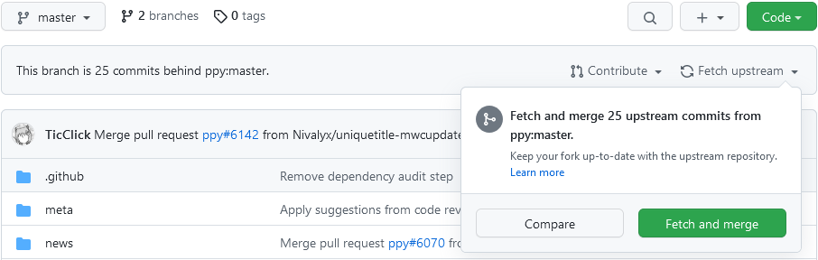
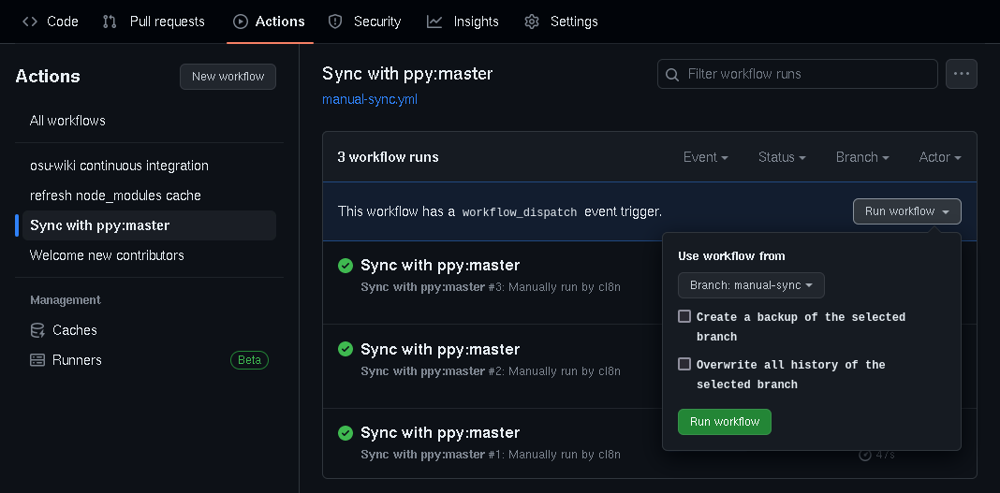
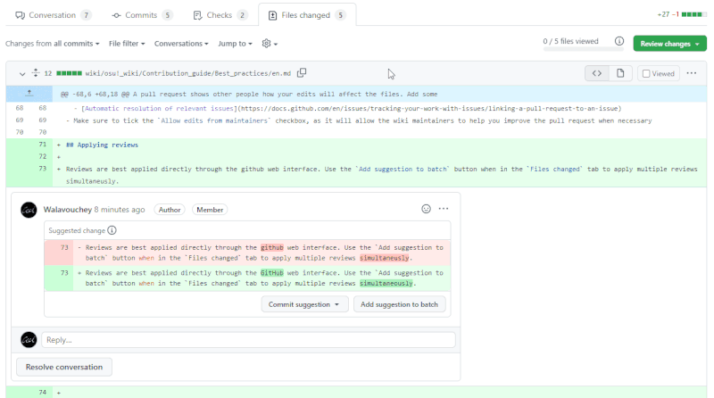
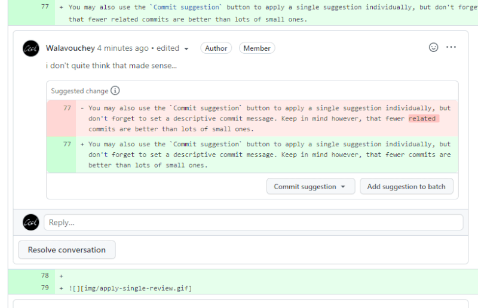

# Bonnes pratiques

Cette page couvre certaines des tâches auxquelles vous pouvez être confronté lors de votre contribution. Les approches mentionnées ici sont conçues pour faciliter le processus et peuvent être appliquées à d'autres projets hébergés sur GitHub ou des plateformes similaires.

## Introduction

*Pour plus d'informations sur Git et GitHub, voir [la documentation de GitHub](https://docs.github.com)*

**Git** est un système de gestion de versions qui permet de gérer les modifications apportées aux fichiers. Les données du wiki d'osu! et l'historique des modifications sont stockés dans un dépôt Git. **GitHub** est une plateforme de développement qui fournit une interface web pour les dépôts Git et offre un ensemble d'outils pour la gestion des projets.

## Synchronisation du fork

Afin d'apporter des modifications à un dépôt situé sur GitHub, un contributeur potentiel doit obtenir une copie contrôlée de celui-ci, appelée *fork*. Lorsque vous créez votre fork du dépôt `osu-wiki`, vous prenez un instantané de son contenu à ce moment précis. Pour apporter une contribution significative, **synchronisez toujours votre fork** avant de faire un ensemble de changements - cela peut être fait directement depuis GitHub :

1. Allez dans votre fork du dépôt `osu-wiki`.

2. Sélectionnez la branche `master` dans la liste déroulante.

3. Cliquez sur `Fetch upstream`, et sélectionnez `Fetch and merge`.

   

Votre branche est maintenant à jour avec le dépôt original.

---

Cette solution fonctionne bien dans la plupart des cas, bien que la fonctionnalité elle-même ait des capacités limitées. Par exemple, elle ne vous permet pas d'écraser les changements non désirés sur la branche, car elle ne fusionne que la branche `master` en amont.

Si vous avez rencontré des problèmes lors de l'utilisation de l'outil GitHub ou si vous souhaitez écraser le contenu de votre branche, vous pouvez utiliser le workflow écrit par les contributeurs du wiki d'osu!.

1. Ouvrez **votre fork** et allez dans l'onglet `Actions`.

2. Dans la barre latérale gauche, cherchez `Sync with ppy:master`.

3. Cliquez sur `Run workflow` et remplissez les options suivantes :

   

   - **Use workflow from**: Branche cible que vous voulez synchroniser. Par défaut, elle est définie sur `master`.
   - **Create a backup of the selected branch**: Crée une copie de la branche cible à `{nom de la branche}-backup` sur votre fork avant d'essayer de la mettre à jour.
   - **Overwrite all history of the selected branch**: Remplace la branche cible par `ppy:master`, en supprimant tous ses commits différents. Par défaut, `ppy:master` sera fusionné dans la branche cible.

4. Cliquez sur le bouton `Run workflow` et attendez que le workflow se termine. Si vous êtes curieux de savoir comment fonctionne l'outil, cliquez sur la tâche de workflow `Sync with ppy:master`.

## Effectuer des modifications

*Voir également : [Forking Workflow | Atlassian Git Tutorial](https://www.atlassian.com/git/tutorials/comparing-workflows/forking-workflow)*

Dans votre fork du wiki d'osu!, vous êtes libre de faire des changements et de les sauvegarder. Les **commits** sont des "points de sauvegarde" individuels du dépôt. Les **branches** sont des espaces de travail, qui vous permettent de passer d'une version à l'autre du dépôt. Pour faciliter votre travail et garder l'historique du wiki propre et sans parasites, suivez ces directives :

- [Synchroniser la branche `master`](#synchronisation-du-fork).
- Commencez toujours le travail en créant une nouvelle branche sur `master`, et ne gardez que vos changements dans cette branche. Donnez-lui un nom significatif, comme `staff-log-fr`.
- Validez votre travail lorsque vous avez apporté des modifications de taille raisonnable. Il est préférable de valider un article dans son ensemble plutôt que 10 petites modifications.
- **Utiliser des messages de commit courts et significatifs**, car ils permettent aux autres de savoir ce qu'il y a dans la boîte. Quelque chose comme `Rewrite the section about jump patterns` en dit beaucoup plus long que `Update fr.md`.

## Ouvrir un pull request

Un pull request montre aux autres personnes comment vos modifications affecteront les fichiers. Ajoutez quelques informations à votre pull request pour expliquer vos intentions :

- `Titre` : un titre descriptif très court pour vos modifications en anglais, ainsi que le nom de l'article. S'il s'agit d'une traduction, commencez par le nom à deux lettres de la langue dans laquelle vous traduisez, entre parenthèses. Exemples :
  - ``[FR] Add `BBCode` ``
  - ``Update `Beatmapping` and `Beatmap/Difficulty` ``
- `Description` : tout ce que vous voulez signaler aux responsables et autres réviseurs potentiels. Exemples :
  - Un bref résumé des changements, surtout s'ils concernent plusieurs articles.
  - L'exhaustivité de la pull requests, ou les idées qui s'y rapportent
  - [Résolution automatique des issues](https://docs.github.com/fr/issues/tracking-your-work-with-issues/linking-a-pull-request-to-an-issue)
- Assurez-vous de cocher la case `Allow edits from maintainers`, car cela permettra aux mainteneurs du wiki de vous aider à améliorer la pull request si nécessaire.

## Application des reviews

Il est préférable d'appliquer les reviews directement via l'interface web de GitHub. Utilisez le bouton `Add suggestion to batch` dans l'onglet `Files changed` pour appliquer plusieurs reviews simultanément.

Vous pouvez également utiliser le bouton `Commit suggestion` pour appliquer une seule suggestion individuellement, à condition que vous fassiez des commits avec parcimonie et [avec des messages informatifs](#effectuer-des-modifications).

L'utilisation de ce système marquera automatiquement les suggestions comme résolues. Lors de l'application manuelle des reviews (par exemple, lorsque le réviseur n'a pas ajouté de suggestion directe), marquez-les comme résolues *après avoir commis le changement* pour éviter d'en oublier. Il est préférable de laisser GitHub appliquer les reviews automatiquement, car cela permet de s'assurer que les suggestions sont appliquées correctement et d'éviter toute erreur de copie manuelle.

## Résolution des conflits

Il y a deux raisons pour lesquelles un conflit a pu se produire :

- Vous avez modifié un fichier alors que votre branche n'était pas à jour.
- Il y a eu un manque de communication entre vous et une autre personne, de sorte que vous avez tous deux modifié le même article. Les modifications de l'autre personne ont été merge avant les vôtres, ce qui a rendu vos fichiers modifiés obsolètes.

En fonction de la gravité des conflits, deux options s'offrent à vous pour y remédier :

1. Si votre pull request a le bouton `Resolve conflicts`, cliquez dessus. Cela ouvrira une version légèrement différente de l'éditeur web.
   1. GitHub met en évidence les zones conflictuelles. Trouvez l'une d'entre elles.
   2. Tout ce qui se trouve entre `<<<<<<<` et `=======` correspond à vos modifications, tandis que tout ce qui se trouve entre `=======` et `>>>>>>> master` correspond à ce qui se trouve dans la branche `ppy/master`.
   3. A partir de là, vous devrez corriger manuellement le conflit et supprimer les lignes `<<<<<<<`, `=======`, et `>>>>>>> master`.
   4. Répétez l'opération pour tous les conflits.
   5. Lorsque vous avez terminé, cliquez sur `Mark as resolved` (cette option n'est disponible que lorsque toutes les parties en conflit du fichier ont été résolues).
2. Si le bouton `Resolve conflicts` est bloqué parce que les conflits sont trop compliqués pour GitHub, vous n'avez pas de chance et vous devrez [mettre à jour votre branche](#synchronisation-du-fork) et refaire vos changements.
   - *Note : Ceci n'est vrai que si vous êtes limité à l'utilisation de l'interface web de GitHub.* Il existe encore des moyens de résoudre ce problème, mais ils n'entrent pas dans le cadre de cet article. De plus, cela ne vaut probablement pas la peine de faire cet effort, car vous écraserez et annulerez les modifications en conflit.
