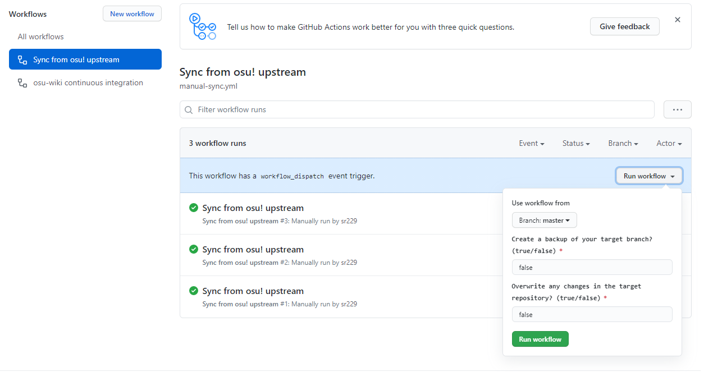
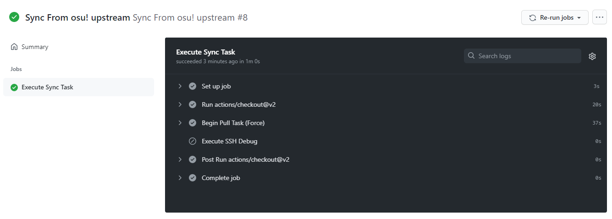

# 모범 사례

이 페이지에서는 위키에 기여하는 동안 직면할 수 있는 몇가지 것들에 대해 설명합니다. 여기에 언급된 내용은 작업을 더 쉽게 만들기 위해 작성되었으며, GitHub 또는 유사한 플랫폼에서 호스팅되는 프로젝트에 적용할수도 있습니다.

## 설명

*Git이나 GitHub에 대한 더 자세한 내용은 [GitHub 문서](https://docs.github.com)를 확인하세요*

**Git**은 파일에 대한 변경 사항의 관리를 도와주는 시스템으로 osu! wiki의 데이터 및 변경 이력을 Git 저장소에 기록합니다. **GitHub**은 Git 저장소에 대한 웹 인터페이스를 제공하고 관리를 위한 여러 기능을 제공하는 개발 플랫폼입니다.

## Fork된 저장소 동기화

GitHub에 있는 저장소를 변경하려면 *Fork*라고 불리는 제어된 저장소의 사본을 얻어야 합니다. `osu-wiki` 저장소의 Fork를 만든다면, 그 순간의 저장소의 스냅샷을 가져옵니다. 의미있는 기여를 위해서는 **항상 Fork된 저장소를 동기화** 할 필요가 있습니다. 이러한 작업은 GitHub에서 직접 할 수 있습니다:

1. Fork한 `osu-wiki` 저장소로 이동하세요.

2. 드롭다운 메뉴의 `master` branch를 선택하세요.

3. `Fetch upstream`를 클릭하고, `Fetch and merge`를 선택하세요.

   

이렇게 branch를 원본 저장소의 내용으로 업데이트 할 수 있습니다.

---

이 작업은대부분의 경우엔 정상적으로 작동하지만 기능이 제한되어 있습니다. 예를 들자면, 이 기능은 업스트림의 `master` branch만을 병합하기에 원하지 않는 내용은 덮어쓸 수 없습니다.

만약 GitHub 기능을 하다가 이러한 문제에 직면했거나, 내용을 덮어쓰고 싶다면 osu! wiki의 기여자들이 작성한 워크플로우를 이용하시면 됩니다.

1. **Fork한 저장소**를 열고 `Action` 탭으로 이동하세요.

2. `Workflows`에서 `Sync from osu! upstream` 항목을 찾으세요.

3. `Run workflow`를 클릭하고 추가적인 내용을 채워 넣으세요:

   <!-- when updating this translation, delete img/github-actions-workflow-dialog.png if this translation is the last one to use it. —clayton -->

   

   - **Use workflow form**: 동기화를 원하는 branch의 이름을 적으세요. 기본적으로 `master`로 설정되어 있습니다.
   - **Overwrite any changes in the target repository**:
     - `true`: branch의 내용을 `ppy/osu-wiki`의 `master` branch의 내용으로 완전히 복사합니다.
     - `false` (기본값): 변경한 내용을 `ppy/osu-wiki`의 내용과 복사합니다.
   - **Create a backup of your target branch**:
     - `true`: 변경하기 전 내용을 `backup-{선택한 branch}`이라는 branch로 백업합니다.
     - `false` (기본값): 백업을 만들지 않습니다.

4. `Run Workflow` 버튼을 누르고 작업이 완료 될 때까지 기다리세요. 이 기능이 어떻게 작동되는지 궁금하다면 `Sync from osu! upstream` 워크플로우 작업을 클릭하시면 됩니다.

   <!-- when updating this translation, delete img/github-actions-workflow-overview.png if this translation is the last one to use it. —clayton -->

   

## 수정하기

*또다른 참조: [Forking Workflow | Atlassian Git Tutorial](https://www.atlassian.com/git/tutorials/comparing-workflows/forking-workflow)*

osu! wiki의 Fork에서는 자유롭게 내용을 변경하고 적용할 수 있습니다. **Commit**은 저장소의 "세이브 포인트", **Branch**는 여러 버전의 저장소로 전환할 수 있는 작업 영역입니다. 작업을 더 쉽고 기록을 깔끔하게 남기고 싶다면 다음 내용을 참조하세요:

- [`master` branch를 동기화하세요](#fork된-저장소-동기화).
- 항상 '마스터'에서 새 branch를 만들어 작업을 시작하고 변경 사항만 유지하고, `update-staff-log`와 같이 의미있는 이름을 붙이세요.
- 합리적인 크기의 변경 사항이 있는 경우에만 커밋하세요. 10개의 작은 수정을 하기 보다는 문서 전체를 커밋하는게 좋습니다.
- 다른 사람들이 수정한 내용이 무엇인지 알 수 있도록, **간결하고 의미있는 내용의 커밋 메시지를 사용하세요**. `Rewrite the section about jump patterns` 같은 내용이 `Update en.md`보다 더 많은것을 설명할 수 있습니다.

## Pull Request 열기

Pull Request는 수정한 내용이 파일에 어떠한 식으로 적용되는지 사람들에게 보여줍니다. 그러니 Purll Request에 몇가지 정보를 추가하여 어떠한 의도가 있었는지 설명하세요:

- `Title`: 변경 사항에 대한 매우 짧은 설명을 담은 제목을 문서의 이름과 같이 적으세요. 변역의 경우, 제목 앞에 대괄호와 함께 언어 이름을 2글자로 적어주시면 됩니다. 예:
  - ``[KO] Add `BBCode` ``
  - ``Update `Beatmapping` and `Beatmap/Difficulty` ``
- `Description`: 유지 관리자 및 잠재적 리뷰어에게 알릴 내용을 적으세요. 예:
  - A short summary of the changes, especially if they affect several articles
  - The pull request's completeness, or ideas related to it
  - [Automatic resolution of relevant issues](https://docs.github.com/en/issues/tracking-your-work-with-issues/linking-a-pull-request-to-an-issue)
- `Allow edits from maintainers` 항목이 체크되어 있는지 확인하세요. 위키 관리자가 Pull Request를 개선하는데 도움을 줄 수 있습니다.

## 리뷰 적용하기

리뷰는 GitHub 웹 인터페이스를 통해 직접 적용하는 것이 가장 좋습니다. 여러 리뷰를 동시에 적용하려면 `File changed` 탭에서 `Add suggestion to batch`를 클릭하세요.

또한 `Commit suggestion` 버튼을 이용하여 각각의 제안을 [정보 메시지와 함께](#수정하기) 개별적으로 적용할 수 있습니다.

이 기능을 사용하면 제안이 자동적으로 해결된 것으로 처리됩니다. 리뷰를 수동으로 적용하려 할 때 (예: 리뷰어가 제안을 따로 하지 않았을 경우), *변경 사항을 커밋 한 후* Mark as resolved로 표시해 잊어버리지 않도록 합니다. GitHub에서 자동으로 리뷰를 적용한다면 제안이 그대로 적용되고 수동 복사 오류를 방지할 수 있으므로 이 방법을 선호해 주세요.

## 충돌 해결

충돌이 발생하는데에는 2가지 이유가 있습니다:

- 오래된 Branch의 파일을 수정했을 경우
- 다른 사람들과의 소통의 부재로 같은 문서를 수정했고, 다른 사람의 변경 사항이먼저 병합되어 자신이 작성한 파일이 오래된 Branch의 것이 되었을 경우

충돌의 심각도에 따라 2가지의 문제 해결 방법이 있습니다:

1. 작성한 Pull Request에 `Resolve conflicts` 버튼이 있다면 클릭하세요. 그러면 약간 다른 버전의 웹 에디터가 열립니다.
   1. 충돌이 발생한 부분은 GitHub에서 강조하여 보여줍니다. 그 부분을 찾으세요.
   2. 모든 `<<<<<<<` 부터 `=======` 까지의 내용은 자신이 수정한 내용이고, `=======` 부터 `>>>>>>> master` 까지의 내용은 `ppy/master` branch의 내용입니다.
   3. 여기에서 충돌이 발생한 부분을 직접 수정하고 `<<<<<<<`, `=======`, `>>>>>>> master` 표시가 있는 줄을 삭제하세요.
   4. 충돌이 발생한 모든 부분에서 다음과 같은 작업을 반복하세요.
   5. 작업을 완료했다면 `Mark as resolved`를 클릭하세요 (파일의 모든 충돌이 해결되었을 경우에만 사용할 수 있습니다).
2. 만약 충돌이 너무 복잡하게 되어있어 GitHub에서 `Resolve conflicts` 버튼을 차단했다면, 운이 좋지 못한 것이니 [Branch를 업데이트](#fork된-저장소-동기화) 작업을 진행하고 다시 편집을 해야 합니다.
   - *참고: 이는 GitHub 웹 인터페이스 사용이 제한된 경우에만 해당됩니다.* 수정할 방법은 있지만, 이 문서의 범주에 속하지 않아 다루지 않습니다. 그리고 다른 방법 또한 충돌하는 변경 사항을 덮어쓰고 되돌리기 때문에 할 가치가 없습니다.
