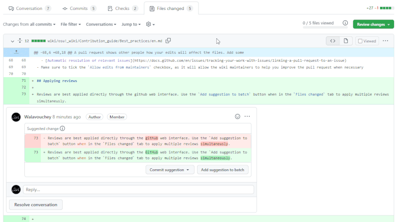
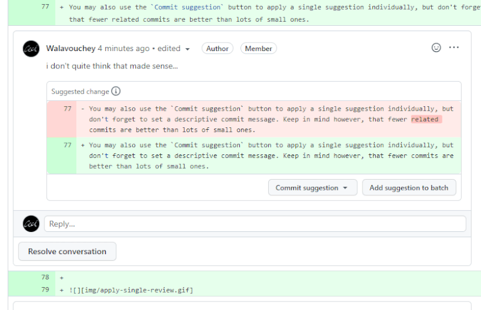

# Как правильно работать с вики

В этой статье рассказывается о том, с чем вы обязательно столкнётесь при редактировании вики. Описанные ниже шаги не только облегчат вашу жизнь, но и применимы в работе с другими проектами, живущими на GitHub или похожих платформах.

## Введение

::: alert-note
**Примечание:** Подробнее о Git и GitHub можно прочитать в [документации по GitHub](https://docs.github.com)
:::

**Git** — это система контроля версий, которая помогает отслеживать изменения в файлах. Данные osu! wiki, а также история всех правок хранятся в Git-репозитории. **GitHub** — это платформа для разработки, в которой есть веб-интерфейс для работы с Git-репозиториями, а также набор инструментов для управления проектами.

## Как синхронизировать форк

::: Infobox

:::

*Форк* — это «замороженная» копия исходного репозитория, которая не обновляется самостоятельно. Чтобы работать с самой свежей версией osu! wiki, форк нужно синхронизировать перед началом правок. Это можно сделать прямо через GitHub:

1. Откройте свой форк `osu-wiki`.
2. Выберите в выпадающем списке ветку `master`.
3. Нажмите на кнопку `Sync fork`.
   - Если вы правили что-то прямо в ветке `master` и хотите это сохранить, нажмите `Update branch`.
   - Если же вам нужна чистая копия, а свои правки больше не нужны, нажмите `Discard n commit(s)`.

## Внесение правок

::: alert-note
**См. также:** [Forking Workflow | Atlassian Git Tutorial](https://www.atlassian.com/git/tutorials/comparing-workflows/forking-workflow)
:::

В рамках своего форка osu! wiki вы можете вносить и сохранять различные изменения. **Коммит** — это отдельная точка сохранения репозитория. **Ветка** — это рабочее пространство, содержащее конкретные изменения; переключаясь между ветками, вы переходите между разными версиями репозитория. Чтобы упростить себе жизнь, а также не засорять общую историю правок, следуйте этим рекомендациям:

- [Синхронизируйте ветку `master`](#как-синхронизировать-форк) перед началом работы.
- Всегда отводите от `master` отдельную ветку и делайте все изменения только в ней. Чтобы не запутаться, где вы над чем работаете, давайте веткам осмысленные названия, например, `ru-ranking-criteria`.
- Делайте коммит, когда ваши изменения подходят к какой-то логической границе. К примеру, вместо десяти коммитов с разными правками одной и той же статьи лучше сделать один коммит, содержащий их все.
- **Давайте коммитам ёмкие и понятные описания**, чтобы другие люди могли сразу понять суть изменений. Фраза `Rewrite the section about jump patterns` лучше отражает содержание, чем стандартное `Update en.md`.

## Как отправить пулл-реквест

Через пулл-реквест вы сообщаете другим людям, как ваши правки влияют на содержание статей. Чтобы ваши намерения были лучше понятны остальным, напишите о них:

- `Title`: суть ваших изменений на английском вместе с именем статьи. Если вы сделали перевод, название нужно начать с кода языка в квадратных скобках. Примеры:
  - ``[RU] Add `BBCode` ``
  - ``Update `Beatmapping` and `Beatmap/Difficulty` ``
- `Description`: всё, что вы хотите донести до администраторов вики и потенциальных ревьюеров. Примеры:
  - Краткое описание изменений, особенно если они затрагивают несколько статей сразу;
  - Что ещё вам осталось сделать в рамках работы, либо планы на будущее;
  - Кроме того, через описание пулл-реквеста можно [автоматически закрывать issue](https://docs.github.com/en/issues/tracking-your-work-with-issues/linking-a-pull-request-to-an-issue)
- Не забудьте поставить галочку напротив пункта `Allow edits from maintainers` чтобы администраторы вики могли корректировать изменения без вашего участия.

## Как применять ревью

Ревью с готовыми предложениями удобнее всего применять через интерфейс GitHub. Чтобы принять несколько предложений сразу, перейдите на вкладку `Files changed`, затем прокликайте кнопку `Add suggestion to batch` около нужных замечаний и сохраните их одним коммитом.

Предложения можно принимать и по отдельности, нажимая под каждым на кнопку `Commit suggestion`, если они достаточно самостоятельны и если вы пишете к каждому коммиту [информативное описание](#внесение-правок).

При принятии готового предложения GitHub автоматически пометит замечание как решённое. Если вы вносите изменения самостоятельно (например, ревьюер объяснил проблему на словах, без готового решения), *сначала закоммитьте исправления*, а потом вручную решите замечания, чтобы ничего не забыть. По возможности пользуйтесь встроенными инструментами GitHub, поскольку они делают большинство работы за вас и предотвращают ошибки.

## Конфликтующие изменения

Конфликт изменений может произойти в двух случаях:

- Вы изменили файл в отставшей ветке, а в основном репозитории кто-то изменил этот же файл, но по-другому;
- Помимо вас, правкой статьи занимался другой человек, и его изменения были влиты раньше ваших.

В зависимости от сложности конфликтов, есть два решения.

1. Если в вашем пулл-реквесте есть кнопка `Resolve conflicts`, нажмите на неё, чтобы открыть редактор.
   1. Найдите один из конфликтов (GitHub их подсвечивает).
   2. Всё, что находится между маркерами `<<<<<<<` и `=======`, — ваши изменения; всё, что между `=======` и `>>>>>>> master`, — текущая версия статьи в `ppy/master`.
   3. Разрешите конфликт. Чтобы оставить вашу версию изменений, удалите правку, сделанную другим человеком; чтобы отказаться от ваших изменений, удалите их. В обоих случаях удалите маркеры `<<<<<<<`, `=======` и `>>>>>>> master`.
   4. Разрешите оставшиеся конфликты.
   5. Когда все конфликты будут решены, активируется кнопка `Mark as resolved` — нажмите на неё.
2. Если кнопка `Resolve conflicts` неактивна, вам придётся [обновить свою ветку](#как-синхронизировать-форк), **сбросив все изменения,** и внести их заново.
   - *Примечание: так стоит поступать, если вы пользуетесь только веб-интерфейсом GitHub. Решить конфликт возможно с помощью более сложных инструментов, но их описание выходит за рамки данной статьи.* Кроме того, иногда всё действительно проще переделать заново.
