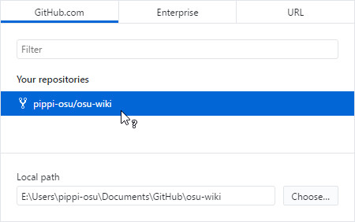
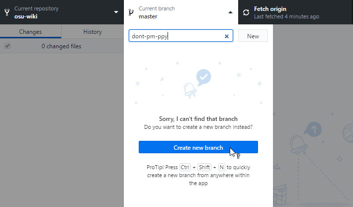
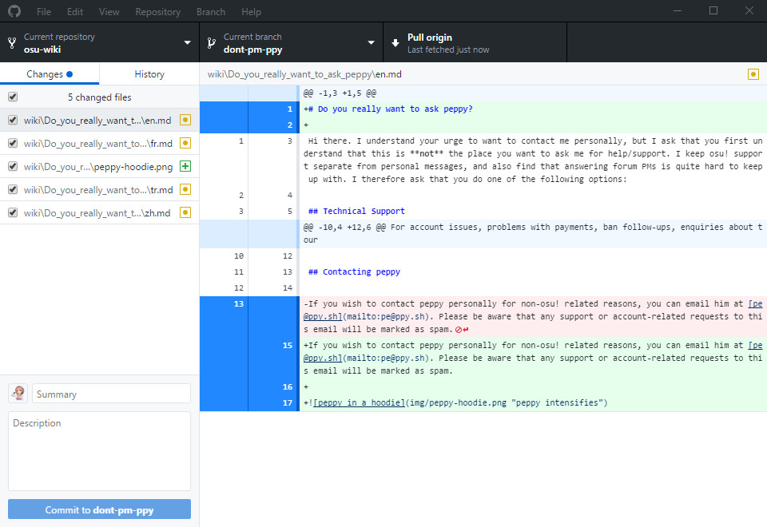
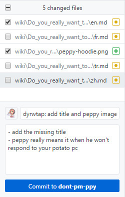
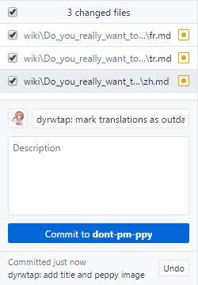
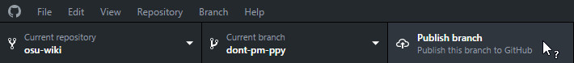

# GitHub Desktop

*บทความนี้ต่อจาก[หน้าหลัก](/wiki/osu!_wiki/Contribution_guide)* และสมมติว่าคุณจะใช้ [GitHub Desktop](https://desktop.github.com) **คุณสามารถใช้ Git clients อื่นได้ตามเงื่อนไขของคุณเอง** แม้จะทำงานในเครื่อง local คุณก็ยังต้องเข้า GitHub เพื่อสร้าง pull requests ให้การเปลี่ยนแปลงของคุณเกิดขึ้นจริง

## การติดตั้ง GitHub Desktop

1. ติดตั้ง [GitHub Desktop](https://desktop.github.com) หากยังไม่ได้ติดตั้งไว้
2. เมื่อติดตั้งเสร็จ GitHub Desktop จะให้คุณ sign in ให้คลิก `Sign in to GitHub.com`
3. กรอกข้อมูลตาม prompts ที่ปรากฏ
4. ไปต่อที่ [Cloning](#cloning)

## Cloning

1. คลิก `Clone a repository`

2. ระบบจะแสดงรายการ repos ของคุณ ให้เลือก repo `osu-wiki`

3. เลือกตำแหน่ง clone จะ clone repo ไว้ที่ไหนก็ได้ แค่จำให้ได้ว่า clone ไว้ที่ไหน

   

4. คลิก `Clone` ขั้นตอนนี้อาจใช้เวลาสักพักขึ้นอยู่กับสภาพ network ของคุณ

5. ไปต่อที่ [Branching](#branching)

## Branching

แม้ branching จะไม่บังคับในทางเทคนิค แต่ก็[แนะนำอย่างมากด้วยหลายเหตุผล](https://www.atlassian.com/git/tutorials/comparing-workflows/forking-workflow) ตัวอย่างเช่น:

- Branches แยกการเปลี่ยนแปลงเชิงตรรกะออกจากกัน คุณจึงทำงานมากกว่าหนึ่งบทความและให้ review/merge แยกกันได้
- เมื่อการเปลี่ยนแปลงของคุณอยู่นอก branch `master` คุณสามารถ [sync branch นั้นได้อย่างปลอดภัย](/wiki/osu!_wiki/Contribution_guide/Best_practices#syncing-the-fork) โดยไม่มี merge conflicts

1. คลิก dropdown `Current branch` ที่อยู่ด้านบนของเมนู

2. ใส่ชื่อ branch แนะนำให้ใช้สรุปการเปลี่ยนแปลงของคุณเป็นชื่อ branch ตัวอย่างเช่น หากแก้บทความ `Forums` อาจตั้ง branch ว่า `update-forums`

   

3. ไปต่อที่ [Editing](#editing)

## Editing

1. ในโฟลเดอร์ที่คุณ clone repo ไว้ ให้ไปยังไฟล์ที่ต้องการแก้ บทความจัดเรียงตามชื่อโฟลเดอร์ที่เป็นชื่อบทความ และไฟล์ `.md` เป็น locale ต่าง ๆ
2. เมื่อเจอไฟล์ที่ถูกต้องแล้ว ให้เปิดด้วย text editor ที่คุณชอบ
3. ตอนนี้คุณแก้ไขได้แล้ว อย่าลืมใช้เวลาตรวจ [self-check](/wiki/osu!_wiki/Contribution_guide#self-check) ด้วย
4. ไปต่อที่ [Committing and pushing](#committing-and-pushing)

### การย้ายไฟล์ที่มีอยู่

1. ใช้ Windows Explorer เพื่อย้ายไฟล์
2. ไปต่อที่ [Committing and pushing](#committing-and-pushing)

### การสร้างไฟล์ใหม่

*คำเตือน: หากคุณจะสร้างไฟล์บทความด้วย Windows Explorer ให้ตรวจว่าเปิดตัวเลือก `File name extensions` แล้ว* ดูวิธีได้ที่ [Common file name extensions in Windows](https://support.microsoft.com/en-us/windows/common-file-name-extensions-in-windows-da4a4430-8e76-89c5-59f7-1cdbbc75cb01)

1. ใช้ Windows Explorer, image editor ที่คุณชอบ และ/หรือ text editor ที่คุณชอบ เพื่อสร้างไฟล์ใหม่ หากคุณสร้างบทความใหม่หรือคำแปลใหม่ ให้เปลี่ยนชื่อไฟล์ตาม [Locales in the Article Styling Criteria](/wiki/Article_styling_criteria/Formatting#locales)
2. ไปต่อที่ [Committing and pushing](#committing-and-pushing)

### การลบไฟล์

1. ใช้ Windows Explorer เพื่อลบไฟล์
2. ไปต่อที่ [Committing and pushing](#committing-and-pushing)

## Committing and pushing

1. กลับไปที่ GitHub Desktop หน้าตาควรคล้าย ๆ แบบนี้:

   

2. โดยค่าเริ่มต้น GitHub Desktop จะเลือกการเปลี่ยนแปลงทั้งหมดของคุณให้อัตโนมัติ

3. แนะนำให้แยก "การกระทำใหญ่" แต่ละอย่างเป็น commit เดียว

   ตัวอย่างเช่น ในภาพด้านบน [pippi](/wiki/Mascots#pippi) ได้เพิ่มไฟล์รูป แก้ไฟล์ `en.md` เพื่อเพิ่ม title และลิงก์ไปยังรูป และ mark translations เป็น outdated จากตรงนี้ เราสามารถมี 2 commits คือ commit หนึ่งสำหรับการเปลี่ยนแปลงที่กระทบไฟล์ `en.md` และอีก commit สำหรับการ mark translations เป็น outdated

4. เลือกไฟล์ที่จะ commit

5. ใส่ commit summary ข้อความนี้จำกัด 72 ตัวอักษรและ **ต้องเป็นภาษาอังกฤษ**

6. ใส่ description ส่วนนี้ไม่บังคับ ไม่จำกัดจำนวนตัวอักษร และใช้ภาษาใดก็ได้

   

7. คลิกปุ่มสีน้ำเงิน `Commit to` และถ้ามี ให้เริ่มใหม่จากขั้นตอนที่ 4 เพื่อทำ commit อื่นที่ต้องการ

   

8. เมื่อทำ commit เสร็จแล้ว ให้คลิกปุ่ม `Publish branch` ด้านบน

   

9. ไปต่อที่ [Review](/wiki/osu!_wiki/Contribution_guide#review) สำหรับข้อมูลสุดท้ายเกี่ยวกับ pull request และการเปลี่ยนแปลงของคุณ
