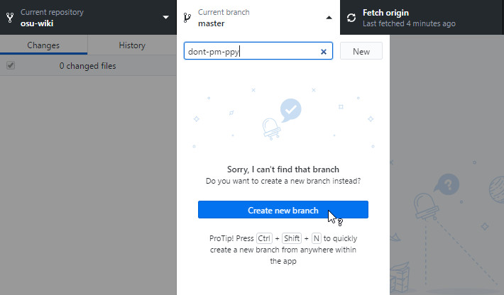

# GitHub Desktop

*Bài viết này tiếp tục từ [trang chính](/wiki/osu!_wiki/Contribution_guide)* và coi rằng bạn sẽ sử dụng [GitHub Desktop](https://desktop.github.com). **Bạn có thể sử dụng Git client khác theo ý thích của mình**. Kể cả khi bạn làm việc cục bộ, bạn vẫn cần truy cập GitHub để tạo pull request để làm cho các thay đổi của bạn có thể được thực hiện.

## Cài đặt GitHub Desktop

1. Cài đặt [GitHub Desktop](https://desktop.github.com) nếu bạn chưa làm điều đó.
2. Sau khi việc cài đặt hoàn tất, GitHub Desktop sẽ yêu cầu bạn đăng nhập, nhấn `Sign in to GitHub.com`.
3. Điền các thông tin cần thiết khi được yêu cầu.
4. Tiến đến phần [Nhân bản (Cloning)](#nhân-bản-(cloning)).

## Nhân bản (Cloning)

1. Nhấn vào `Clone a repository`.

2. Ứng dụng sẽ hiện danh sách các repo của bạn, chọn repo `osu-wiki`.

3. Chọn vị trí nhân bản. Không quan trọng việc bạn nhân bản ở chỗ nào, miễn bạn nhớ chỗ đó là được.

   

4. Nhấn `Clone`. Có thể mất một khoảng thời gian tuỳ vào tình trạng Internet.

5. Tiến đến phân nhánh [Phân nhánh (Branching)](#phân-nhánh-(branching)).

## Phân nhánh (Branching)

Tuy việc phân nhánh không bắt buộc, nhưng nó [được khuyến nghị với khá nhiều lý do](https://www.atlassian.com/git/tutorials/comparing-workflows/forking-workflow). Ví dụ:

- Phân nhánh cô lập các thay đổi logic khác nhau: bạn có thể làm việc với nhiều bài viết cũng như được đánh giá và merge một cách riêng biệt.
- Nếu các thay đổi nằm ngoài nhánh `master`, bạn có thể [đồng bộ chúng an toàn](/wiki/osu!_wiki/Contribution_guide/Best_practices#đồng-bộ-fork) mà không gặp xung đột khi merge.

1. Nhấn vào trình đơn thả xuống `Current branch` ở menu trên cùng.

2. Nhập tên nhánh. Chúng tôi đề nghị việc tổng hợp các thay đổi của bạn làm tên nhánh. Lấy ví dụ, bạn có thể đặt tên nhánh là `update-forums` khi sửa bài viết `Diễn đàn (Forums)`.

   

3. Đi tới [Sửa đổi](#sửa-đổi).

## Sửa đổi

1. Trong thư mục mà bạn vừa nhân bản repo, điều hướng tới tệp bạn muốn sửa. Bài viết được sắp xếp với tên thư mục là tên của các bài viết, còn các tệp `.md` là các bản dịch.
2. Sau khi tìm được tệp, mở nó bằng trình soạn thảo văn bản mà bạn thích.
3. Giờ bạn có thể thực hiện các thay đổi. Hãy bỏ một chút thời gian để học qua phần [tự kiểm tra](/wiki/osu!_wiki/Contribution_guide#self-check).
4. Đi tới [Committing và pushing](#committing-và-pushing).

### Di chuyển các tệp có sẵn

1. Sử dụng Windows Explorer dể di chuyển các tệp.
2. Đi tới [Committing and pushing](#committing-và-pushing).

### Tạo tệp mới

*Chú ý: Nếu bạn định tạo tệp bài viết bằng Windows Explorer, hãy đảm bảo lựa chọn `File name extensions` đang được bật.* Xem [Đuôi tên tệp phổ biến trong Windows](https://support.microsoft.com/vi-vn/windows/đuôi-tên-tệp-phổ-biến-trong-windows-da4a4430-8e76-89c5-59f7-1cdbbc75cb01) để biết thêm thông tin.

1. Sử dụng Windows Explorer, phần mềm chỉnh sửa hình ảnh, và/hoặc trình soạn thảo văn bản mà bạn ưa thích để tạo tệp mới. Nếu bạn tạo bài viết hoặc bản dịch mới, đổi tên tệp tuân theo [Ngôn ngữ trong Tiêu chuẩn tạo kiểu bài viết](/wiki/Article_styling_criteria/Formatting#locales).
2. Đi tới [Committing và pushing](#committing-và-pushing).

### Xoá tệp

1. Sử dụng Windows Explorer để xoá các tệp.
2. Đi tới [Committing và pushing](#committing-và-pushing).

## Committing và pushing

1. Quay trở lại GitHub Desktop. Nó sẽ trông giống như thế này:

   

2. Mặc định GitHub Desktop sẽ tích chọn mọi thay đổi của bạn.

3. Tốt nhất là hãy tách mỗi hành động "lớn" của bạn làm một commit.

   Ví dụ, như ở hình trên, [pippi](/wiki/Mascots#pippi) đã thêm một tệp hình ảnh, chỉnh sửa tệp `en.md` để thêm tiêu đề và đường dẫn tới hình ảnh đó, và đánh dấu bản dịch lỗi thời. Ở trường hợp này, chúng ta nên tạo 2 commit, một cái về việc thay đổi tệp `en.md`, và một cái là đánh dấu bản dịch bị lỗi thời.

4. Chọn các tệp mà bạn định commit.

5. Điền tổng thể về commit của bạn. Phần này bị giới hạn 72 ký tự và **phải được viết bằng tiếng Anh**.

6. Điền mô tả. Phần này không bắt buộc, không có giới hạn ký tự và có thể được viết bằng bất cứ ngôn ngữ nào.

   

7. Nhấn vào nút mày xanh lam `Commit to`, và nếu cần, tiến hành lại từ bước 4 với các commit khác bạn định thực hiện.

   

8. Sau khi thực hiện xong các commit của mình, nhấn vào `Publish branch` ở trên cùng.

   

9. Đi tới [Đánh giá](/wiki/osu!_wiki/Contribution_guide#review) để biết thêm các thông tin cuối cùng về việc tạo pull request của bạn.
