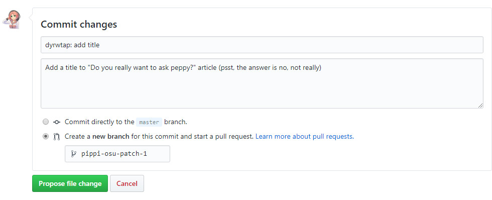

# GitHub Web Interface

*Artikel ini merupakan lanjutan dari [laman utama sebelumnya](/wiki/osu!_wiki_Contribution_Guide).* Jika kamu akan membuat perubahan pada beberapa artikel (termasuk mengunggah, menghapus, dan/atau memindahkan gambar atau file), silakan lihat panduan lainnya, [GitHub Desktop](/wiki/osu!_wiki_Contribution_Guide/GitHub_Desktop).

## Menyunting

1. Buka menu kode di fork kamu (kamu seharusnya sudah ada di tab ini).

2. Cari file yang akan kamu sunting. Artikel-artikel tersebut terletak di folder `wiki` dan nama folder yang digunakan biasanya mengacu juga pada nama artikel, sedangkan file `.md` adalah terjemahannya.

3. Setelah kamu menemukan file yang akan disunting, klik filenya.

4. Lalu klik ikon pensil.

   

5. Kamu sekarang dapat membuat penyuntingan yang hendak kamu lakukan. Saat membuat perubahan, mohon ikuti [Kriteria Penyusunan Artikel](/wiki/ASC) sebisa mungkin.

6. Lanjutkan ke tahap [Menyimpan dan melakukan commit](#menyimpan-dan-melakukan-commit).

### Memindahkan file

*Peringatan: Hal ini **tidak disarankan** karena kamu hanya dapat memindahkan satu file dalam satu waktu! Hal ini dapat membuat beberapa commit "bodoh" yang dapat menandai peninjau untuk [menutup atau menghentikan pull request kamu](/wiki/osu!_wiki_Contribution_Guide/Common_Issues#seseorang-mengatakan-kepada-saya-untuk-meninggalkan-pesan-commit-yang-lebih-berarti!)!*

1. Cari file yang akan kamu pindahkan dan buka.

2. Lalu klik ikon pensil.

3. Di atas editor teks, ada jalur (path) yang memberikan lokasi file, klik pada kotak teks (textbox) untuk file saat ini.

   

4. Untuk mengubah jalur filenya, tekan `Backspace` dan ulangi hingga kotak teks bergerak kembali satu level. Untuk memindahkan file ke level selanjutnya, tekan `/`.

5. Setelah kamu berada di level yang diperlukan, ketik nama folder lain dan/atau nama locale (kode negara dalam 2 huruf menggunakan huruf kecil) diikuti dengan `.md`.

6. Lanjutkan ke tahap [Menyimpan dan melakukan commit](#menyimpan-dan-melakukan-commit).

### Membuat file

1. Buka menu kode di fork kamu.
2. Arahkan ke folder tempat file akan diunggah.
3. Klik tombol `Create new file`.
4. Masukkan lokasi dan/atau name file dari artikel yang kamu buat. Jalur harus dimulai dengan `wiki/`, diikuti oleh judul artikel, lalu nama locale (kode negara dalam 2 huruf menggunakan huruf kecil) diikuti oleh `.md`. Untuk daftar locale yang tersedia, kamu bisa mengunjungi [Kriteria Penyusunan Artikel](/wiki/Article_styling_criteria/Formatting#locales).
5. Lanjutkan ke tahap [Menyimpan dan melakukan commit](#menyimpan-dan-melakukan-commit).

### Mengunggah file

1. Buka menu kode di fork kamu.
2. Arahkan ke folder tempat file akan diunggah.
3. Klik tombol `Upload files`.
4. Pilih file yang akan kamu unggah.
5. Lanjutkan ke tahap [Menyimpan dan melakukan commit](#menyimpan-dan-melakukan-commit).

*Catatan: Kamu juga dapat mengunggah dalam bentuk folder.* Hal ini akan berguna bagi mereka yang akan membuat artikel baru secara lokal.

### Menghapus file

*Peringatan: Hal ini **tidak disarankan** karena kamu hanya dapat memindahkan satu file dalam satu waktu! Hal ini dapat membuat beberapa commit "bodoh" yang dapat menandai peninjau untuk [menutup atau menghentikan pull request kamu](/wiki/osu!_wiki_Contribution_Guide/Common_Issues#seseorang-mengatakan-kepada-saya-untuk-meninggalkan-pesan-commit-yang-lebih-berarti!)!*

1. Buka menu kode di fork kamu.
2. Arahkan ke folder tempat file akan diunggah.
3. Klik pada ikon tempat sampah.
4. Lanjutkan ke tahap [Menyimpan dan melakukan commit](#menyimpan-dan-melakukan-commit).

## Menyimpan dan melakukan commit

1. Ketika kamu telah selesai menyunting, gulir (scroll) ke bagian bawah halaman. Kamu akan melihat sesuatu yang mirip dengan gambar di bawah ini:

   

2. **Apa pun yang kamu lakukan, jangan pernah meninggalkan kotak teks judul kosong!** Untuk mengisinya, masukkan judul artikel dan ringkasan singkat dari semua perubahan yang kamu buat **dalam Bahasa Inggris**.

3. Jika perlu, kamu juga dapat menggunakan kotak teks deskripsi opsional untuk membuat log perubahan lebih rinci. Commit yang baik bisa dinilai seperti berikut:

   

4. Jika ini adalah hasil suntingan pertama yang kamu buat untuk artikel ini, pilih opsi `Create a new branch for this commit and start a pull request`. Pilihan ini akan memungkinkan kamu untuk membuat beberapa artikel yang berbeda-beda, perubahan artikel di masa yang akan datang (lanjutkan ke langkah 5). Jika tidak, pilih `Commit directory to the {xxxxxx} branch.` (dan lewat ke langkah 6).

5. Beri nama branch ini dengan apa pun yang kamu inginkan, pastikan kamu telah mencatat nama yang kamu pilih.

6. Klik tombol berwarna hijau, dengan mengklik tombol ini kamu akan diberikan dialog `Propose file change` atau `Commit changes`, tergantung apakah kamu ingin membuat branch baru atau tidak.

7. Setelah proses langkah 6 terlewati, maka akan terjadi dua hal, menyimpan perubahan kamu ke dalam branch yang baru yang telah kamu beri nama dan akan membuka laman pull request.

   ")

8. Lanjutkan ke tahap [Penyelesaian](/wiki/osu!_wiki_Contribution_Guide#penyelesaian) untuk informasi terakhir mengenai pull request dan perubahan yang kamu lakukan.
