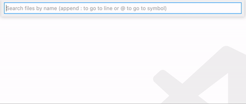
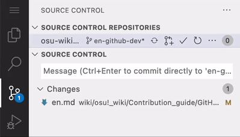

# GitHub web-based editor

*หมายเหตุ: บทความนี้ใช้ key combinations ของ Windows*\
*ดูเพิ่มเติม: [The github.dev web-based editor - GitHub Docs](https://docs.github.com/en/codespaces/the-githubdev-web-based-editor)*

[github.dev](https://github.dev) คือ [Visual Studio Code](https://code.visualstudio.com) เวอร์ชันเว็บสาธารณะที่ปรับมาสำหรับ GitHub เมื่อเทียบกับ web editor ของ GitHub เอง มันยืดหยุ่นและควบคุมเนื้อหาใน repository ได้มากกว่า github.dev เป็นวิธีที่แนะนำสำหรับการมีส่วนร่วมกับ osu! wiki โดยเฉพาะเมื่อต้องทำงานกับหลายบทความพร้อมกัน

## Navigation

*หมายเหตุ: หากต้องการทำงานกับ osu! wiki ให้ **[fork repository `ppy/osu-wiki`](/wiki/osu!_wiki/Contribution_guide#editing-the-wiki)** ก่อน*

หากต้องการเปิด osu! wiki ใน editor ให้แทนที่ `github.com` ใน URL ของ fork repository ของคุณด้วย `github.dev` หรือเปิด fork ของคุณบน GitHub แล้วกด `.` (period)

::: Infobox

:::

แม้ทุกเมนูจะเข้าถึงได้จาก interface ของ editor แต่วิธี navigation ที่ตั้งใจให้ใช้คือ **command palette**:

- กด `F1` แล้วใส่ชื่อ setting ที่ต้องการเปิด หรือ action ที่ต้องการทำ หากไม่มีอะไรขึ้นมา ให้ลองสำรวจ hamburger menu (`≡`) ที่มุมซ้ายบนของหน้าจอ
- หากต้องการเปิดไฟล์ กด `Ctrl` + `P` แล้วใส่ชื่อไฟล์

## Branching

หลังจากอ่าน [Best practices § Making changes](/wiki/osu!_wiki/Contribution_guide/Best_practices#making-edits) แล้ว ให้สร้าง branch ใหม่เพื่อเก็บการเปลี่ยนแปลงของคุณ

1. คลิกชื่อ branch ปัจจุบันที่มุมซ้ายล่าง หรือกด `F1` แล้วพิมพ์ `branch`
   - เลือก `Create new branch...`, ใส่ชื่อ branch แล้วกด `Enter`
   - เพื่อช่วยให้จำได้ว่างานของคุณเกี่ยวกับอะไรโดยคร่าว ๆ ให้เลือกชื่อที่อธิบายงาน ตัวอย่างเช่น สำหรับคำแปลภาษาเยอรมันของ [Beatmap Discussion](/wiki/Beatmap_discussion) คุณอาจใช้ `de-modding-v2`
2. หากต้องการกลับมายังการเปลี่ยนแปลงของคุณ ให้เลือกชื่อ branch ที่เหมาะสมจาก dropdown ที่กล่าวไปก่อนหน้านี้

## Editing

### ไฟล์ที่มีอยู่

1. กด `Ctrl` + `P` แล้วใส่ชื่อไฟล์ที่ต้องการเปิด จากนั้นกด `Enter` รองรับ loose matching เช่น พิมพ์ `nominators veto en` จะพาไปที่ `wiki/People/The_Team/Beatmap_Nominators/Beatmap_Veto/en.md`
2. แก้ไขไฟล์ตามต้องการ การเปลี่ยนแปลงที่ยังไม่ได้ commit จะ **ถูกเก็บไว้ใน browser ของคุณ** และคุณสามารถกลับมาทำต่อได้หลังออกจาก `github.dev`
3. เมื่อพอใจกับบทความแล้ว ให้ [commit การเปลี่ยนแปลง](#committing-changes)

### บทความหรือคำแปลใหม่

บทความถูกเก็บไว้ในโฟลเดอร์ที่มีต้นฉบับ (`en.md`) และคำแปล ซึ่งใช้ชื่อไฟล์ตามภาษา

- หากต้องการเพิ่ม **คำแปล** ใหม่ให้บทความที่มีอยู่ ให้คลิกขวาโฟลเดอร์ของบทความนั้น แล้วสร้างไฟล์ `.md` ใหม่โดยใช้[หนึ่งในชื่อไฟล์ที่รองรับ](/wiki/Article_styling_criteria/Formatting#locales)
- หากต้องการเพิ่ม **บทความ** ใหม่ ให้ทำดังนี้:
  - สร้างโฟลเดอร์ในหมวดที่เหมาะสมตาม [naming convention](/wiki/Article_styling_criteria/Formatting#folder-and-file-structure) หากบทความไม่เข้าหมวดใด ให้สร้างโฟลเดอร์ใน directory `/wiki/`
  - เพิ่มไฟล์ `en.md` พร้อมข้อความของบทความลงในโฟลเดอร์ใหม่

### การทำงานกับไฟล์

- เปิด built-in file explorer (`Ctrl` + `Shift` + `E`)
- ย้ายไฟล์หรือ directory ด้วยการลากไปมา กด `Ctrl` ค้างไว้เพื่อเลือกหลาย object
- หากต้องการ rename หรือลบไฟล์หรือ directories ให้ใช้ context menu หรือกด `F2`
- หากต้องการอัปโหลดไฟล์ ให้ลากไฟล์ไปยังตำแหน่งที่เหมาะสมใน file explorer

## Committing changes

::: Infobox

:::

1. เปิด source control view (`Ctrl` + `Shift` + `G`)
2. คลิกปุ่ม `+` บนไฟล์ที่ต้องการบันทึกเป็น batch เดียว
3. ใส่ commit message เป็นภาษาอังกฤษ **ใช้ commit message ที่สั้นและมีความหมาย** เพราะช่วยให้คนอื่นรู้ว่าข้างในมีอะไร
4. กด `Ctrl` + `Enter` หรือคลิกปุ่ม `✓` เพื่อ commit และ push การเปลี่ยนแปลงของคุณ

## ขั้นต่อไป

เมื่อทุกอย่างพร้อมแล้ว ใช้ [Best practices § Self-check](/wiki/osu!_wiki/Contribution_guide#self-check) เพื่อตรวจทานการเปลี่ยนแปลงของคุณ หลังจากนั้น ส่งการเปลี่ยนแปลงให้ review โดย[เปิด pull request](/wiki/osu!_wiki/Contribution_guide#pull-request) ไปยัง repository `ppy/osu-wiki`
