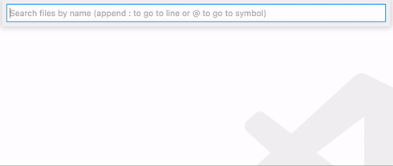
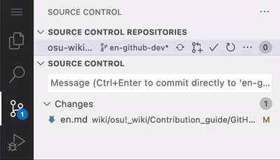

# Веб-орієнтований редактор GitHub

*Зауважте: Ця стаття використовує комбінації клавіш Windows.*\
*Перегляньте також: [The github.dev web-based editor - GitHub Docs](https://docs.github.com/en/codespaces/the-githubdev-web-based-editor)*

[github.dev](https://github.dev) це загальнодоступа веб-орієнтована версія редактору [Visual Studio Code](https://code.visualstudio.com), створена спеціально для GitHub. У порівнянні з власним редактором GitHub, він надає набагто більше гнучкості і контролю над вмістом репозиторію. github.dev — рекомендований спосіб роботи з osu! wiki, особливо якщо працювати над декількома статтями одночасно.

## Навігація

*Зауважте: Щоб працювати з osu! wiki, **[зробіть форк репозиторію `ppy/osu-wiki`](/wiki/osu!_wiki/Contribution_guide#редагування-wiki).***

Для того, щоб відкрити osu! wiki в редакторі, замініть `github.com` в посиланні вашого репозиторію на `github.dev`. Як альтернативний варіант, можете відкрити ваш форк на GitHub і натиснути `.` (крапку).

::: Infobox

:::

Не зважаючи на те, що всі меню доступні через інтерфейс редактора, найкращий спосіб навігації — використовуючи **палітру команд**, так як було задумано розробниками:

- Натисніть `F1` та введіть назву налаштування, або дії, яку потрібно виконати. Якщо нічого не з'являється, загляньте в меню (`≡`) у лівому верхньому куті екрану.
- Щоб відкрити файл, натисніть `Ctrl` + `P` та введіть його назву.

## Створення гілок

Після прочитання статті [Найкращі практики § Внесення змін](/wiki/osu!_wiki/Contribution_guide/Best_practices#внесення-змін), створіть нову гілку для збереження ваших змін.

1. Натисніть на назву поточної гілки в лівому нижньому куті, або клавішу `F1` та введіть `branch`.
   - Оберіть `Create new branch...`, введіть назву гілки і натисніть `Enter`.
   - Щоб допомогти собі запам'ятати чого стосується ваша робота, оберіть відповідну назву. Наприклад, для українського перекладу сторінки [Обговорення Бітмап](/wiki/Beatmap_discussion), можна використати назву `uk-modding-v2`.
2. Щоб повернути ваші зміни, оберіть гілку з відповідною назвою в раніше згаданому випадаючому списку.

## Редагування

### Існуючі файли

1. Натисніть `Ctrl` + `P` та введіть назву файлу, який ви хочете відкрити, потім натисніть `Enter`. Можна вводити неточні назви: наприклад, написавши `nominator veto en` знайде `wiki/People/The_Team/Beatmap_Nominators/Beatmap_Veto/en.md`.
2. Відредагуйте файл як потрібно. Зміни, які ще не додані до коміту, **зберігаються у вашому браузері** і ви можете повернутися до них після виходу з `github.dev`.
3. Коли ви будете задовлені статтею/статтями, [зробіть коміт ваших змін](#коміт-змін).

### Нові статті або переклади

Статті зберігаються у папках разом з оригінальним текстом (`en.md`) та їх перекладами. Переклади мають назви файлів відповідні до їх мови.

- Щоб додати новий **переклад** для існуючої статті, натисніть правою кнопкою миші на папку і створіть новий файл `.md`, використовуючи [одну з доступних назв файлів](/wiki/Article_styling_criteria/Formatting#locales).
- Щоб створити нову **статтю**, виконайте наступне:
  - Створіть папку у відповідній категорії слідуючи [способам найменування](/wiki/Article_styling_criteria/Formatting#folder-and-file-structure). Якщо стаття нікуди не належить, створіть для неї власну папку в директорії `/wiki/`.
  - Додайте файл `en.md` до нової папки, разом з текстом статті в середині нього.

### Дії з файлами

- Відкрийте вбудований файловий провідник (`Ctrl` + `Shift` + `E`).
- Для переміщення файлу або папки, просто перетягніть їх. Утримуйте `Ctrl`, щоб вибрати декілька об'єктів.
- Щоб перейменовувати, або видаляти файли чи директорії, використовуйте контекстне меню, або натисніть `F2`.
- Щоб вивантажити файл, перетягніть його у відповідне місце файлового провідника.

## Коміт змін

::: Infobox

:::

1. Відкрийте перегляд джерела (`Ctrl` + `Shift` + `G`).
2. Натисніть кнопку `+` на файлах, які ви бажаєте зберегти в одному коміті.
3. Введіть повідомлення коміту англійською. **Використовуйте коротке і змістовне повідомлення коміту**, оскільки це допомогає іншим зрозуміти що всередині.
4. Натисніть `Ctrl` + `Enter`, або клацніть кнопку `✓`, щоб зберегти коміт і запушити ваші зміни.

## Що далі

Коли все готово, використайте [Найкращі практики § Самоперевірка](/wiki/osu!_wiki/Contribution_guide#self-check), щоб перевірити ваші зміни. Після цього, відправте їх на огляд [відкривши пул реквест](/wiki/osu!_wiki/Contribution_guide#пул-реквест) до репозиторію `ppy/osu-wiki`.
