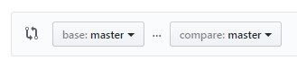
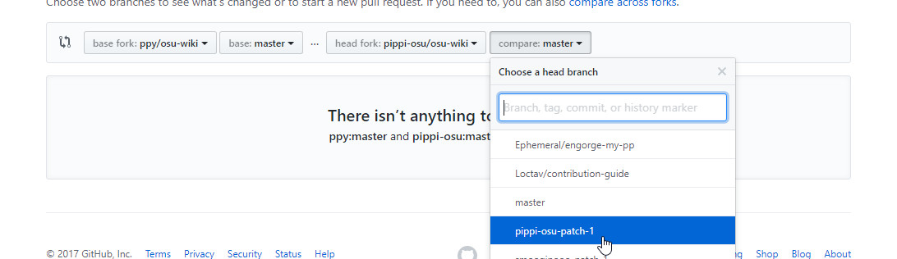
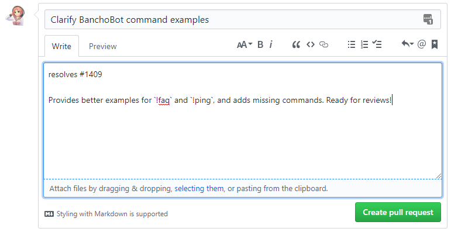

# osu! wiki contribution guide

osu! wikiの改善に興味を持ってくださりありがとうございます! このクイックスタートガイドはGitHubを使って作業をしたことがない、もしくはosu! wikiの作業をしたことがない人のために作られました。 もしあなたにGitHubを使った経験があれば、このガイドを遠慮なくスキップして、通常のフィーチャーブランチ作業に則って、リポジトリの内容をアップデートしてください。

もし作業中に困ったことができたり、助けが必要になったりしたら、遠慮なく[osu!dev Discord](https://discord.gg/ppy) (`#osu-wiki` チャンネル)にメッセージを送ってください。

## はじめる前の準備

### 登録

1. もし持っていなければ、[ここ](https://github.com/join) からGitHubアカウントを作成してください。
2. [ログイン](https://github.com/login)してください。
3. [フォーク](#フォーク)へ進んでください。

### フォーク

1. [`osu-wiki` リポジトリ](https://github.com/ppy/osu-wiki)を開いてください。

2. `Fork`をクリックしてください。

   

3. もう一度`Fork`をクリックしてあなたがフォークしたリポジトリに進んでください。

4. 下の画像のように、`ppy/osu-wiki`リポジトリのフォークを作り、現在それを開いていることを確認してください。

   

5. [フォークを同期する](#フォークを同期する)へ続けてください。

### フォークを同期する

1. 自分の`osu-wiki`リポジトリのフォークを開いてください。

2. ファイルリストの上に、あなたのブランチが`ppy:master`ブランチと比べて遅れている(behind)、進んでいる(ahead)、または同じ状態にある(even)かが表示されます。もし遅れたコミットと一緒に"behind"もしくは"ahead and behind"と表示されている場合、あなたのブランチは過去のバージョンです。

   ")

   ")

   ")

   ")

3. もし他の人によってすでに変更されたファイルを変更する予定がない場合、これはさほど大きな問題ではありません。

4. これを解決するには、[My branch is out of date! section in the Common Issues article](/wiki/osu!_wiki/Contribution_guide/Best_practices#syncing-the-fork)を読んでください。

5. 4が完了したら、 [オンラインかローカルで編集する](#オンラインかローカルで編集する)へ続けてください。

## オンラインかローカルで編集する

編集する方法は大きく2つあります。

- [GitHub Web Interface](/wiki/osu!_wiki/Contribution_guide/GitHub_web-based_editor) - オンラインで編集します。一人で編集をするのに適しています。
- [GitHub Desktop](/wiki/osu!_wiki/Contribution_guide/GitHub_Desktop) - ローカルで編集します。これは複数人で編集するのに適しています。（特に画像やファイルを移動したり削除したりするのに適しています。）

*ちなみに: 編集するのにこれらの方法しか使ってはいけないわけではありません。このガイドを短く簡潔にするために、ここでは他のツールについて多くは語りません。他にも上の２つのような働きをするアプリケーションが存在します。*

**GitHub Web InterfaceやGitHub Desktopなどで作業を完了させた後で次のセクションへ続けてください。**

## 最後に

### プルリクエストを開く

1. [`ppy/osu-wiki` レポジトリ](https://github.com/ppy/osu-wiki)を開いてください。

2. あなたの作業が早ければ、黄色いバナーが表示されます。

   

3. もし表示されていれば、 `Compare & pull request` ボタンを押してください。 (ステップ8まで飛ばしてください。) もし表示されていなければ、 `New pull request` ボタンを押してください。 (ステップ4へ続けてください。)

4. 表示されたページには、以下の写真のような2つのボタンがあります。 `compare across forks` ボタンを押してください。

   

5. `head fork` ドロップダウンをクリックしてあなたのユーザーネームが入っているものを選んでください。 (2つ目にあるはずです。)

   

6. `compare` ドロップダウンをクリックしてあなたが作成したブランチを選択してください。 (アルファベット順に並んでいます。)

   

7. `Create pull request`をクリックしてください。

8. 英語でタイトルを入力してください。タイトルは短くあなたが何をしたかを明白にするようなものにしてください。

   文章を翻訳した場合は、2文字の言語名をタイトルの前に入れてください。そして、タイトルはあなたが翻訳した文章の名前にして構いません。例えば、 `[JA] BBCode` は日本語で [BBCode article](/wiki/BBCode) を翻訳したことを示すことができます。

9. 説明欄にあなたが変更したことの解説を書いてください。あなたはプルリクエストについて関連することを書くべきです。例えば、進捗状況や、レビュワーに知っておいてほしいことなどです。また、説明欄に"resolves #1" か "closes #1"と書くことでマージされたときにIssueを同時に閉じることができます。(詳しくは [Closing issues using keywords](https://help.github.com/articles/closing-issues-using-keywords/) を見てください。).

10. 準備ができれば、`Create pull request`を押してください。

    

11. 下の [レビュー](#レビュー) と [マージ](#マージ) を読んでください。

### レビュー

プルリクエストを一度作成すると、他のosu! wikiの作成者が、あなたのプルリクエストをより良いものにするためにレビューをしてくれるかもしれません。 **あなたはそれらのレビューに協力的でなければなりません。** さもないと、あなたのプルリクエストは取り消されるかもしれません! もしあなたのプルリクエストを誰かにみてもらいたければ、[osu!dev Discord](https://discord.gg/ppy) (`#osu-wiki` チャンネル) やGithubのコメントで他のosu! wikiの編集者に聞いてみるといいかもしれません。

### マージ

あなたの変更をosu! wikiに実際に反映させるためには、あなたのプルリクエストはマージという作業を経る必要があります。あなたのプルリクエストが、レビューされ、承認(approved)されると、Githubのコメント欄や[osu!dev Discord](https://discord.gg/ppy) (`#osu-wiki` チャンネル)でマージしてもらうように尋ねることができます。無事にマージされれば、あなたの変更は５時間ほどで実際にosu! wikiに反映されます。
