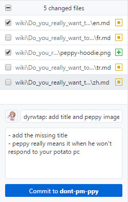
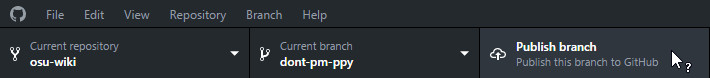

# GitHub Desktop

*Cet article est la continuité de la page principale* et suppose que vous utiliserez [GitHub Desktop](https://desktop.github.com). **Vous pouvez utiliser d'autres clients git à vos propres conditions.** Même si vous travaillez en local, vous devrez toujours accéder à GitHub pour créer des pull request permettant d'effectuer vos modifications.

## Installer GitHub Desktop

1\. Installer [GitHub Desktop](https://desktop.github.com) si vous ne l'avez pas déjà installé.

2\. Lorsque le programme d'installation est terminé, GitHub Desktop vous invitera à vous connecter, cliquez sur `Sign in to GitHub.com`.

3\. Remplissez les invites telles qu'elles apparaissent.

4\. Continuer à [Clonage](#clonage).

## Clonage

1\. Cliquer sur `Clone a repository`.

2\. Cela affichera une liste de vos repos; sélectionnez le `osu-wiki`.

3\. Sélectionnez l'emplacement du clone. Peu importe où vous clonez le repo, rappelez-vous juste où vous l'avez cloné.

4\. Cliquez sur `Clone`. Cela peut prendre un certain temps en fonction de votre environnement réseau.

5\. Continuer à [Branching](#branching).

## Branching

*Remarque: Ceci est techniquement optionnel, mais fortement recommandé pour des raisons que vous devrez rechercher vous-même.*

1\. Cliquez sur le menu déroulant  `Current branch`. Celui-ci est situé en haut du menu.

2\. Entrez un nom pour cette branche. Il est suggéré d'utiliser le nom de l'article que vous modifiez en tant que nom de branche suivi d'un numéro. Par exemple, pour éditer l'article `Forums` il faudra appeller la branche `forums1`.

3\. Continuez à [Édition](#édition).

## Édition

1\. Dans le dossier dans lequel vous avez cloné le référentiel, accédez au fichier que vous souhaitez modifier. Les articles sont organisés en fonction des noms de dossier, à savoir les noms d’articles et les fichiers `.md` en local.

2\. Une fois que vous avez trouvé le bon fichier, ouvrez-le à l'aide de votre éditeur de texte préféré.

3\. Vous pouvez maintenant apporter vos modifications. Lorsque vous effectuez des modifications, essayez de suivre les [Critères de style pour les Article](/wiki/ASC) du mieux que vous pouvez.

4\. Continuez à [Committing et pushing](#committing-and-pushing).

### Déplacement de fichiers existants

1\. Utilisez l'explorateur Windows pour déplacer des fichiers.

2\. Continuez à [Committing and pushing](#committing-and-pushing).

### Créer de nouveaux fichiers

*Attention: Si vous envisagez de créer des fichiers d’article à l’aide de l’explorateur Windows, assurez-vous que l'option `Extensions de nom de fichier` est activée.* Voir [Comment afficher ou masquer les extensions de nom de fichier dans l'Explorateur Windows](https://support.microsoft.com/en-us/help/865219/how-to-show-or-hide-file-name-extensions-in-windows-explorer) pour les instructions.

1\. Utilisez l'explorateur Windows, votre éditeur d'images préféré et/ou votre éditeur de texte préféré pour créer de nouveaux fichiers. Si vous créez de nouveaux articles ou traductions, renommez le fichier pour suivre les instructions des [Paramètres régionaux dans les critères de style d'article](/wiki/ASC#locales).

2\. Continuer à [Committing and pushing](#committing-and-pushing).

### Suppression de fichiers

1\. Utilisez l'explorateur Windows pour supprimer des fichiers.

2\. Continuez à [Committing and pushing](#committing-and-pushing).

## Committing and pushing

1\. Retournez sur GitHub Desktop. Cela devrait ressembler à ceci :

2\. Par défaut, GitHub Desktop sélectionnera automatiquement toutes vos modifications.

3\. Il est préférable de séparer chaque "grosse" action en un seul commit.

Par exemple, comme illustré ci-dessus, [pippi](/wiki/Mascots#-pippi) avait ajouté un fichier image, modifié le fichier `en.md` pour ajouter un titre et un lien à l'image, et marquer les traductions comme obsolètes. À partir de là, nous pouvons avoir deux commits, un pour les changements qui ont affecté le fichier`en.md` et un pour marquer les traductions comme obsolètes.

4\. Sélectionnez les fichiers à valider.

5\. Entrez le message de commit. Celui-ci est limité à 72 caractères et **doit être en anglais**.

6\. Entrez la description. Ceci est facultatif, n’a pas de limite de caractères et peut être dans n’importe quelle langue.

7\. Cliquez sur le bouton bleu `Commit to` et, le cas échéant, recommencez à partir de l'étape 4 pour effectuer les autres commits que vous souhaitez effectuer.

8\. Une fois que vous avez terminé vos commits, cliquez sur le bouton `Publish branch` en haut à droite.

9\. Continuez à [Finition](#finition).

## Finition

Vous pouvez maintenant revenir à [osu! Guide de contribution au wiki](/wiki/osu!_wiki_Contribution_Guide#finishing) pour la dernière information concernant votre demande et vos modifications.
