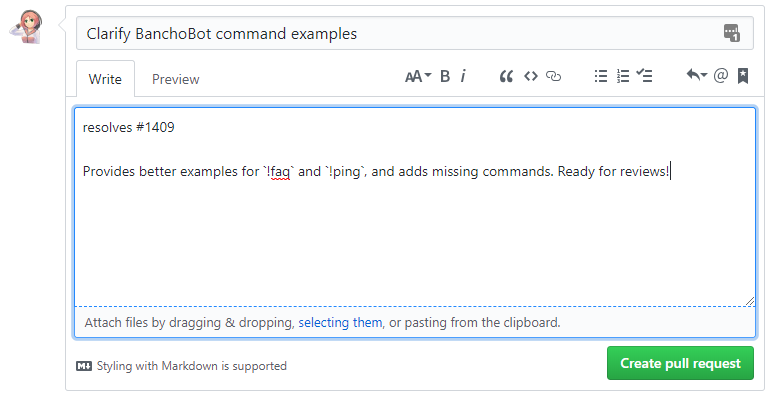

# osu! wiki 기여 가이드

osu! wiki 개선에 관심을 가져주셔서 감사합니다! 이 빠른 시작 가이드는 GitHub 및 osu! wiki workflow를 사용해 본 적이 없는 신규 사용자를 위해 제작되었습니다. GitHub를 사용해 본 경험이 있는 경우, 이 가이드를 건너뛰고, feature-branch workflow 방식으로 이 레포지토리에 컨텐츠를 업데이트 해주시면 감사하겠습니다.

만약, 작업 중, 헷갈리는 부분이나 지원이 필요하다면, [osu!dev 디스코드](https://discord.gg/ppy) (`#osu-wiki` 채널)로 메세지를 보내주시면 답변해 드리겠습니다.

## 시작하기

### 가입 및 로그인

1. GitHub 계정이 없는 경우 새로 [계정을 등록](https://github.com/join)합니다.

2. 계정에 [로그인](https://github.com/login)합니다.

3. [포크하기](#포크하기) 섹션으로 이어서 진행해 주세요.

### 포크하기

1. [`osu-wiki` 레포지토리](https://github.com/ppy/osu-wiki)로 이동합니다.

2. `Fork` 버튼을 클릭합니다.

   

3. 자신이 `Fork`한 레포지토리로 가기 위해 `Fork`버튼을 한번 더 클릭합니다.

4. 아래 이미지와 비슷한 것이 보인다면, `ppy/osu-wiki` 레포를 포크했고, 현재 포크한 레포지토리에 있음을 말합니다.

   

5. [포크 동기화하기](#포크-동기화하기) 섹션으로 이어서 진행해 주세요.

### 포크 동기화하기

1. 자신의 포크한 `osu-wiki` 레포지토리로 이동하세요.

2. 파일 리스트 위에 보면, 당신의 브랜치가 "behind", "ahead", 또는 "even" with `ppy:master` 상태라고 알려주는 텍스트가 있습니다. 혹시 당신의 브랜치가 "behind" 또는 "ahead and behind" 인 경우, 당신의 브랜치가 오래된 버전임을 의미합니다.

   ")

   ")

   ")

   ")

3. 이것은 그다지 문제를 일으키지는 않을 것입니다; 엄청나게 오래된 버전이 아니고서야, 이미 수정된 파일을 수정할 가능성이 낮기 때문입니다.

4. 이 문제를 해결하기 위해서, [흔히 발생하는 문제: 제 branch가 오래됐습니다!](/wiki/owcg/Common_Issues#제-branch가-오래됐습니다!)를 참고해 주세요.

5. Step 4를 완료 했다면, [온라인 또는 로컬에서 편집](#온라인-또는-로컬에서-편집)으로 이어서 진행해 주세요.

## 온라인 또는 로컬에서 편집

여기서 2가지의 방법이 있습니다:

- [GitHub 웹 인터페이스](/wiki/owcg/GitHub_Web_Interface) - 온라인에서 수정합니다. 비교적 변경 사항이 적은 문서 수정에 적합합니다.
- [GitHub 데스크톱](/wiki/owcg/GitHub_Desktop) - 로컬로 편집합니다. 여러 문서 수정에 적합합니다. (파일의 업로드, 삭제, 이동도 포합됩니다.)

*Note: 편집할 수 있는 방법이 위 두가지만 있는 것이 아닙니다. 이 가이드를 간단하게 하기 위해, 이 문서는 다른 방법을 심도있게 다루지는 않겠습니다. GitHub 웹 인터페이스나 데스크톱에서 할 수 있는 내용을 할 수 있는 서드파티 소프트웨어가 있습니다.*

***GitHub 웹 인터페이스* 또는 *GitHub 데스크톱*에서 편집을 진행 했다면, 다음 섹션으로 넘어가 주세요.**

## 마무리하기

### Pull Request 열기

1. [`ppy/osu-wiki` 레포지토리](https://github.com/ppy/osu-wiki)로 이동합니다.

2. 아래와 같이 노란색 배너가 보일 것입니다.

   

3. `Compare & pull request` 버튼을 클릭하세요 (Step 8로). 혹시 보이지 않는다면, `New pull request` 버튼을 클릭하세요 (Step 4로).

4. 아래 사진처럼 2개의 버튼이 보이면, `compare across forks`를 눌러주세요.

   

5. `head fork`를 누르고 자신의 유저 네임이 있는 레포지토리를 클릭합니다 (보통 2번째에 위치합니다).

   

6. `compare`을 누르고 자신이 생성한 브랜치를 누릅니다 (알파벳 순서로 배열됩니다).

   

7. `Create pull request`를 누릅니다.

8. 제목을 영어로 입력합니다. 당신이 변경한 내용에 대한 간단한 요약을 적어주세요.

   문서 번역의 경우, 제목 맨 앞에 대괄호로 두 글자의 국가 코드를 입력해야 합니다. 제목에 번역 중인 문서의 이름을 적어도 좋습니다. 예를 들어, `[FR] BBCode`는 [BBCode article](/wiki/BBCode)의 불어 번역을 업데이트하고 있음을 나타냅니다.

9. 설명 란에 변경 사항을 요약한 내용을 적습니다. Pull Request에 관련된 정보(예를 들면, 작업의 완료 여부 또는 검토자가 알고자 하는 정보)를 작성해주세요. 설명 란에 "resolves #1" 또는 "closes #1"와 같이 작성하여 Pull Request가 병합될 경우 자동으로 해당 이슈가 종료되도록 할 수도 있습니다. (자세한 내용은 GitHub Help의 [Closing issues using keywords](https://help.github.com/articles/closing-issues-using-keywords/)를 참고하시길 바랍니다.)

10. 준비가 되었으면, `Create pull request`를 클릭합니다.

    

11. [검토](#검토) 섹션과 [병합](#병합) 섹션을 확인해 주세요.

### 검토

Pull Request를 만든 뒤에는, osu! wiki의 다른 에디터가 당신이 놓쳤을 지도 모르는 실수를 찾기 위해 당신의 수정 사항을 검토할 수 있습니다. **검토자의 리뷰에 따라 적극적으로 응해주세요.** 그렇지 않을 경우 당신의 Pull Request가 닫힐 수도 있습니다! 당신의 Pull Request를 검토해 줄 사람이 필요하다면, [osu!dev 디스코드](https://discord.gg/ppy) (`#osu-wiki` 채널) 또는 GitHub 댓글 란의 다른 osu! wiki 에디터에게 요청해 보세요.

### 병합

osu! wiki에 반영되기 위해서는, 당신의 pull request가 병합되어야 합니다. 당신의 pull request가 검토되고 허가되면, 병합을 [osu!dev 디스코드](https://discord.gg/ppy) (`#osu-wiki` 채널) 또는 GitHub 댓글 란에 요청해 보세요. 변경 사항이 병합된 후에는, 적어도 5시간 이내에 osu! wiki에 반영됩니다.
