<!--{{OL}}{{DISPLAYTITLE:osu!academy}}{{Events}}-->

# osu!academy
## Introduction
Source: http://news.ppy.sh/post/70504430082/introducing-the-osu-academy  
Official Youtube channel: http://www.youtube.com/user/osuacademy/videos  
Official thread: http://osu.ppy.sh/forum/t/169707

**osu! academy** aims to give a comprehensive look at all aspects of osu!, from playing to mapping and everything in-between.

We hope that new players will find these videos informative, and help ease the arguably steep learning curve associated with the game. If you have any questions or comments, please forward them to [ztrot](http://osu.ppy.sh/u/6347 "ztrot userpage"); he is the primary and almost sole owner of the osu! academy and its channel.

[Now with a trailer](http://www.youtube.com/watch?v=z5gy34k3RI0&feature=c4-overview&list=UUMeRgqzTfC5ja40B6kM6pdg "Youtube link").

## Episodes
Click on the image to be taken to corresponding episode.

Episode | Description
:---: | :---
 | In this episode, we will cover installing the game and account creation!
 | In this episode, we will be going over standard gameplay and how to customize playstyle settings!
 | In this episode, we will be going over the game mode osu!mania featuring LoliFlan!
[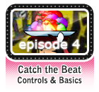](https://www.youtube.com/watch?v=6WKZE2HPOK8) | In this episode, we will be going over the game mode CTB!
[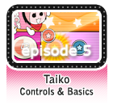](https://www.youtube.com/watch?v=f_uSO2ESCRI) | In this episode, we will be going over the game mode Taiko featuring Tasha!
 | In this episode, we will be going over the multiplayer mode!
 | In this episode, we are going to take a step into the world of making beatmaps!
[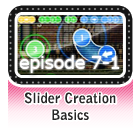](https://www.youtube.com/watch?v=RKLanv4pvJc) | In this episode, we will be going over slider creation basics!
[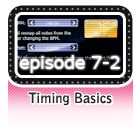](https://www.youtube.com/watch?v=8nsbrOhLE9w) | In this episode, we will be going over how to time your beatmap!
[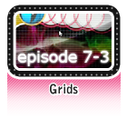](https://www.youtube.com/watch?v=MhIuPvQjLbU) | In this episode, we will talk about grids and what they do!
[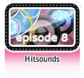](https://www.youtube.com/watch?v=PFEYlQfiJHQ]) | In this episode, we are going to go over an important part of mapping that can both make or break a map: hitsounding!
 | In this episode, we are going to be talking about modding beatmaps!
[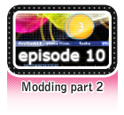](https://www.youtube.com/watch?v=SFSwmRdNbXM]) | In this episode, we will continue our discussion about modding beatmaps!
 | In this episode, we will be going over some tips and tricks to playing standard!
[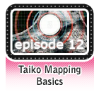](https://www.youtube.com/watch?v=8reEFNk5kQY]) | In this episode, we will be looking at the editor again, but for other game modes!
[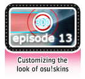](https://www.youtube.com/watch?v=oUvCBsGyTtw]) | In this episode, we will be looking at how to change the appearance of osu! through skinning!
[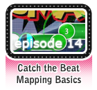](https://www.youtube.com/watch?v=dyDMyB9D420]) | In this episode, we will go over how to use the CtB editor!
[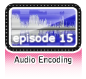](https://www.youtube.com/watch?v=muu3HkG38kk]) | In this episode, we will go over where to get music and some things to avoid as well!
[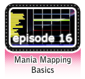](https://www.youtube.com/watch?v=uTnO_7bMV44]) | In this episode, we will go over how to use the osu!mania editor!
[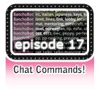](https://www.youtube.com/watch?v=yWqRJZ5FX5Y]) | In this episode, we will go over different IRC commands and what they are used for!
[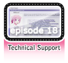](https://www.youtube.com/watch?v=Ywu3PZGYPxs]) | In this episode, we will discuss the helpful aspect of the Technical Support forum!
[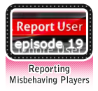](https://www.youtube.com/watch?v=ZoBAZCl9wXY]) | In this episode, we will be going over a bit of a touchy subject: misbehaving players and how to report them!
[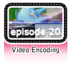](https://www.youtube.com/watch?v=exyuI9lv_OI]) | In this episode, we are going to go over another aspect of beatmap editing, video encoding!
 | In this episode, we will go over the basics of how to capture/stream to your favorite streaming sites like twitch or livestream!
 | In this episode, we are going to go rapidly go over the features of osu!direct and the benefits of supporter status!
 | In this episode, we will be talking about a new feature that has recently been sweeping over the modding community and that is community modding featuring Shiro!
[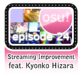](https://www.youtube.com/watch?v=pq33jvMitRk]) | In this episode, we will be going over how to improve with streaming featuring Kyonko Hizara!
 | In this episode, we are going to be talking about the staff teams a bit more!
[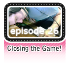](https://www.youtube.com/watch?v=y61v2QCHlpY]) | The following episode of the osu! academy is brought to you by a public service announcement!
 | In this episode, we will go over how to make and share your own guest difficulties!
[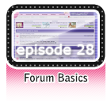](https://www.youtube.com/watch?v=PEZFOM8NKtw]) | In this episode, we will cover forum basics such as where to post and correct behaviour!
[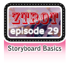](https://www.youtube.com/watch?v=uvCRwcyJ4TA]) | In this episode, we will cover the basics of storyboarding!
[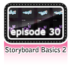](https://www.youtube.com/watch?v=EvICgPuOylk]) | In this episode, we will cover more advanced storyboarding!
[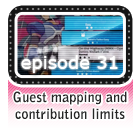](https://www.youtube.com/watch?v=s2ZK4o8V5tI]) | In this episode, we will go further in-depth about guest difficulties and other beatmap contributions!
[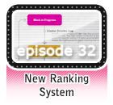](https://www.youtube.com/watch?v=wa_hNegtBw0]) | In this episode, we will go over the new ranking system!
[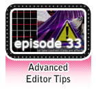](https://www.youtube.com/watch?v=_-Xke2bqzok]) | In this episode, we will cover more advanced editor tips!

<!-- <noinclude>[[Category:Table Templates]]</noinclude>  {{Contents}} [[Category:History of osu!]] -->
