# osu!academy

**osu!academy** aims to give a comprehensive look at all aspects of osu!, from playing to mapping and everything in-between.

We hope that new players will find these videos informative, and help ease the arguably steep learning curve associated with the game.
If you have any questions or comments, please forward them to [ztrot](https://osu.ppy.sh/users/6347); he is the primary and almost sole owner of the osu! academy and its channel.

[Now with a trailer](https://www.youtube.com/watch?v=z5gy34k3RI0&feature=c4-overview&list=UUMeRgqzTfC5ja40B6kM6pdg "YouTube").

## Core Episodes

| Episode Thumbnail | Link | Description |
| :-- | :-- | :-- |
|  | [Episode 1](https://www.youtube.com/watch?v=cz522ZAs5aQ "YouTube") | In this episode, we will cover installing the game and account creation! |
|  | [Episode 2](https://www.youtube.com/watch?v=mswLEXK0eDk "YouTube") | In this episode, we will be going over standard gameplay and how to customize playstyle settings! |
|  | [Episode 3](https://www.youtube.com/watch?v=UAomychlbic "YouTube") | In this episode, we will be going over the game mode osu!mania featuring LoliFlan! |
|  | [Episode 4](https://www.youtube.com/watch?v=6WKZE2HPOK8 "YouTube") | In this episode, we will be going over the game mode CTB! |
|  | [Episode 5](https://www.youtube.com/watch?v=f_uSO2ESCRI "YouTube") | In this episode, we will be going over the game mode Taiko featuring Tasha! |
|  | [Episode 6](https://www.youtube.com/watch?v=cyYRl-a5xII "YouTube") | In this episode, we will be going over the multiplayer mode! |
|  | [Episode 7-0](https://www.youtube.com/watch?v=WKS8Zhut9XU "YouTube") | In this episode, we are going to take a step into the world of making beatmaps! |
|  | [Episode 7-1](https://www.youtube.com/watch?v=RKLanv4pvJc "YouTube") | In this episode, we will be going over slider creation basics! |
|  | [Episode 7-2](https://www.youtube.com/watch?v=8nsbrOhLE9w "YouTube") | In this episode, we will be going over how to time your beatmap! |
|  | [Episode 7-3](https://www.youtube.com/watch?v=MhIuPvQjLbU "YouTube") | In this episode, we will talk about grids and what they do! |
|  | [Episode 8](https://www.youtube.com/watch?v=PFEYlQfiJHQ "YouTube") | In this episode, we are going to go over an important part of mapping that can both make or break a map: hitsounding! |
|  | [Episode 9](https://www.youtube.com/watch?v=bTGBspoMFVA "YouTube") | In this episode, we are going to be talking about modding beatmaps! |
|  | [Episode 10](https://www.youtube.com/watch?v=bTGBspoMFVA "YouTube") | In this episode, we will continue our discussion about modding beatmaps! |
|  | [Episode 11](https://www.youtube.com/watch?v=j8fpJKCjTvM "YouTube") | In this episode, we will be going over some tips and tricks to playing standard! |
|  | [Episode 12](https://www.youtube.com/watch?v=8reEFNk5kQY "YouTube") | In this episode, we will be looking at the editor again, but for other game modes! |
|  | [Episode 13](https://www.youtube.com/watch?v=oUvCBsGyTtw "YouTube") | In this episode, we will be looking at how to change the appearance of osu! through skinning! |
|  | [Episode 14](https://www.youtube.com/watch?v=dyDMyB9D420 "YouTube") | In this episode, we will go over how to use the CtB editor! |
|  | [Episode 15](https://www.youtube.com/watch?v=muu3HkG38kk "YouTube") | In this episode, we will go over where to get music and some things to avoid as well! |
|  | [Episode 16](https://www.youtube.com/watch?v=uTnO_7bMV44 "YouTube") | In this episode, we will go over how to use the osu!mania editor! |
|  | [Episode 17](https://www.youtube.com/watch?v=yWqRJZ5FX5Y "YouTube") | In this episode, we will go over different IRC commands and what they are used for! |
|  | [Episode 18](https://www.youtube.com/watch?v=Ywu3PZGYPxs "YouTube") | In this episode, we will discuss the helpful aspect of the Technical Support forum! |
|  | [Episode 19](https://www.youtube.com/watch?v=ZoBAZCl9wXY "YouTube") | In this episode, we will be going over a bit of a touchy subject: misbehaving players and how to report them! |
|  | [Episode 20](https://www.youtube.com/watch?v=exyuI9lv_OI "YouTube") | In this episode, we are going to go over another aspect of beatmap editing, video encoding! |
|  | [Episode 21](https://www.youtube.com/watch?v=59Tm9LvYk3Q "YouTube") | In this episode, we will go over the basics of how to capture/stream to your favorite streaming sites like Twitch or livestream! |
|  | [Episode 22](https://www.youtube.com/watch?v=ec0pLh4U8eY "YouTube") | In this episode, we are going to go rapidly go over the features of osu!direct and the benefits of supporter status! |
|  | [Episode 23](https://www.youtube.com/watch?v=MxlB__wjt9A "YouTube") | In this episode, we will be talking about a new feature that has recently been sweeping over the modding community and that is community modding featuring Shiro! |
|  | [Episode 24](https://www.youtube.com/watch?v=pq33jvMitRk "YouTube") | In this episode, we will be going over how to improve with streaming featuring Kyonko Hizara! |
|  | [Episode 25](https://www.youtube.com/watch?v=sgcdrxevAT4 "YouTube") | In this episode, we are going to be talking about the staff teams a bit more! |
|  | [Episode 26](https://www.youtube.com/watch?v=y61v2QCHlpY "YouTube") | The following episode of the osu! academy is brought to you by a public service announcement! |
|  | [Episode 27](https://www.youtube.com/watch?v=nXWA1Qh9bT8 "YouTube") | In this episode, we will go over how to make and share your own guest difficulties! |
|  | [Episode 28](https://www.youtube.com/watch?v=PEZFOM8NKtw "YouTube") | In this episode, we will cover forum basics such as where to post and correct behaviour! |
|  | [Episode 29](https://www.youtube.com/watch?v=uvCRwcyJ4TA "YouTube") | In this episode, we will cover the basics of storyboarding! |
|  | [Episode 30](https://www.youtube.com/watch?v=EvICgPuOylk "YouTube") | In this episode, we will cover more advanced storyboarding! |
|  | [Episode 31](https://www.youtube.com/watch?v=s2ZK4o8V5tI "YouTube") | In this episode, we will go further in-depth about guest difficulties and other beatmap contributions! |
|  | [Episode 32](https://www.youtube.com/watch?v=wa_hNegtBw0 "YouTube") | In this episode, we will go over the new ranking system! |
|  | [Episode 33](https://www.youtube.com/watch?v=_-Xke2bqzok "YouTube") | In this episode, we will cover more advanced editor tips! |

## Academy Bytes - Mapping Techniques

**[Academy Bytes](https://www.youtube.com/playlist?list=PLmWVQsxi34bMq9xkL8affDZpUzSTXa5_r "YouTube")** are short videos made by [ztrot](https://osu.ppy.sh/users/6347) explaining the arrangement and usage of useful and commonly used mapping techniques.

| Episode Thumbnail | Link | Description |
| :-- | :-- | :-- |
| 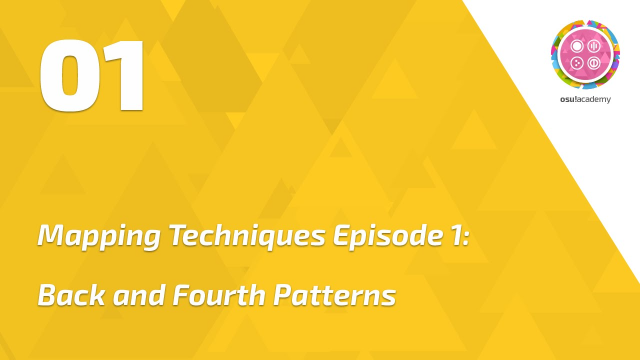 | [Episode 1](https://www.youtube.com/watch?v=Ra_hrzkyIRs "YouTube") | In this episode, we will cover the placement and timing of Back and Forth Patterns! |
| 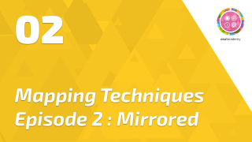 | [Episode 2](https://www.youtube.com/watch?v=ocvaH50lNks "YouTube") | In this episode, we will be going over the arrangement and usage of the Mirrored Sliders! |
| 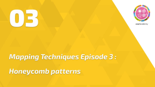 | [Episode 3](https://www.youtube.com/watch?v=_hla2JtEPkU "YouTube") | In this episode, we will be covering the positioning and use of Honeycomb patterns! |
|  | [Episode 4](https://www.youtube.com/watch?v=LHch8V-v7i4 "YouTube") | In this episode, we will go over creating star patterns and all the shortcuts associated with them! |
|  | [Episode 5](https://www.youtube.com/watch?v=2XtP58p9DtY "YouTube") | In this episode of bytes, we go over compressed streams and ways to use distance spacing and snaps to create them! |
| 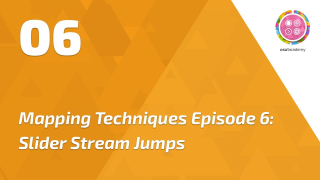 | [Episode 6](https://www.youtube.com/watch?v=tPRFa2sRXSs "YouTube") | In this episode, we briefly go over slider stream jumps one of the newer patterns in mapping! |
| 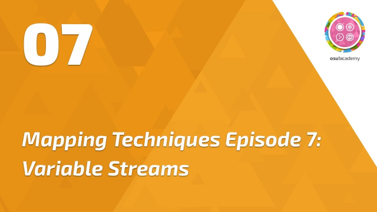 | [Episode 7](https://www.youtube.com/watch?v=oaIWbuEihZk "YouTube") | In this episode, we are going to take a look into variable streams and where to use them! |

## Time Lapse Mapping

**[Time Lapse Mapping](https://www.youtube.com/playlist?list=PLmWVQsxi34bO7PAmjWZjVDi16pAy-GRBP "YouTube")** is a series of videos hosted by [ztrot](https://osu.ppy.sh/users/6347) and several mappers from different game modes, where they explain the process of creating beatmaps with a sped-up mapping session in the background.

| Episode Thumbnail | Link | Description |
| :-- | :-- | :-- |
| 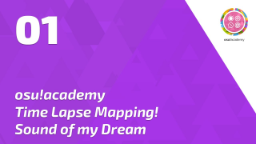 | [Episode 1](https://www.youtube.com/watch?v=nP3jepiQslg "YouTube") | In this episode, we go over the time lapse mapping of the Insane difficulty of [Miqz - Sound of my Dream!](https://osu.ppy.sh/beatmapsets/245877#osu/566538) |
| 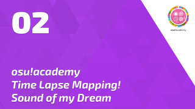 | [Episode 2](https://www.youtube.com/watch?v=ECBMHNVGucM "YouTube") | In this episode, we look at the time lapse mapping of the Hard difficulty of [Miqz - Sound of my Dream!](https://osu.ppy.sh/beatmapsets/245877#osu/603075) |
|  | [Episode 3](https://www.youtube.com/watch?v=3OM8AgzIFAY "YouTube") | In this episode, we go over the time lapse mapping of the Normal difficulty of [Miqz - Sound of my Dream!](https://osu.ppy.sh/beatmapsets/245877#osu/632389) |
| 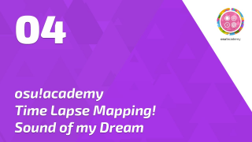 | [Episode 4](https://www.youtube.com/watch?v=NZ4oE_Xe51Q "YouTube") | In this episode, we visit the time lapse mapping of the Easy difficulty of [Miqz - Sound of my Dream!](https://osu.ppy.sh/beatmapsets/245877#osu/643621) |
| 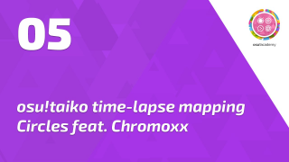 | [Episode 5](https://www.youtube.com/watch?v=phFJRXp0O5o "YouTube") | In this episode, [Chromoxx](https://osu.ppy.sh/users/1881639) takes us on a journey of time lapse mapping the Oni difficulty of Circles! |
|  | [Episode 6](https://www.youtube.com/watch?v=6LC7Bez0uCg "YouTube") | In this episode, [Chromoxx](https://osu.ppy.sh/users/1881639) goes over the time lapse mapping of the Muzukashii difficulty of Circles in the taiko gamemode! |
|  | [Episode 7](https://www.youtube.com/watch?v=A5x5QiFExFo "YouTube") | In this episode, [Chromoxx](https://osu.ppy.sh/users/1881639) goes over the time lapse mapping of the Futsuu difficulty of Circles in the taiko gamemode! |
| 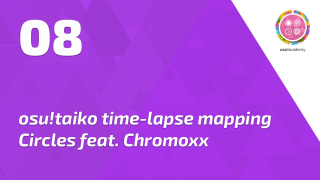 | [Episode 8](https://www.youtube.com/watch?v=UfWlpD3pocs "YouTube") | In this episode, [Chromoxx](https://osu.ppy.sh/users/1881639) goes over the time lapse mapping of the Kantan difficulty of Circles in the taiko gamemode! |
| 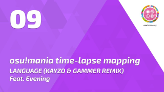 | [Episode 9](https://www.youtube.com/watch?v=REpmCJEB9jY "YouTube") | In this episode, [Evening](https://osu.ppy.sh/users/2193881) covers the time lapse mapping of the 4K Insane difficulty of LANGUAGE (KAYZO AND GAMMER REMIX) in the mania gamemode! |

## External Links

- [Source](https://osu.ppy.sh/home/news/2013-12-19-introducing-the-osu-academy)
- [Official YouTube channel](https://www.youtube.com/user/osuacademy/videos "YouTube")
- [Official thread](https://osu.ppy.sh/community/forums/topics/169707)
