# osu!academy

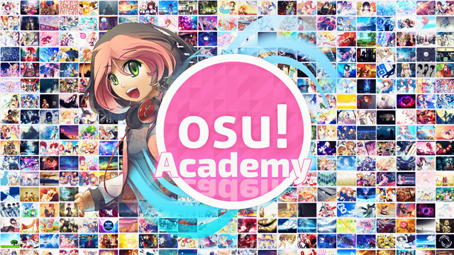

**osu! academy** a pour objectif de donner un aperçu complet de tous les aspects d'osu!, du jeu à la cartographie, en passant par la cartographie.

Nous espérons que les nouveaux joueurs trouveront ces vidéos informatives et contribueront à atténuer la courbe d'apprentissage relativement abrupte associée au jeu.
Si vous avez des questions ou des commentaires, veuillez les envoyer à [ztrot](https://osu.ppy.sh/users/6347); il est le principal et presque unique propriétaire de l'osu!académie et son canal.

[Maintenant avec un trailer](https://www.youtube.com/watch?v=z5gy34k3RI0&feature=c4-overview&list=UUMeRgqzTfC5ja40B6kM6pdg).

## Épisodes

| Vignette d'épisode | Lien | Description |
| :-- | :-- | :-- |
|  | [Épisode 1](https://www.youtube.com/watch?v=cz522ZAs5aQ "Épisode 1") | Dans cet épisode, nous allons couvrir l’installation du jeu et la création du compte! |
|  | [Épisode 2](https://www.youtube.com/watch?v=mswLEXK0eDk "Épisode 2") | Dans cet épisode, nous allons passer en revue le gameplay standard et comment personnaliser les paramètres de style de jeu ! |
|  | [Épisode 3](https://www.youtube.com/watch?v=UAomychlbic "Épisode 3") | Dans cet épisode, nous allons passer en revue le mode de jeu osu!mania avec LoliFlan! |
| 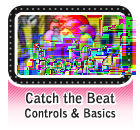 | [Épisode 4](https://www.youtube.com/watch?v=6WKZE2HPOK8 "Épisode 4") | Dans cet épisode, nous allons passer en revue le mode de jeu CTB! |
| 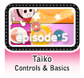 | [Épisode 5](https://www.youtube.com/watch?v=f_uSO2ESCRI "Épisode 5") | Dans cet épisode, nous allons passer en revue le mode de jeu Taiko avec Tasha! |
|  | [Épisode 6](https://www.youtube.com/watch?v=cyYRl-a5xII "Épisode 6") | Dans cet épisode, nous allons passer en mode multijoueur! |
|  | [Épisode 7-0](https://www.youtube.com/watch?v=WKS8Zhut9XU "Épisode 7-0") | Dans cet épisode, nous allons faire un pas dans le monde de la création de beatmaps! |
|  | [Épisode 7-1](https://www.youtube.com/watch?v=RKLanv4pvJc "Épisode 7-1") | Dans cet épisode, nous allons passer en revue les bases de la création de curseurs! |
|  | [Épisode 7-2](https://www.youtube.com/watch?v=8nsbrOhLE9w "Épisode 7-2") | Dans cet épisode, nous verrons comment chronométrer votre beatmap! |
| 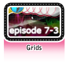 | [Épisode 7-3](https://www.youtube.com/watch?v=MhIuPvQjLbU "Épisode 7-3") | Dans cet épisode, nous parlerons des grilles et de ce qu'elles font! |
|  | [Épisode 8](https://www.youtube.com/watch?v=PFEYlQfiJHQ "Épisode 8") | Dans cet épisode, nous allons passer en revue une partie importante de la cartographie qui peut à la fois faire ou défaire une carte: hitsounding! |
| 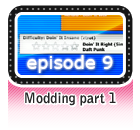 | [Épisode 9](https://www.youtube.com/watch?v=bTGBspoMFVA "Épisode 9") | Dans cet épisode, nous allons parler de modding Beatmaps! |
|  | [Épisode 10](https://www.youtube.com/watch?v=bTGBspoMFVA "Épisode 10") | Dans cet épisode, nous poursuivrons notre discussion sur le modding beatmaps! |
|  | [Épisode 11](https://www.youtube.com/watch?v=j8fpJKCjTvM "Épisode 11") | Dans cet épisode, nous allons passer en revue quelques trucs et astuces pour jouer au standard! |
| 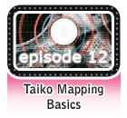 | [Épisode 12](https://www.youtube.com/watch?v=8reEFNk5kQY "Épisode 12") | Dans cet épisode, nous reverrons l'éditeur, mais pour d'autres modes de jeu! |
|  | [Épisode 13](https://www.youtube.com/watch?v=oUvCBsGyTtw "Épisode 13") | Dans cet épisode, nous verrons comment changer l'apparence d'osu! à travers le skin! |
| 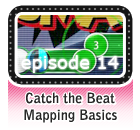 | [Épisode 14](https://www.youtube.com/watch?v=dyDMyB9D420 "Épisode 14") | Dans cet épisode, nous verrons comment utiliser l'éditeur CtB! |
| 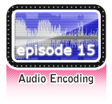 | [Épisode 15](https://www.youtube.com/watch?v=muu3HkG38kk "Épisode 15") | Dans cet épisode, nous verrons où trouver de la musique et des choses à éviter également! |
|  | [Épisode 16](https://www.youtube.com/watch?v=uTnO_7bMV44 "Épisode 16") | Dans cet épisode, nous allons expliquer comment utiliser l'éditeur osu!mania! |
|  | [Épisode 17](https://www.youtube.com/watch?v=yWqRJZ5FX5Y "Épisode 17") | Dans cet épisode, nous allons passer en revue différentes commandes IRC et leur utilité! |
| 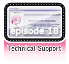 | [Épisode 18](https://www.youtube.com/watch?v=Ywu3PZGYPxs "Épisode 18") | Dans cet épisode, nous allons discuter de l'aspect utile du forum de support technique! |
|  | [Épisode 19](https://www.youtube.com/watch?v=ZoBAZCl9wXY "Épisode 19") | Dans cet épisode, nous aborderons un sujet délicat: les joueurs qui se conduisent mal et comment les signaler! |
|  | [Épisode 20](https://www.youtube.com/watch?v=exyuI9lv_OI "Épisode 20") | Dans cet épisode, nous allons aborder un autre aspect de l'édition de beatmap, le codage vidéo! |
|  | [Épisode 21](https://www.youtube.com/watch?v=59Tm9LvYk3Q "Épisode 21") | Dans cet épisode, nous allons passer en revue les bases de la capture/diffusion sur vos sites de streaming préférés, tels que Twitch ou livestream! |
|  | [Épisode 22](https://www.youtube.com/watch?v=ec0pLh4U8eY "Épisode 22") | Dans cet épisode, nous allons passer rapidement en revue les caractéristiques d'osu! Direct et les avantages du statut de partisan! |
|  | [Épisode 23](https://www.youtube.com/watch?v=MxlB__wjt9A "Épisode 23") | Dans cet épisode, nous allons parler d'une nouvelle fonctionnalité qui a récemment balayé la communauté du modding et qui est un modding communautaire mettant en vedette Shiro! |
|  | [Épisode 24](https://www.youtube.com/watch?v=pq33jvMitRk "Épisode 24") | Dans cet épisode, nous verrons comment nous améliorer avec le streaming mettant en vedette Kyonko Hizara! |
| 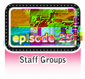 | [Épisode 25](https://www.youtube.com/watch?v=sgcdrxevAT4 "Épisode 25") | Dans cet épisode, nous allons parler un peu plus des équipes d'état-major! |
|  | [Épisode 26](https://www.youtube.com/watch?v=y61v2QCHlpY "Épisode 26") | L'épisode suivant de l'osu! academy vous est présenté par une annonce de service public! |
|  | [Épisode 27](https://www.youtube.com/watch?v=nXWA1Qh9bT8 "Épisode 27") | Dans cet épisode, nous verrons comment créer et partager les difficultés de votre propre invité! |
| 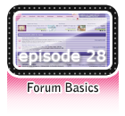 | [Épisode 28](https://www.youtube.com/watch?v=PEZFOM8NKtw "Épisode 28") | Dans cet épisode, nous aborderons les bases du forum, telles que l'endroit où poster et corriger le comportement! |
| 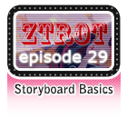 | [Épisode 29](https://www.youtube.com/watch?v=uvCRwcyJ4TA "Épisode 29") | Dans cet épisode, nous couvrirons les bases du scénarimage! |
|  | [Épisode 30](https://www.youtube.com/watch?v=EvICgPuOylk "Épisode 30") | Dans cet épisode, nous allons couvrir le storyboarding plus avancé! |
|  | [Épisode 31](https://www.youtube.com/watch?v=s2ZK4o8V5tI "Épisode 31") | Dans cet épisode, nous approfondirons les difficultés des invités et d’autres contributions de beatmap! |
|  | [Épisode 32](https://www.youtube.com/watch?v=wa_hNegtBw0 "Épisode 32") | Dans cet épisode, nous allons passer en revue le nouveau système de classement! |
| 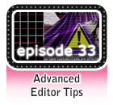 | [Épisode 33](https://www.youtube.com/watch?v=_-Xke2bqzok "Épisode 33") | Dans cet épisode, nous allons couvrir des astuces plus avancées de l'éditeur! |

## Liens externes

- [Source](https://osu.ppy.sh/home/news/2013-12-19-introducing-the-osu-academy)
- [Chaîne YouTube officielle](https://www.youtube.com/user/osuacademy/videos)
- [Fil officiel](https://osu.ppy.sh/community/forums/topics/169707)
