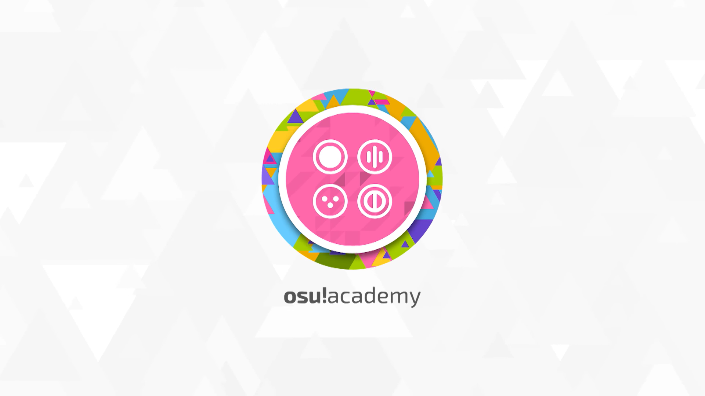

# Academia do osu!

## Introdução

- [Fonte](https://osu.ppy.sh/home/news/2013-12-19-introducing-the-osu-academy)
- [Canal Oficial do Youtube](https://www.youtube.com/user/osuacademy/videos)
- [Forum oficial](https://osu.ppy.sh/community/forums/topics/169707)

Essa nova serie chamada de **osu!academy** (Academia do osu!) pretende dar uma visão abrangente de todos os aspectos do jogo, de jogar para o mapeamento e tudo relacionado

Esperamos que os novos jogadores vão encontrar esses vídeos informativos, e ajudar a responder dúvidas relacionadas com o jogo. Se você tiver quaisquer perguntas ou comentários, por favor envie-os para [ztrot](https://osu.ppy.sh/users/6347)- ele é o principal colaborador do projeto e é praticamente o dono do osu! academy e seu canal.

## Episódios

Clique na imagem do episódio que deseja assistir.

| Episódio | Descrição |
| :-- | :-- |
|  | Instalação/Criação de Conta! |
|  | Jogabilidade Standard/Ajustes de configuração! |
|  | Padrões de Teclas/Jogabilidade de osu!mania (por Loliflan)! |
|  | Comandos do Catch the Beat/Básicos! |
|  | Comandos do Taiko/Básicos apresentado por Tasha! |
|  | Básicos do Multiplayer/Painel de Usuários Online! |
|  | Básicos do Editor de Mapping! |
|  | Básico de Criação de Sliders! |
|  | Básicos sobre Timing! |
|  | Grids! |
|  | Hitsounds! |
|  | Modding 1/2! |
|  | Modding 2/2! |
|  | Modificadores de Jogabilidade e Dicas para Melhorar em Standard! |
|  | Básicos sobre Mapeamento de Taiko! |
|  | Mudando a aparência do osu! com skins! |
|  | Básicos sobre mapeamento de CtB! |
|  | Manipulação de Áudio! |
|  | Básicos sobre mapeamento de Mania! |
|  | Comandos do Chat! |
|  | Suporte Técnico! |
|  | Reportando Jogadores com comportamento inadequado! |
|  | Manipulação de Vídeo! |
|  | Guia básico de Transmissão ao Vivo! |
|  | Supporter e osu!direct! |
|  | Community modding apresentado por Shiro! |
|  | Aperfeiçoamento em Streams apresentado por Kyonko Hizara! |
|  | Grupos da Staff! |
|  | Fechando o jogo! |
|  | Guest Diffs! |
|  | Básicos do Forum! |
|  | Básicos de Storyboards! |
|  | Básicos de Storyboards 2! |
|  | Guest Mapping e limites de contribuição! |
|  | Novo Sistema de Ranking! |
|  | Dicas Avançadas do Editor! |
