介绍
============

**[osu!store（osu!商店）](http://store.ppy.sh/store/listing)** (曾经的 *[osu!market(osu!市场)](http://market.ppy.sh/)*，售卖一些杯子、衣服之类的）是一个在线的osu!周边商店。每一件商品都以最高品质造就，且价格适中。几乎所有的商品都经过质量检测，经过osu!创始人批准，只为给您一个令人满意的商品，或是给朋友的一份精致的礼物。  

商品列表
===========

| 编号 | 图片 | 商品名称 / "说明" | 简介 |
| :-: | :---: | :----------------------: | ----------- |
| 2 |  | [osu! 贴纸套装](http://store.ppy.sh/store/product/2) | 一套 osu! 主题贴纸，可以贴在您或您朋友的东西上！  套装包含:<ul><li>1x pippi 天使图案</li><li>1x trifosu!</li><li>1x pippi-don 与 pippi</li><li>2x osu! 徽标 (新版设计)</li></ul>这些贴纸拥有最好的质量。它们能忍受极端气候，并且可以随时被小心地移除、重贴，永不褪色！ |
| 4 | 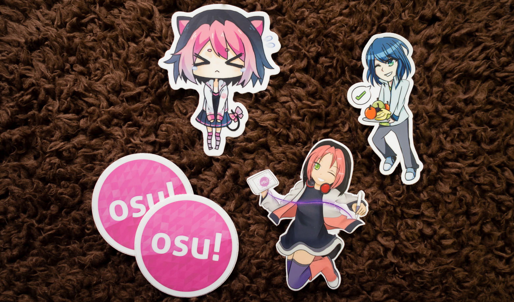 | [osu! 贴纸套装 #2](http://store.ppy.sh/store/product/4) | 快把 osu! 的吉祥物 Yuzu，Pippi 和 Nyan Pippi 贴在您的物件上！  由于第一套贴纸人气很高，所以发行了第二套贴纸。  一套全新的 osu! 主题贴纸，可以贴在您或您朋友的东西上！这些贴纸取材于第三次 osu! 第三届艺术大赛的图案。  套装包含：<ul><li>1x nyan pippi [kakifly制作](https://osu.ppy.sh/u/kakifly)</li><li>1x 手持平板的 pippi [\[ Vocal 制作\]](https://osu.ppy.sh/u/%5B%20Vocal%20%5D)</li><li>1x yuzu [ERIKATISIMA制作](https://osu.ppy.sh/u/ERIKATISIMA)</li><li>2x osu! 徽标</li></ul>这些贴纸拥有最好的质量。它们能忍受极端气候，并且可以随时被小心地移除、重贴，永不褪色！ |
| 9 |  | [osu! 地图蓝本](http://store.ppy.sh/store/product/9) *随时随地做图！* | 您现在可以随时做图啦！不用什么权限，您只需要把这些贴纸贴在本子、冰箱柜、电脑上就能做图了~ <ul><li>第一面贴纸包括54个击打圆圈（褐色、蓝色、棕黄色、淡褐色、深紫色、黑色各9个）。</li><li>第二面贴纸包括7个滑条（形状不同），8个空白的击打圆圈，2个滑条折返箭头，2个缩圈，激、喝、999x 各一个，与一个 osu! 徽标。</li></ul>每个包都包括了2个 8.5" x 11" 的自定义贴纸，可以从游戏中发掘其它元素！贴纸经过特殊处理，使揭除更加容易。  这些贴纸拥有最好的质量。它们能忍受极端气候，并且可以随时被小心地移除、重贴，永不褪色！ |
| 10 | 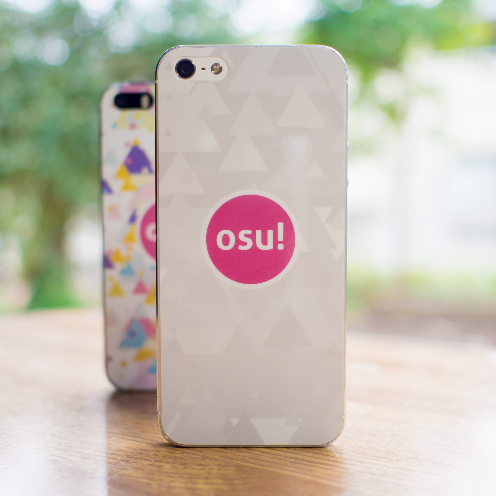 | [iPhone 5/SE 背膜 (osu! 纯色)](http://store.ppy.sh/store/product/10) | 简洁的“osu! 纯色”高级 iPhone 5/5s 背膜。  把它贴在您的手机上，随处彰显您对osu!的喜爱！<ul><li>采用osu!设计师最新设计的三角形徽标！[flyte 制作](https://osu.ppy.sh/u/flyte)</li></ul>这些皮肤是由较厚、耐用的乙烯基与紫外线层压板制作，保护您的iPhone免受划痕，以免被雨水和阳光影响。 |
| 11 | 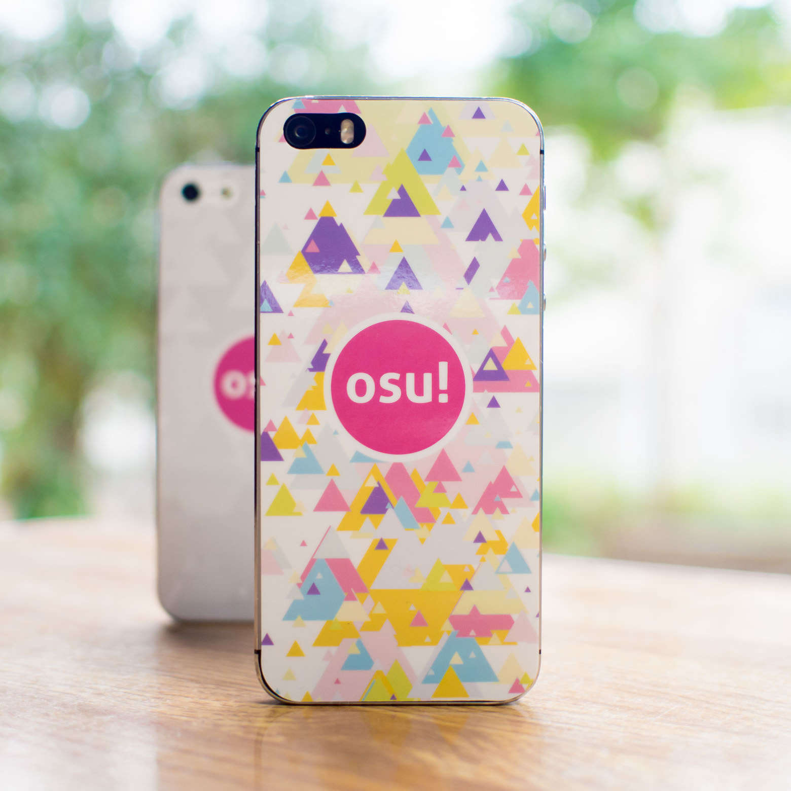 | [iPhone 5/SE skin (osu! 彩色)](http://store.ppy.sh/store/product/11) | 简洁的“osu! 彩色”高级 iPhone 5/5s 背膜。  把它贴在您的手机上，随处彰显您对osu!的喜爱！<ul><li>采用osu!设计师最新设计的三角形徽标！[flyte 制作](https://osu.ppy.sh/u/flyte)</li></ul>这些皮肤是由较厚、耐用的乙烯基与紫外线层压板制作，保护您的iPhone免受划痕，以免被雨水和阳光影响。 |
| 12 - 19 |  | [osu! t-shirt (三角形状)](http://store.ppy.sh/store/product/12) | 全新的osu!T恤已到货！具有osu!设计师flyte 最新设计的三角形徽标！如果您热爱osu!，这将会是您衣橱中的亮点！<ul><li>100% 棉</li><li>标准重量，经过预缩水处理。</li><li>Sizes: S, M, L, XL</li></ul><table><tbody><tr><th>Size</th><th>S</th><th>M</th><th>L</th><th>XL</th></tr><tr><th>Garment Length</th><td>66cm</td><td>70cm</td><td>74cm</td><td>78cm</td></tr><tr><th>Body width</th><td>49cm</td><td>52cm</td><td>55cm</td><td>58cm</td></tr><tr><th>Shoulder width</th><td>44cm</td><td>47cm</td><td>50cm</td><td>53cm</td></tr><tr><th>Sleeve length</th><td>19cm</td><td>20cm</td><td>22cm</td><td>24cm</td></tr></tbody></table>注意：尺码均为日本尺寸，请其它国家的顾客参考以上尺码表！ |
| 20 - 31 |  | [osu! 'nono' 键盘](http://store.ppy.sh/store/product/20) | 一个简单而高质量的键盘，满足您的按键需求。Choose your favourite Cherry MX switch type from four options. Three extra programmable buttons for auxiliary functionality (defaults to Escape, F1 and F2 keys).  Lighting in the base fades between colours and reacts to how fast you tap (customisable)!  Lighting in the keys reacts to each tap!  灯光效果演示 [YouTube 视频](https://www.youtube.com/watch?v=dthQ5P11zn4).  No driver required. Configuration app available for windows to re-bind keys.  Included in the package:<ul><li>事先装配完成的键盘组</li><li>Two custom osu! key-caps for Cherry MX switches. 透明的osu! 徽标具有背光功能。</li><li>4 dampening o-rings (two sets of different thicknesses)</li><li>有双面胶可以牢牢附着在您桌面上。能够被反复重新粘贴。</li><li>如果您不想让键盘永远粘贴在一个位置，可以采用塑料吸盘代替双面胶。</li><li>USB 线缆</li></ul>按键设置程序在[这里](http://puu.sh/l6urN/4b6bc800f2.zip) (1.0b)。  指导如何更改按键的[Youtube 视频](https://www.youtube.com/watch?v=JweSr9watkU&feature=youtu.be)（在中国国内访问可能有困难）。|
| 32 | | [玩家昵称更改](http://store.ppy.sh/store/product/32) *Because "xxultralaser_1986xx" seemed like a good idea at the time..* | |
| 33 - 36 |  | [osu! T恤（isshoni）](http://store.ppy.sh/store/product/33) | 全新的 osu! T恤已到货！采用osu!设计师 flyte 最新设计的三角形徽标。如果您热爱osu!，这将会是您衣橱中的亮点！  日文读作“Isshoni asobou!”，意为“让我们一起来玩吧！”  背后有白色 osu! 徽标<ul><li>100% 棉</li><li>标准重量，经过预缩水处理。</li><li>大小：S，M，L ，XL</li></ul><table><tbody><tr><th>大小</th><th>S</th><th>M</th><th>L</th><th>XL</th></tr><tr><th>Garment Length</th><td>66cm</td><td>70cm</td><td>74cm</td><td>78cm</td></tr><tr><th>Body width</th><td>49cm</td><td>52cm</td><td>55cm</td><td>58cm</td></tr><tr><th>Shoulder width</th><td>44cm</td><td>47cm</td><td>50cm</td><td>53cm</td></tr><tr><th>Sleeve length</th><td>19cm</td><td>20cm</td><td>22cm</td><td>24cm</td></tr></tbody></table>注意：尺码均为日本尺寸，请其它国家的顾客参考以上尺码表！ |
| 88 |  | [osu!go](http://store.ppy.sh/store/product/88) *把 osu! 随身携带* | 用这个USB设备，把 osu! 随身携带！此USB存储器拥有绝对一流的质量。坚固的金属质地显得十分自信。<ul><li>32G 超高速 USB 3.0 存储器。</li><li>osu! 在出厂时就已经内置在了USB中，当然您也可以**存储任何您想存储的内容**。</li><li>box art is actually a sticker you can stick elsewhere.</li></ul>顺序读取速度： **180MB/s**  Sequential Writes: **80MB/s**  Benchmark results can be found [here](https://puu.sh/n8uiF/6823d63f58.png).  NOTE: This is an initial limited run of this item. As such, the quantity is limited and the price is slightly higher than usual. If we continue to stock this item, the price will likely drop slightly. |
| 89 | 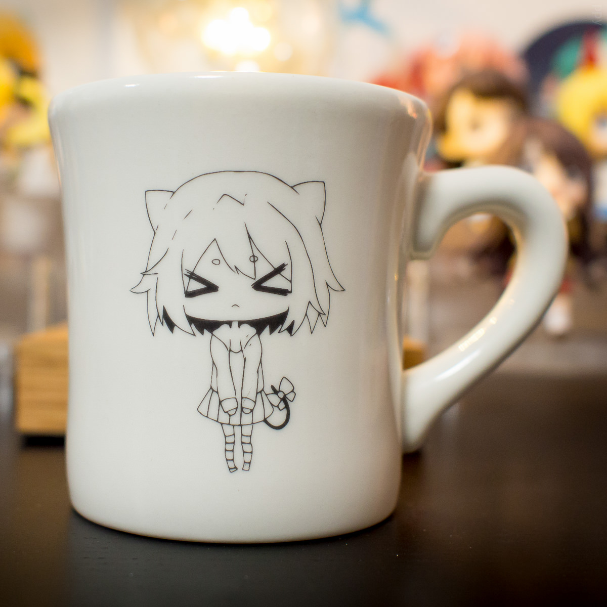 | [osu!mug (pippi)](http://store.ppy.sh/store/product/89) *兼容茶与咖啡* | 从最棒的杯子中喝一口水吧！  采用“nyan pippi”（来自 kakifly 的设计）图案，杯子底部内部印有osu!徽标。这将是您边戳泡泡边喝饮料的最佳选择。杯子均在日本制造，质量上乘。 |
| 90 | 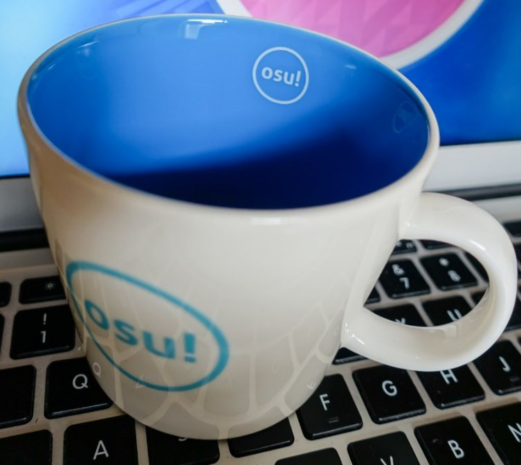 | [osu!mug (osu!)](http://store.ppy.sh/store/product/90) *兼容茶与咖啡。* | 从最棒的杯子中喝一口水吧！  The outside of this official mug is white with a cool blue osu! logo, the inside is totally blue with a mini white osu! logo. Your drinks have never looked better. 杯子均在日本制造，质量上乘。 |
| 91 | 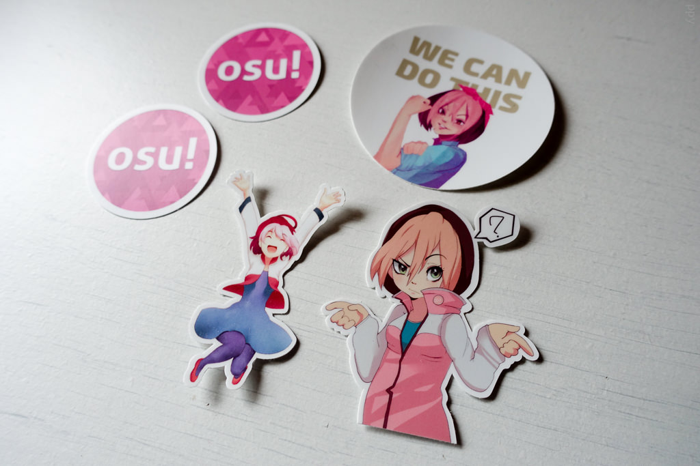 | [osu! sticker set #3](http://store.ppy.sh/store/product/91) | 全新贴纸  Now with the update 2016 design osu! logo.  Another set of osu!-themed stickers to slap on you (or your friends') belongings! These stickers feature popular artworks from the third official osu! fan art contest.  套装包含：<ul><li>1x "We Can Do It" by [BurntToaster](http://mallanarts.tumblr.com/)</li><li>1x "Shrug" by [BurntToaster](http://mallanarts.tumblr.com/)</li><li>1x “跳跃的 pippi”[Elzapatoverde 设计](https://osu.ppy.sh/u/Elzapatoverde)</li><li>2x osu! 徽标 (2016)</li></ul>这些贴纸拥有最好的质量。它们能忍受极端气候，并且可以随时被小心地移除、重贴，永不褪色！ |
| 117 - 125 | 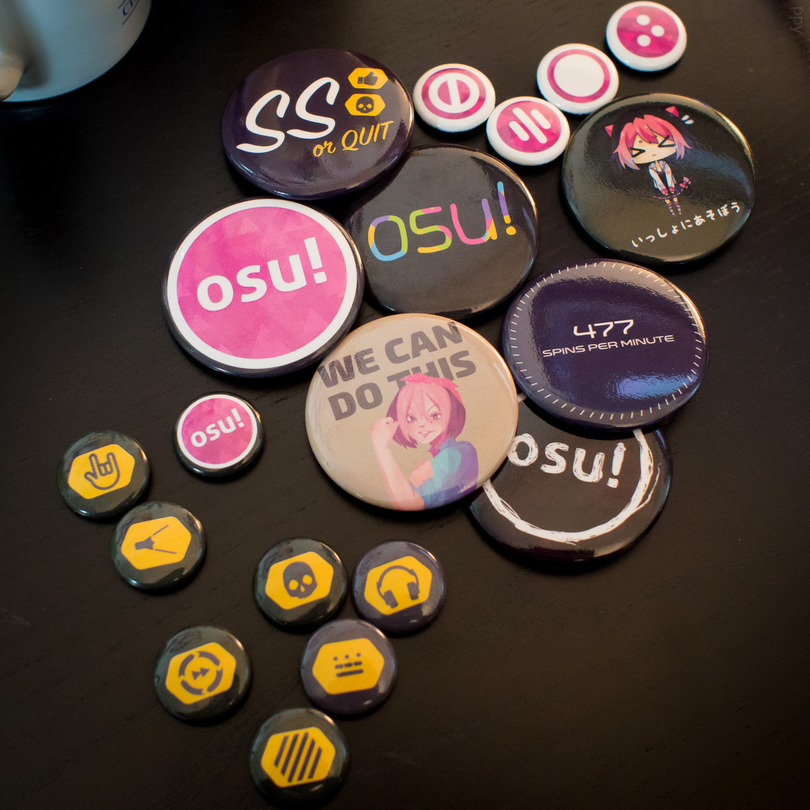 | [osu!纽扣](http://store.ppy.sh/store/product/117) *pinnable osu! flair* | Buttons to pin to everything you own!  High quality aluminium back buttons which can be pinned through most any fabric. Add a bit of osu! to your bag, jacket, cap or pretty much anywhere else!  Choose from:<ul><li>Full set: 12 个小 (2.5cm) + 7 个大 (6cm) buttons</li><li>Small set: 12 small (2.5cm) buttons</li><li>Individual large (6cm) button</li></ul>"We Can Do It" artwork [BurntToaster制作](http://mallanarts.tumblr.com/) |
| 126 - 129 | 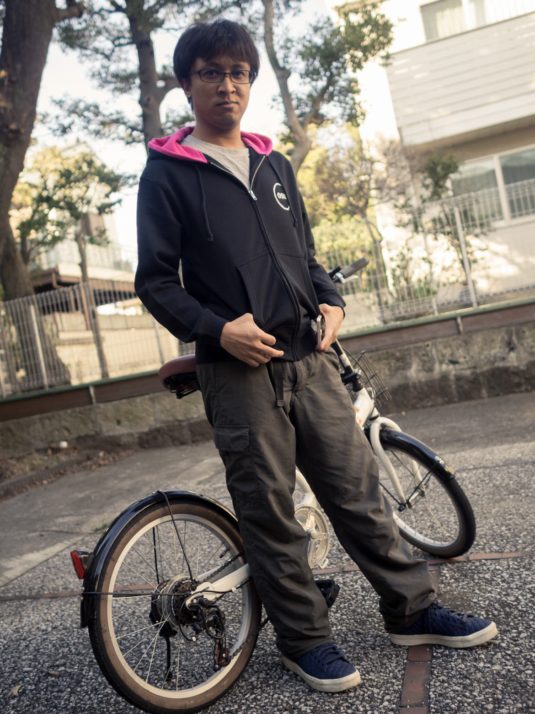 | [osu!hoodie (内侧粉色)](http://store.ppy.sh/store/product/126) *能在夜间保暖* | 全新设计的连帽衫重磅回归了！A simple osu! logo marks the front (white) and back (dark grey) and the inside of the hood is lined with osu! pink.<ul><li>100% 棉</li><li>标准重量，经过预缩水处理。</li><li>大小：S，M，L ，XL</li></ul><table><tbody><tr><th>Size</th><th>S</th><th>M</th><th>L</th><th>XL</th></tr><tr><th>Garment Length</th><td>62cm</td><td>66cm</td><td>70cm</td><td>75cm</td></tr><tr><th>Body width</th><td>52cm</td><td>55cm</td><td>58cm</td><td>63cm</td></tr><tr><th>Shoulder width</th><td>44cm</td><td>48cm</td><td>52cm</td><td>55cm</td></tr><tr><th>Sleeve length</th><td>56cm</td><td>60cm</td><td>61cm</td><td>62cm</td></tr></tbody></table>注意：尺码均为日本尺寸，请其它国家的顾客参考以上尺码表！ |
| 146 - 149 | 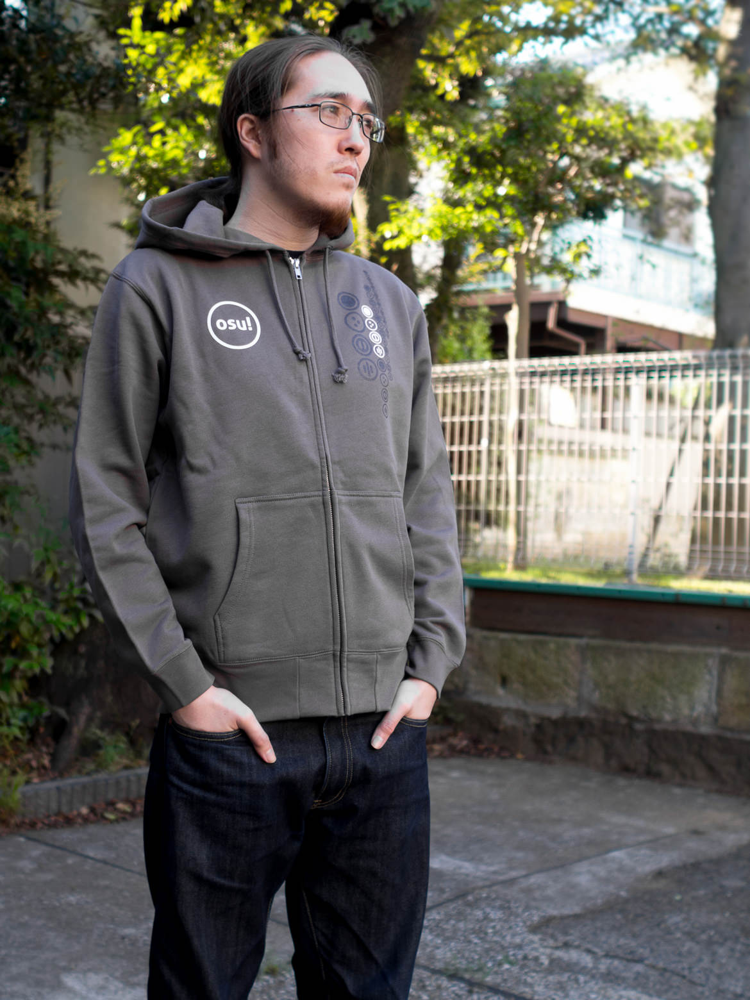 | [osu!hoodie (charcoal)](http://store.ppy.sh/store/product/146) *能在夜间保暖* | A simple and smart hoodie. Has the osu! logo and each of the four game modes in an arrangement on opposite sides of the chest area (no print on back).<ul><li>轻便的质地可以让这件连帽衫在各种气温下都能穿。</li><li>100% 棉</li><li>Sizes: S，M，L，XL</li></ul><table><tbody><tr><th>Size</th><th>S</th><th>M</th><th>L</th><th>XL</th></tr><tr><th>Garment Length</th><td>62cm</td><td>66cm</td><td>70cm</td><td>75cm</td></tr><tr><th>Body width</th><td>52cm</td><td>55cm</td><td>58cm</td><td>63cm</td></tr><tr><th>Shoulder width</th><td>44cm</td><td>48cm</td><td>52cm</td><td>55cm</td></tr><tr><th>Sleeve length</th><td>56cm</td><td>60cm</td><td>61cm</td><td>62cm</td></tr></tbody></table>注意：尺码均为日本尺寸，请其它国家的顾客参考以上尺码表！ |
| 166 | 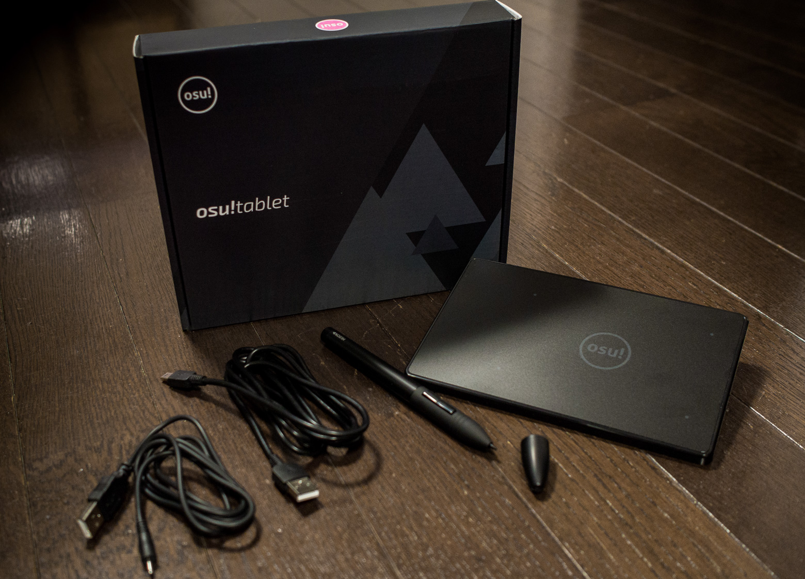 | [osu!平板 2016](http://store.ppy.sh/store/product/166) *设计更新，笔更耐磨* | 具有osu! 按键的数位板，能在 osu! 标准模式下完美运行。  2016全新版。This is the new 2016 model, featuring a higher quality pen and professional black design. The pen is now lighter and sturdier, featuring a built-in lithium-ion battery that charges via USB and lasts months at a time.  Note that the pens have a custom firmware which increases the idle standby length to ~12 minutes. This is useful for "hover" players, as with the standard HUION model it will turn off after 5 minutes of no tapping.   Specifications:  **科技**：数字电磁传感器 **活跃区域**：10.2cm x 5.8cm (4"x2.3") **输入精度**：4096x4096 **上行速率**：200Hz **压力传感器敏感度**: 2048 Levels **可读高度**：1cm (0.4") **额定功率**：0.35w **交互**: USB 1.1 **电缆长度**：150cm **规格**：176.6mm x 115mm x 7.5mm **重量**：127g |
| 167 | 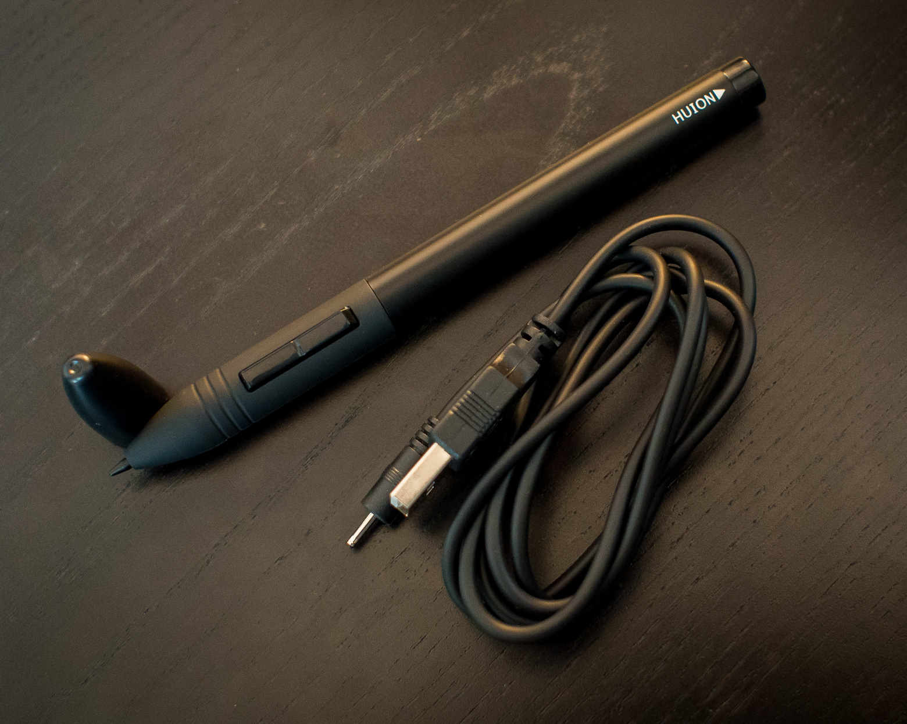 | [osu!平板 2016 替代用笔](http://store.ppy.sh/store/product/167) | osu!平板自带的笔损坏了？需要一支替代用笔？这是一支全新的、拥有内置电池（USB充电）的触控笔。它与旧版白色 osu! 平板与新版黑色 osu! 平板兼容。  注意：替代用笔只包含一支替芯。 |

定价
----

所有价格 **不包含运费**。 通过 [汇率转换](http://www.oanda.com/currency/converter/) 或者 [访问 Google](https://www.google.com.my/#q=usd+exchange+rate) 来查询您所在国家的货币汇率。
