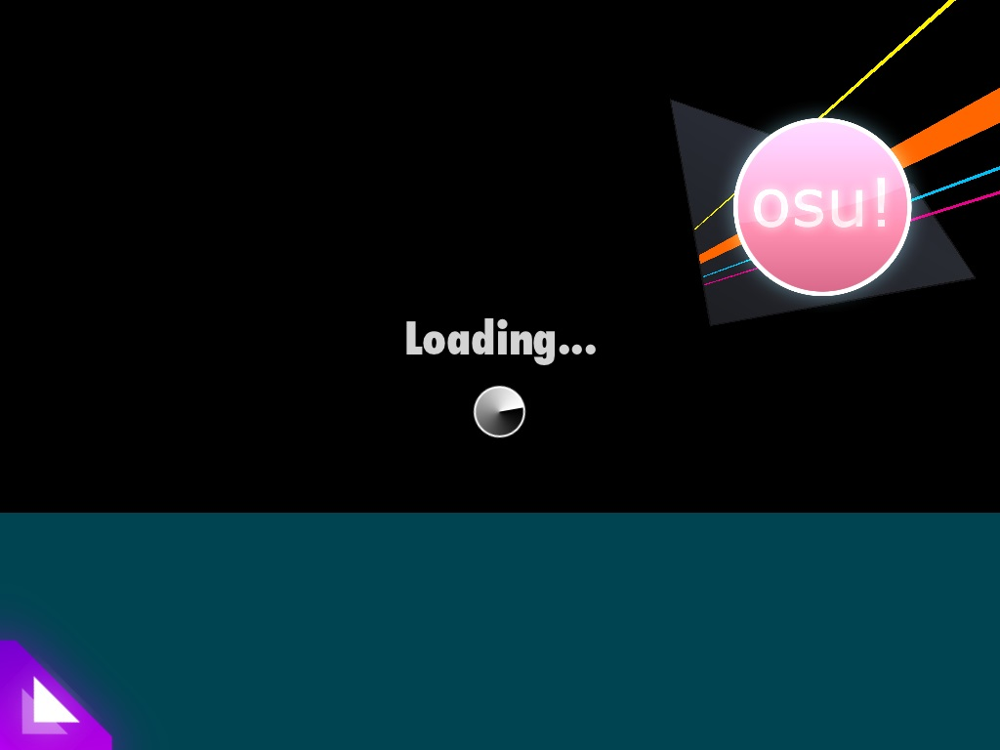

# osu!stream song list

*สำหรับข้อมูลเกี่ยวกับเกมหลัก ดูได้ที่: [osu!stream](/wiki/osu!stream)*

osu!stream มีเพลงให้เล่นได้สูงสุด 45 เพลง กระจายอยู่ในหลาย bundle และ song pack ตั้งแต่[อัปเดตปี 2020](https://news.osustream.com/post/611013728007274496/osustream-2020-release) เป็นต้นมา ทุกเพลงสามารถดาวน์โหลดและเล่นได้ฟรี

ในเมนู Store คุณสามารถเลื่อนดูรายชื่อ song pack ทั้งหมดที่มีให้โหลด และดูพรีวิวบีตแมปข้างในก่อนดาวน์โหลดได้ เมื่อเลือกปุ่ม `PREVIEW` คุณจะเห็นเดโมเกมเพลย์สั้น ๆ ของทั้งสี่ระดับความยากในบีตแมป โดยเรียงจากความยากต่ำสุดไปสูงสุด[ตามลำดับ stream ของแต่ละระดับ](/wiki/osu!stream#ระบบเกมเพลย์ใหม่)

คล้ายกับระบบ [Featured Artists](/wiki/People/Featured_Artists) ที่ osu! มีในปัจจุบัน เพลงทั้งหมดในเกมเป็นเพลงที่ถูกว่าจ้างทำหรือขอไลเซนส์ไว้ก่อนปล่อยทั้งสิ้น อีกจุดที่ควรรู้คือบีตแมปของ osu!stream ใช้ไฟล์ฟอร์แมต `.osf2` (แทนที่จะเป็น [`.osz`](/wiki/Client/File_formats/osz_(file_format))) จึงไม่สามารถใช้กับไคลเอนต์ osu! ปกติได้

## Bundled songs

ราคา: **ฟรี**

bundle นี้มีเพลงเริ่มต้น 4 เพลงที่ติดมากับการติดตั้ง osu!stream ใหม่

| เพลง | แมปเปอร์ | ระดับความยาก |
| :-- | :-- | :-- |
| nekodex - Liquid Future | ::{ flag=CA }:: [mm201](https://osu.ppy.sh/users/30655) |  |
| tieff & Natteke - Endless Tower | ::{ flag=GB }:: [RandomJibberish](https://osu.ppy.sh/users/157879) |  |
| tieff & Natteke - Sunrise | ::{ flag=GB }:: [jericho2442](https://osu.ppy.sh/users/88904) |  |
| SkyMarshall - Hitchhikers | ::{ flag=MX }:: [Gens](https://osu.ppy.sh/users/23062) |  |

ดูเพิ่มเติม:

- [**รายชื่อ Featured Artist ของ nekodex**](https://osu.ppy.sh/beatmaps/artists/1)
- [**รายชื่อ Featured Artist ของ tieff**](https://osu.ppy.sh/beatmaps/artists/34)
- [โปรไฟล์ osu! ของ nekodex](https://osu.ppy.sh/users/102)
- [โปรไฟล์ osu! ของ tieff](https://osu.ppy.sh/users/89619)
- [โปรไฟล์ osu! ของ Natteke](https://osu.ppy.sh/users/157177)
- [เว็บไซต์ของ SkyMarshall](https://hafskjold.net/skymarshallarts/)

## Free Pack 1

ราคา: **ฟรี**

song pack นี้มีเพลง 2 เพลงที่ให้ฟีลต่างกัน

| เพลง | แมปเปอร์ | ระดับความยาก |
| :-- | :-- | :-- |
| haru☆ - March Handyman | ::{ flag=FR }:: [Sushi](https://osu.ppy.sh/users/43108) |  |
| Garbled Waves - Apatisk | ::{ flag=GB }:: [RandomJibberish](https://osu.ppy.sh/users/157879) |  |

ดูเพิ่มเติม:

- [เว็บไซต์ของ haru☆](https://haru.ocv.me/)
- [หน้า Bandcamp ของ Garbled Waves](https://garbledwaves.bandcamp.com)

## Free Pack 1.5

ราคา: **ฟรี**

song pack นี้มีเพลง *Want You Gone* ของ Jonathan Coulton (ภายใต้ชื่อ Aperture Science) ซึ่งโด่งดังจากวิดีโอเกม [Portal 2](https://www.thinkwithportals.com/)

| เพลง | แมปเปอร์ | ระดับความยาก |
| :-- | :-- | :-- |
| Aperture Science - Want You Gone | ::{ flag=DE }:: [Larto](https://osu.ppy.sh/users/12328) |  |

ดูเพิ่มเติม:

  - [เว็บไซต์ของ Jonathan Coulton](https://www.jonathancoulton.com/)

## Free Pack 2

ราคา: **ฟรี**

song pack นี้มีเพลง 2 เพลงที่ให้ฟีลต่างกัน

| เพลง | แมปเปอร์ | ระดับความยาก |
| :-- | :-- | :-- |
| Bomb Boy - Ignition, Set, GO! | ::{ flag=GB }:: [D33d](https://osu.ppy.sh/users/791387) |  |
| daniwellP - Nekomimi Switch | Team STREAM (::{ flag=GB }:: [RandomJibberish](https://osu.ppy.sh/users/157879) and ::{ flag=CL }:: [Krisom](https://osu.ppy.sh/users/99269)) |  |

ดูเพิ่มเติม:

- [บัญชี Twitter ของ Bomb Boy](https://twitter.com/BomuBoi)
- [เว็บไซต์ของ daniwellP](https://aidn.jp/)

## Cranky Pack Vol. 1

ราคา: **ฟรี** / **USD$1.99** (ก่อน[อัปเดตปี 2020](https://news.osustream.com/post/611013728007274496/osustream-2020-release))

song pack นี้มีเพลง 4 เพลงจาก Cranky ผู้คร่ำหวอดด้าน rave music

| เพลง | แมปเปอร์ | ระดับความยาก |
| :-- | :-- | :-- |
| Cranky - 1970 | ::{ flag=RU }:: [IceBeam](https://osu.ppy.sh/users/208440) |  |
| Cranky - Crocus | ::{ flag=SE }:: [Xgor](https://osu.ppy.sh/users/98661) |  |
| Cranky - Into the Unknown | ::{ flag=AU }:: [Samah](https://osu.ppy.sh/users/343490) |  |
| Cranky - Dee Dee Cee | ::{ flag=GB }:: [D33d](https://osu.ppy.sh/users/791387) |  |

ดูเพิ่มเติม:

- [**รายชื่อ Featured Artist ของ Cranky**](https://osu.ppy.sh/beatmaps/artists/23)
- [เว็บไซต์ของ Cranky](https://www.feline-groove.com/)

## OK Go Vol. 1

ราคา: **ฟรี** / **USD$1.99** (ก่อน[อัปเดตปี 2020](https://news.osustream.com/post/611013728007274496/osustream-2020-release))

song pack นี้มีเพลง 4 เพลงจาก OK Go วงร็อกอเมริกัน

| เพลง | แมปเปอร์ | ระดับความยาก |
| :-- | :-- | :-- |
| OK Go - All Is Not Lost | ::{ flag=CA }:: [mm201](https://osu.ppy.sh/users/30655) |  |
| OK Go - End Love | ::{ flag=GB }:: [RandomJibberish](https://osu.ppy.sh/users/157879) |  |
| OK Go - This Too Shall Pass | ::{ flag=AU }:: [m980](https://osu.ppy.sh/users/3288) |  |
| OK Go - WTF | Team STREAM (::{ flag=CA }:: [mm201](https://osu.ppy.sh/users/30655) and ::{ flag=AU }:: [Lilac](https://osu.ppy.sh/users/58197)) |  |

ดูเพิ่มเติม:

- [เว็บไซต์ของ OK Go](https://okgo.net/)

## Koizumi Vol. 1

ราคา: **ฟรี** / **USD$2.99** (ก่อน[อัปเดตปี 2020](https://news.osustream.com/post/611013728007274496/osustream-2020-release))

song pack นี้มีเพลง 4 เพลงจากค่ายเพลง Tsundere Recordings

| เพลง | แมปเปอร์ | ระดับความยาก |
| :-- | :-- | :-- |
| Koizumi UNDERGROUND - Get Back! | ::{ flag=GB }:: [D33d](https://osu.ppy.sh/users/791387) |  |
| samplingmasters Koizumi - With Me | ::{ flag=GB }:: [D33d](https://osu.ppy.sh/users/791387) |  |
| samplingmasters Koizumi - Love is a Danger Zone | ::{ flag=GB }:: [D33d](https://osu.ppy.sh/users/791387) |  |
| samplingmasters Koizumi - Infinity Loop | ::{ flag=GB }:: [D33d](https://osu.ppy.sh/users/791387) |  |

ดูเพิ่มเติม:

- [ช่อง YouTube ของ Tsundere Recordings](https://www.youtube.com/user/TsundereRecordings)

## Electronic Pack Vol. 1

ราคา: **ฟรี** / **USD$0.99** (ก่อน[อัปเดตปี 2020](https://news.osustream.com/post/611013728007274496/osustream-2020-release))

song pack นี้มีเพลงแนว electronic 4 เพลงจากนักดนตรีอิสระที่คัดเลือกมา

| เพลง | แมปเปอร์ | ระดับความยาก |
| :-- | :-- | :-- |
| Kenneth Nilsen - Space Music | ::{ flag=GB }:: [jericho2442](https://osu.ppy.sh/users/88904) |  |
| Kenneth Nilsen - Woohoo! | ::{ flag=CL }:: [Krisom](https://osu.ppy.sh/users/99269) |  |
| NIGHTkilla - Fracture | ::{ flag=GB }:: [jericho2442](https://osu.ppy.sh/users/88904) |  |
| SkyMarshall - It's True | ::{ flag=GB }:: [jericho2442](https://osu.ppy.sh/users/88904) |  |

ดูเพิ่มเติม:

- [หน้า Soundcloud ของ Kenneth Nilsen](https://soundcloud.com/keosni391)
- [Soundcloud ของ NIGHTkilla](https://soundcloud.com/qbiq-nightkilla)
- [เว็บไซต์ของ SkyMarshall](https://hafskjold.net/skymarshallarts/)

## Odyssey Pack

ราคา: **ฟรี** / **USD$0.99** (ก่อน[อัปเดตปี 2020](https://news.osustream.com/post/611013728007274496/osustream-2020-release))

song pack นี้มีเพลง 4 เพลงจาก Odyssey Eurobeat กลุ่มนักดนตรีบนอินเทอร์เน็ต

| เพลง | แมปเปอร์ | ระดับความยาก |
| :-- | :-- | :-- |
| Odyssey - Wings of Burning Love | ::{ flag=DE }:: [Larto](https://osu.ppy.sh/users/12328) |  |
| Odyssey - Cherry Blossoms (2010 Mix) | ::{ flag=GB }:: [Mashley](https://osu.ppy.sh/users/41481) |  |
| Mortimer - Rive | ::{ flag=US }:: [ouranhshc](https://osu.ppy.sh/users/139493) |  |
| Travis Stebbins - Magnetic Love | ::{ flag=CA }:: [mm201](https://osu.ppy.sh/users/30655) |  |

ดูเพิ่มเติม:

- [หน้า Bandcamp ของ Odyssey Eurobeat](https://odysseymusic.bandcamp.com/)

## VVVVVV Pack Vol. 1

ราคา: **ฟรี** / **USD$0.99** (ก่อน[อัปเดตปี 2020](https://news.osustream.com/post/611013728007274496/osustream-2020-release))

song pack นี้มีเพลง 4 เพลงจาก SoulEye ซึ่งทั้งหมดเป็นเพลงที่อยู่ในเกมแพลตฟอร์มชื่อดัง [VVVVVV](https://thelettervsixtim.es/)

| เพลง | แมปเปอร์ | ระดับความยาก |
| :-- | :-- | :-- |
| Souleye - Positive Force | ::{ flag=GB }:: [RandomJibberish](https://osu.ppy.sh/users/157879) |  |
| Souleye - Pressure Cooker | ::{ flag=SE }:: [Xgor](https://osu.ppy.sh/users/98661) |  |
| Souleye - Potential for Anything | ::{ flag=DE }:: [Larto](https://osu.ppy.sh/users/12328) |  |
| Souleye - Passion for Exploring | ::{ flag=CA }:: [mm201](https://osu.ppy.sh/users/30655) |  |

ดูเพิ่มเติม:

- [เว็บไซต์ของ Souleye](http://magnuspalsson.com/)

## SHIKI Pack Vol. 1

ราคา: **ฟรี** / **USD$1.99** (ก่อน[อัปเดตปี 2020](https://news.osustream.com/post/611013728007274496/osustream-2020-release))

song pack นี้มีเพลง 4 เพลงจาก SHIKI โปรดิวเซอร์เพลง BMS ชื่อดัง

| เพลง | แมปเปอร์ | ระดับความยาก |
| :-- | :-- | :-- |
| SHIKI - Lapis | Team STREAM (::{ flag=GB }:: [RandomJibberish](https://osu.ppy.sh/users/157879) and ::{ flag=FR }:: [Kurai](https://osu.ppy.sh/users/77089)) |  |
| SHIKI - Pure Ruby | ::{ flag=US }:: [Lybydose](https://osu.ppy.sh/users/64501) |  |
| SHIKI - BABYLON | ::{ flag=SE }:: [Xgor](https://osu.ppy.sh/users/98661) |  |
| SHIKI - Jade Star | ::{ flag=KR }:: [Nakagawa-Kanon](https://osu.ppy.sh/users/87065) |  |

ดูเพิ่มเติม:

- [เว็บไซต์ของ SHIKI](http://shiki2.sakura.ne.jp/)

## Unreleased Tracks Vol. 1

ราคา: **ฟรี** / **USD$1.99** (ก่อน[อัปเดต v1.1](https://news.osustream.com/post/10624373514/osustream-v11-release))

song pack นี้มีเพลง arrange ต้นฉบับ 4 เพลงจาก Touhou Project โดยนักดนตรีหลายคน

เดิมที song pack นี้ถูกรวมอยู่ในตัวเกมตอนเปิดตัว พร้อมป้ายราคา USD$1.99 แต่ด้วยข้อกังวลทางกฎหมายเกี่ยวกับการแจกจ่าย asset ที่เกี่ยวข้องกับ Touhou Project บน App Store ในฐานะคอนเทนต์แบบเสียเงิน song pack นี้จึงถูกถอดออกใน[อัปเดต v1.1](https://news.osustream.com/post/10624373514/osustream-v11-release) ต่อมาจึงถูกปล่อยใหม่เป็นคอนเทนต์ฟรีใน[อัปเดตปี 2020](https://news.osustream.com/post/611013728007274496/osustream-2020-release)

| เพลง | แมปเปอร์ | ระดับความยาก |
| :-- | :-- | :-- |
| Amane - Eternal Fullmoon | ::{ flag=PH }:: [James](https://osu.ppy.sh/users/5728) |  |
| Amane - Snow, White, Echo | ::{ flag=NZ }:: [Echo](https://osu.ppy.sh/users/431) |  |
| sou1 - The Maid's Blood and the Pocket Watch | ::{ flag=TW }:: [Alace](https://osu.ppy.sh/users/25993) |  |
| Lix - Phantom Ensemble -Ark Trance mix- | ::{ flag=PH }:: [James](https://osu.ppy.sh/users/5728) |  |

ดูเพิ่มเติม:

- [เว็บไซต์ของ Amane/Rolling Contact](https://youzyo.net/)
- [ช่อง YouTube ของ sou1](https://www.youtube.com/channel/UCDOnl9xBMM-SZtCKKu178NA)
- [เว็บไซต์ของ Lix](https://levolution.info)

## Unreleased Tracks Vol. 2

ราคา: **ฟรี** / **USD$1.99** (ก่อน[อัปเดต v1.1](https://news.osustream.com/post/10624373514/osustream-v11-release))

song pack นี้มีเพลง arrange ต้นฉบับ 4 เพลงจาก Touhou Project โดยนักดนตรีหลายคน

เดิมที song pack นี้ถูกรวมอยู่ในตัวเกมตอนเปิดตัว พร้อมป้ายราคา USD$1.99 แต่ด้วยข้อกังวลทางกฎหมายเกี่ยวกับการแจกจ่าย asset ที่เกี่ยวข้องกับ Touhou Project บน App Store ในฐานะคอนเทนต์แบบเสียเงิน song pack นี้จึงถูกถอดออกใน[อัปเดต v1.1](https://news.osustream.com/post/10624373514/osustream-v11-release) ต่อมาจึงถูกปล่อยใหม่เป็นคอนเทนต์ฟรีใน[อัปเดตปี 2020](https://news.osustream.com/post/611013728007274496/osustream-2020-release)

| เพลง | แมปเปอร์ | ระดับความยาก |
| :-- | :-- | :-- |
| Lix - Electro Magnetic Pulse | ::{ flag=AU }:: [peppy](https://osu.ppy.sh/users/2) |  |
| haru☆ - Septette for the Dead Princess | ::{ flag=US }:: [Lybydose](https://osu.ppy.sh/users/64501) |  |
| Amane - BOOZEHOUND (DJ mix) | ::{ flag=FR }:: [Sushi](https://osu.ppy.sh/users/43108) |  |
| Amane - Being Proof | ::{ flag=PH }:: [James](https://osu.ppy.sh/users/5728) |  |

ดูเพิ่มเติม:

- [เว็บไซต์ของ Lix](https://levolution.info)
- [เว็บไซต์ของ haru☆](https://haru.ocv.me/)
- [เว็บไซต์ของ Amane/Rolling Contact](https://youzyo.net/)

## สกรีนช็อต

---

")

---

---

")

---

---

---

---

