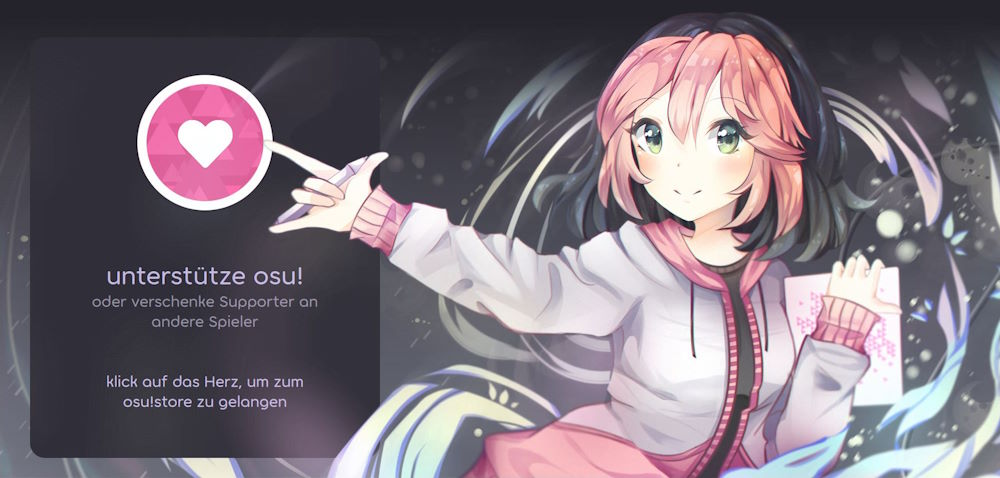
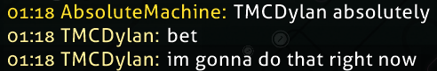
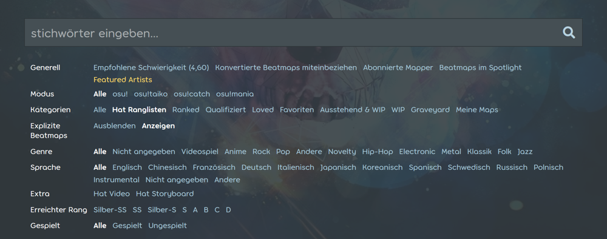
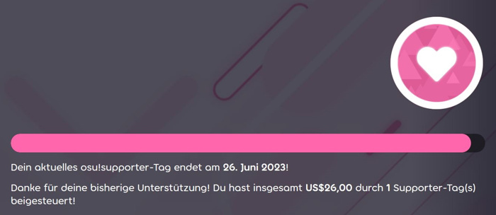
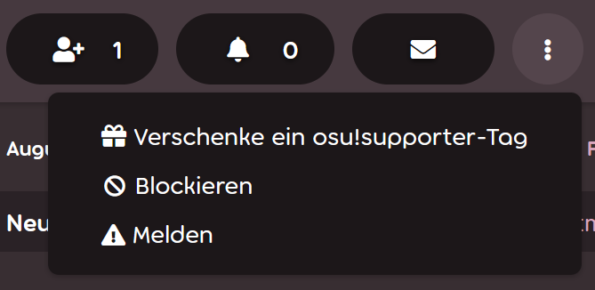

# osu!supporter

**osu!supporter** (oder das ***osu!supporter-Tag***) ist ein zeitlich begrenzter Titel, der Spielern verliehen wird, die osu! durch eine freiwillige Geldspende unterstützen, um das Spiel zu fördern. Unterstützer erhalten eine handvoll kosmetischer und technischer Vorteile, von denen die meisten nur aktiv sind, wenn der Titel vorhanden ist. Die zusätzlichen Funktionen von osu!supporter geben keinen Vorsprung im Gameplay, in der Leistung oder dem Erreichen von Scores und werden es auch nie.

Das osu!supporter-Tag kann über die [osu!supporter-Seite des Stores](https://osu.ppy.sh/store/products/supporter-tag) erworben werden.

## Features

### Herzabzeichen

::: Infobox

:::

::: Infobox

:::

Unterstützer bekommen ein Abzeichen mit Herzen darauf, das auf der Webseite normalerweise neben ihrem Benutzernamen angezeigt wird. Die Anzahl der Herzen hängt ab von der Dauer von osu!supporter, die der Nutzer insgesamt erworben oder erhalten hat:

- Weniger als 1 Jahr: 1 Herz
- Zwischen 1 und 5 Jahre: 2 Herzen
- Mehr als 5 Jahre: 3 Herzen

### Farbe des Nutzernamens

::: Infobox

:::

Nutzernamen von aktiven Unterstützern erscheinen leuchtend gelb im [Chat](/wiki/Client/Interface/Chat_console) für andere Benutzer.

### Editierbare Profilsektion

Unterstützer erhalten einen neuen Profilabschnitt namens `ich!`, welcher oft als Benutzerseite bezeichnet wird. Die Benutzerseite dient als persönlicher, editierbarer Bereich, in dem Text mit [BBCode](/wiki/BBCode) formatiert ist. Diese Funktion ist permanent und bleibt bearbeitbar, selbst nachdem osu!supporter ausläuft.

Die `ich!`-Seite könnte ein guter Platz sein für:

- Banner, Kollaborationen und Infographiken, um das Profil aufzuhübschen
- Einige Absätze oder Einträge, die Einblicke in das Leben des Spielers gewähren
- Ein Schaufenster der beliebtesten Beatmaps, Mapper oder alles andere, das als wichtig erachtet wird

### Profilbanner

Unterstützer können des Weiteren ihr Profil durch ein Titelbild anpassen:

- Klicke auf das Stiftsymbol in der rechten, unteren Ecke des Cover-Platzhalters.
- Wähle ein neues Titelbild aus den vorgegebenen Optionen oder lade ein eigenes Bild hoch (die Dimensionen sollten 2400 x 640 sein).

Sobald osu!supporter ausläuft, wird das Titelbild bestehen bleiben, kann aber nicht mehr geändert werden.

### Profilfarben

Ähnlich zu Profilbannern können osu!supporter die Farbe ihres Profils ändern:

- Drücke auf das Stiftsymbol in der rechten, unteren Ecke des Profilbanners.
- Die Profilfarbe einzustellen verändert die Farbe von fast allem. Dazu gehört der Banner, Buttons, Links und Text.

Sobald osu!supporter ausläuft, bleibt die Farbwahl erhalten, kann aber nur zum Standard zurückgesetzt werden.

### Eine kostenlose Änderung des Benutzernamens

*Anmerkung: Kleinere Namensänderungen können beim Account-Support-Team kostenlos beantragt werden — siehe [Hilfecenter/Account § Kann ich den Benutzernamen meines Accounts ändern?](/wiki/Help_centre/Account#name-changes).*

osu!supporter zu bekommen ist verbunden mit der Fähigkeit, den Benutzernamen beim ersten Mal kostenlos zu ändern, unter den [üblichen Bedingungen](/wiki/Help_centre/Account#name-changes).

### osu!direct

osu!direct ist das Such- und Downloadmodul für Beatmaps im Spiel, welches nur für Unterstützer verfügbar ist. Es kann über das Hauptmenü erreicht werden, indem man auf das vertikale Label `osu!direct` auf der rechten Seite des Bildschirms klickt. Zusätzlich zu einer eingebauten Beatmap-Auflistung bietet osu!direct andere Wege, an neue Beatmaps zu gelangen, ohne das Spiel zu verlassen:

- Beatmap-Links im Chat, die auf Beatmaps auf der osu!-Webseite zeigen, lösen jetzt im Spiel eine Aufforderung zum Herunterladen aus
- Automatisches Herunterladen von Beatmaps während des Spielens in einer [Mehrspieler](/wiki/Client/Interface/Multiplayer)-Lobby oder beim [Zuschauen](/wiki/Gameplay/Spectating) eines anderen Spielers, als eine [Opt-out-Einstellung](/wiki/Client/Options#integration)
- Automatische Verlinkung von aktuell gespielten Beatmaps für Zuschauer im Chat-Tab `#spectator`, als eine [Opt-out-Einstellung](/wiki/Client/Options#mitteilungen-und-privatsphäre)

### Erweiterte Ranglisten

Unterstützer haben Zugriff auf mehrere beatmapspezifische [Ranglisten](/wiki/Beatmap#ranglisten), die sowohl im Spiel als auch auf der Webseite verfügbar sind:

- Globale Ranglisten für jede Kombination an [Spielmodifikationen](/wiki/Gameplay/Game_modifier)
- Länderspezifische Ranglisten von Spielern, die die gleiche Flagge tragen
- Freundesranglisten, die die Position eines Spielers auf einer Beatmap verglichen mit seinen Freunden zeigen

### Erhöhte Grenzwerte

osu! bietet eine Lockerung der Grenzwerte für verschiedene Online-Features für Unterstützer an:

| Wert | Normales Limit | osu!supporter-Limit |
| :-- | :-: | :-: |
| [Ausstehende Beatmaps](/wiki/Beatmap/Category#wip-and-pending) | `4 + min(gerankte Beatmaps, 4)`, bis zu **8**[^pending-beatmaps-ref] | `8 + min(gerankte Beatmaps, 12)`, bis zu **20**[^pending-beatmaps-ref] |
| Teamgröße | 8 | `8 + 4 * Teammitglieder mit osu!supporter`, bis maximal **256** |
| Online-Beatmap-Favoriten | 100 | 1000 |
| Anzahl der Freunde | 500 | 1000 |

Des Weiteren werden Besitzern von osu!supporter weniger strenge Download-Beschränkungen gewährt.

### Extra skinnbare Elemente

Nach Erhalt von osu!supporter können einige visuelle und akustische Elemente der osu!-Benutzeroberfläche benutzerdefiniert angepasst werden:

| Element | Beschreibung |
| :-- | :-- |
| `menu-background.jpg` | Der Hintergrund des Hauptmenüs |
| `welcome_text.png` | Der Text "welcome", der beim Starten des Spiels erscheint |
| `welcome.wav` | Das Sample "welcome to osu!", das beim Starten des Spiels abgespielt wird |
| `seeya.wav` | Das Sample "see ya next time", das beim Beenden des Spiels abgespielt wird |

Für mehr Details, siehe [Skinning/Benutzeroberfläche § Hauptmenü](/wiki/Skinning/Interface#main-menu) und [Skinning/Sounds § Hauptmenü](/wiki/Skinning/Sounds#main-menu).

### Erweiterte Suche

::: Infobox

:::

Unterstützer haben Zugang zu einem erweiterten Satz von [Beatmap-Suchfiltern](https://osu.ppy.sh/beatmapsets):

- Beatmaps, die gespielt (oder nicht gespielt) wurden
- Beatmaps, auf denen ein Score mit einer bestimmten [Note](/wiki/Gameplay/Grade) erreicht wurde

### Mehrspieler in experimentellen Builds von osu!

Unterstützer können auf der Early-Access-Updatequelle "cutting edge" auf den Mehrspielermodus zugreifen.

## Verbleibende Dauer

::: Infobox

:::

Die restliche osu!supporter-Dauer sowie die Gesamtzahl an Beiträgen, Tag-Käufen und Geschenken ist oben auf der [osu!supporter-Promo-Seite](https://osu.ppy.sh/home/support) verfügbar.

## osu!supporter kaufen

Um osu!supporter zu kaufen, besuche die [osu!supporter-Shop-Seite](https://osu.ppy.sh/store/products/supporter-tag) und passe die Dauer des Supporter-Tags mit Hilfe des Schiebereglers oder den Buttons mit der darunter befindlichen Anzahl an Monaten an. Alle Preise sind in United States Dollar (USD) angegeben und enthalten keine möglichen Gebühren für das Bezahlungssystem.

Klicke danach auf `Zum Warenkorb hinzufügen`, um das Supporter-Tag in den osu!store-Einkaufswagen zu legen. Gehe zum Abschluss des Kaufs zum [Einkaufswagen](https://osu.ppy.sh/store/cart) und klicke `Zur Kasse`, dann folge den Anweisungen auf dem Bildschirm.

### osu!supporter verschenken

::: Infobox

:::

osu!supporter kann auch an andere Spieler verschenkt werden, indem ihr Nutzername in die graue Box unter der Benutzerkarte eingegeben wird, oder indem auf den Button `Verschenke ein osu!supporter-Tag` auf ihrer Profilseite geklickt wird. Weitere Personen können hinzugefügt werden, indem man zur Shop-Seite oder zum Profil eines Spielers zurückgeht und den Prozess wiederholt.

Der Empfänger wird nicht darüber informiert, wer ihm das Tag gab, aber beim Verschenken von osu!supporter kann eine optionale Nachricht angehängt werden, die zusammen mit der E-Mail-Benachrichtigung versendet wird.

### Bestätigung

Nachdem die Transaktion abgeschlossen wurde, taucht ein neues Event in der Sektion `Neulich` im Profil sowohl des Schenkenden als auch des Beschenkten:

- `{Benutzername} hat osu! unterstützt - vielen Dank für deine Großzügigkeit!`, wenn es das erste Mal ist, dass der Nutzer osu!supporter erhält oder es einer anderen Person schenkt.
- `{Benutzername} hat sich erneut dazu entschieden, osu! zu unterstützen - vielen Dank für deine Großzügigkeit!`, wenn der Nutzer bereits vorher osu!supporter war oder osu!supporter verschenkt hat.
- `{Benutzername} hat osu!supporter als Geschenk erhalten!`, für den Fall, dass das Tag verschenkt wurde.

Der Schenkende kann dieses Event auf seinem eigenen Profil verbergen, indem während der Bezahlung `Alle osu!supporter-Tags in dieser Bestellung aus meiner Aktivität ausblenden` aktiviert wird. Dies ist nützlich für anonyme Geschenke, weil es verhindert, dass der Empfänger die Profilaktivität abgleichen kann.

Zusätzlich wird der Schenkende und der Empfänger eine E-Mail-Benachrichtigung erhalten, die den Kauf erwähnt.

## Referenzen

[^pending-beatmaps-ref]: [Forumsbeitrag von peppy (14.09.2021) in "Increase the number of pending beatmap slots"](https://osu.ppy.sh/community/forums/topics/1388182?n=34)
