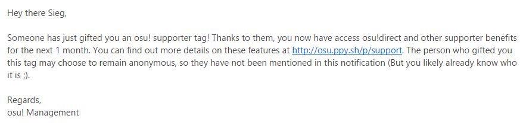

# osu!supporter

[Supporting osu!](https://osu.ppy.sh/p/support)

Laconic: Donation is used to sustain _osu!_ overall.

## Advantages of osu!supporter

- osu!direct (In-game direct download function)
- Access to [Multi](/wiki/Multi "Multi") when using `osu!cuttingedge`.
- [Chat Console](/wiki/Chat_Console "Chat Console"): Bright yellow name for others. However, own username is shown as white instead.
- [Beatmap listing](https://osu.ppy.sh/p/beatmaplist "Beatmap list"): Filter beatmap searches by played and unplayed maps.
- [Skinning](/wiki/Skinning "Skinning"): Some additional skin elements can be used, such as the [main menu](https://osu.ppy.sh/forum/t/96949)'s background.
  - Specifically, `menu-background.jpg` (Main Menu); `triangle.jpg` (Triangles); `welcome.wav` (Welcome Sound); `seeya.wav` (Exiting Sound)
- [Feature Requests](https://osu.ppy.sh/forum/4 "Feature Requests"): Extra votes for feature requests (2 per month over usual 1 per month).
- [Song Selection](/wiki/Interface "Song Selection in Interface"): The ability to view beatmap's in own country/friends/mod-specific rankings in-game.
- Own Profile: <https://osu.ppy.sh/u/{userid/username}>
  - A user page can be added to the profile.
    - The user page will not be deleted when osu!supporter expires.
  - The ability to [change username](https://osu.ppy.sh/p/profile-username/).
    - Username can still be changed even when osu!supporter expires.
  - Increased beatmap submission limits (up to 10 pending beatmaps total).
- [Performance Ranking](https://osu.ppy.sh/p/pp): Allow `filter to friends` command.
- _More to come!_

## Getting osu!supporter

### Cost by month

[Use this currency convertor](https://www.oanda.com/currency/converter/) or [ask Google](https://www.google.com.my/#q=usd+exchange+rate) to check the price at per country rate. The costs are in `USD` (`US$`, United States Dollars) currency.

| Months | Cost, `USD` (against actual overall) |
|--------|--------------------------------------|
| 1      | 4                                    |
| 2      | 8                                    |
| 4      | 12 (-25%)                            |
| 6      | 16 (-33%)                            |
| 8      | 20 (-38%)                            |
| 9      | 22 (-39%)                            |
| 10     | 24 (-40%)                            |
| 12     | 26 (-46% max)                        |
| 24     | 52 (-46% max)                        |

Note:-

- Costs are by per individual account. There are no promotions for group gifting.

### Decide

By default, only the player's account will be shown. If the player want to gift osu!supporter to another player, there is an option called `Gift another player` and type in the player's account name on the empty field provided. For multiple gifting, use `Add another tag` button beside the green `Checkout` button.

After the accounts are confirmed, drag the white slider below the account to determine osu!supporter active duration and the amount to pay for the account's osu!supporter. Each accounts can have different osu!supporter duration.

Once the durations for all the accounts are confirmed, click on the green `Checkout` button to confirm the selection

### Payment

Various payment methods will be displayed here.

It is recommended to use [PayPal](https://www.paypal.com "PayPal") or `Credit Card` services. There are other ways to pay (such as `SMS` or local service providers such as [Cherry Credits](https://www.cherrycredits.com/ "Cherry Credits")) but additional fees may be charged.

### Duration

 After the transaction is completed, the profile's `Recent Activity` will say "{username} has become an osu! supporter - thanks for your generosity!" if it is the first time that account gets osu!supporter or "{username} has once again chosen to donate to the osu! cause - thanks for your generosity!" if the account has been an osu!supporter before. The osu!supporter badge can be found below the profile image.
 
 To check for _when_ the osu!supporter will expire, return to [osu!supporter page](https://osu.ppy.sh/p/support "osu!supporter").

An email will be sent by the osu! Management to all the accounts receiving the osu!supporter tag for the transaction.
