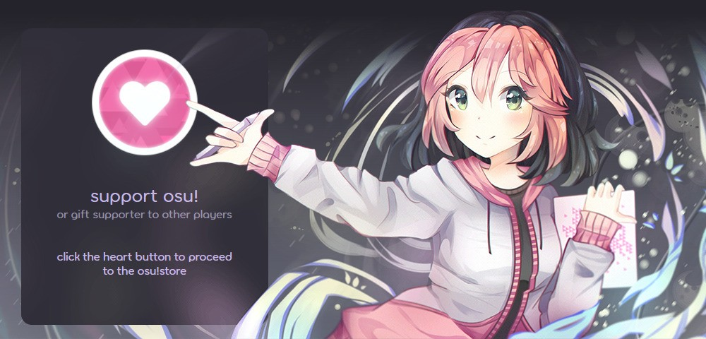
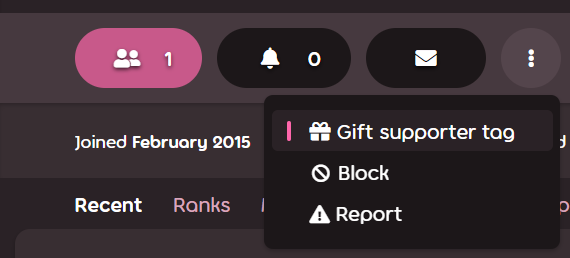

---
tags:
  - supporter tag
  - osu!supporter tag
---

# osu!supporter

**osu!supporter** (or the ***osu!supporter tag***) is a temporary title given to players who support osu! by making a voluntary, monetary donation to help it thrive. Supporters receive a handful of cosmetic and technical benefits, most of which are active only when the title is present. The extra features from osu!supporter do not give any advantage in gameplay, performance, or score, and never will.

The osu!supporter tag may be obtained from the [osu!supporter store page](https://osu.ppy.sh/store/products/supporter-tag).

## Features

### Heart badge

::: Infobox

:::

::: Infobox

:::

Supporters get a badge with hearts on it, usually found next to their username on the website. The amount of hearts depends on the duration of osu!supporter the user has acquired or received in total<!-- source: https://github.com/ppy/osu-web/blob/ac227d6abbd48630ebbf428c4e3372f388004ee5/app/Models/User.php#L1733-L1750 -->:

- Less than 1 year: 1 heart
- From 1 to 5 years: 2 hearts
- More than 5 years: 3 hearts

### Username colour

::: Infobox

:::

Usernames of active supporters appear bright yellow in [chat](/wiki/Client/Interface/Chat_console) for other users.

### Editable profile section

Supporters receive a new profile section titled `me!`, often referred to as a userpage. The userpage serves as a personal editable space, where text is formatted using [BBCode](/wiki/BBCode). This feature is permanent and stays editable even after osu!supporter wears out.

The `me!` section may be a good place for:

- Banners, collabs, and infographics to spice up the profile
- A few paragraphs or items providing insights into a player's life
- A showcase of favourite maps, mappers, or anything else they consider important

### Profile cover

Supporters can further customise their profile by setting a cover image:

- Press the pencil icon in the lower right corner of the cover placeholder.
- Select a new cover from a few predefined options, or upload a custom image (its dimensions should be 2400x640).

Once osu!supporter expires, the cover will remain, but cannot be changed.

### Profile colour

Akin to profile covers, supporters can alter the colour of their profile:

- Press the pencil icon in the lower right corner of the profile cover.
- Adjusting the profile colour alters the colour of almost everything, including the banner, buttons, links, and text.

Once osu!supporter expires, the colour customisations will remain, but may only be changed back to default.

### One free username change

*Note: Minor name changes may be requested from the account support team for free — see [Help centre/Account § Can I change my account's username?](/wiki/Help_centre/Account#name-changes).*

Getting osu!supporter comes with the ability to change usernames for free for the first time, under [usual conditions](/wiki/Help_centre/Account#name-changes).

### osu!direct

osu!direct is the in-game beatmap search and download engine available to supporters. It may be accessed from the main menu by clicking the vertical `osu!direct` label on the right side of the screen. In addition to a built-in beatmap listing, osu!direct provides other ways to obtain new beatmaps without leaving the game:

- Beatmap links in chat, which point to beatmaps on the osu! website, now trigger the download prompt in-game
- Automatic beatmap downloads while playing in a [multiplayer](/wiki/Client/Interface/Multiplayer) lobby or [spectating](/wiki/Gameplay/Spectating) another player, as an [opt-out setting](/wiki/Client/Options#integration)
- Automatic linking of currently played beatmaps in the `#spectator` chat tab for spectators, as an [opt-out setting](/wiki/Client/Options#alerts-and-privacy)

### Extended leaderboards

Supporters have access to several beatmap-specific [leaderboards](/wiki/Beatmap#leaderboards) available both in-game and on the website:

- Global rankings for every combination of [game modifiers](/wiki/Gameplay/Game_modifier)
- Country-specific rankings of players bearing the same flag
- Friend rankings that show a player's position on a map compared to their friends

### Increased limits

osu! offers more relaxed limits on various online features to supporters:

| Value | Regular limit | osu!supporter limit |
| :-- | :-: | :-: |
| [Pending beatmaps](/wiki/Beatmap/Category#wip-and-pending) | `4 + min(ranked beatmaps, 4)`, up to **8**[^pending-beatmaps-ref] | `8 + min(ranked beatmaps, 12)`, up to **20**[^pending-beatmaps-ref] |
| Team size | 8 | `8 + 4 * supporters in the team` up to **256** |
| Online beatmap favourites | 100 | 1000 |
| Friend count | 500 | 1000 |

Additionally, bearers of osu!supporter are granted more lenient beatmap download limits.

### Extra skinnable elements

After obtaining osu!supporter, some visual and aural elements of the osu! interface become skinnable:

| Element | Description |
| :-- | :-- |
| `menu-background.jpg` | The main menu background |
| `welcome_text.png` | The "welcome" text that appears when the game starts up |
| `welcome.wav` | The "welcome to osu!" sample that plays when the game starts up |
| `seeya.wav` | The "see ya next time" sample that plays when the game shuts down |

For details, see [Skinning/Interface § Main menu](/wiki/Skinning/Interface#main-menu) and [Skinning/Sounds § Main menu](/wiki/Skinning/Sounds#main-menu).

### Extended search

::: Infobox

:::

Supporters have access to an extended set of [beatmap search](https://osu.ppy.sh/beatmapsets) filters:

- Beatmaps that were (or were not) played
- Beatmaps where a score with certain [grade](/wiki/Gameplay/Grade) was set

### Multiplayer in experimental builds of osu!

Supporters may access multiplayer from builds on the early access "cutting edge" release stream.

## Remaining duration

::: Infobox

:::

The remaining osu!supporter duration, as well as total amount of contributions, tag purchases, and gifts, is available at the top of the [osu!supporter promo page](https://osu.ppy.sh/home/support).

## Getting osu!supporter

To get osu!supporter, visit the [osu!supporter store page](https://osu.ppy.sh/store/products/supporter-tag) and adjust the supporter tag duration using the slider, or the buttons with the number of months underneath. All prices are in United States dollars (USD) and don't include possible fees of the payment system.

Afterwards, click `Add to Cart` to put the supporter tag into the osu!store shopping cart. To finalise the purchase, go to the [shopping cart](https://osu.ppy.sh/store/cart) and click `Checkout`, then follow on-screen prompts.

### Gifting osu!supporter

::: Infobox

:::

osu!supporter may also be gifted to another player by entering their username below the user card, or by clicking `Gift supporter tag` on their profile page. More people can be added by going back to the store page or someone else's profile and repeating the process.

The recipient is not notified of who gave them the tag, but when gifting osu!supporter, an optional message can be attached to be sent alongside the notification email.

### Confirmation

After the transaction is completed, there will be a new event in the `Recent Activity` section in the profile of both the giver and the recipient:

- `{username} has supported osu! - thanks for your generosity!` if it is the first time the user gets osu!supporter or gifts it to someone else.
- `{username} has once again chosen to support osu! - thanks for your generosity!` if the user has been an osu!supporter or gifted it before.
- `{username} has received the gift of osu!supporter!` in case the tag was gifted.

The giver can also hide this event from their own profile by ticking `Hide all osu!supporter tags in this order from my activity` during checkout. This is useful for gifting anonymously because it prevents the recipient from cross-checking profile activity.

Additionally, both the giver and the recipient will receive email notifications mentioning the purchase.

## References

[^pending-beatmaps-ref]: [Forum post by peppy (2021-09-14) in "Increase the number of pending beatmap slots"](https://osu.ppy.sh/community/forums/posts/8294132)
