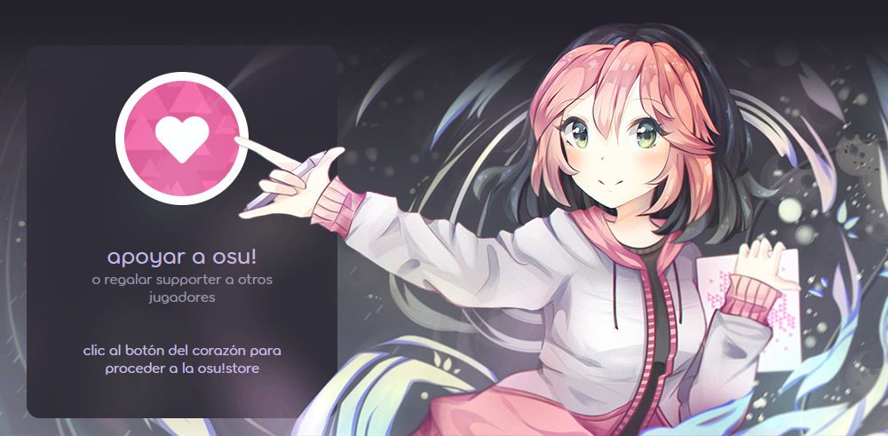
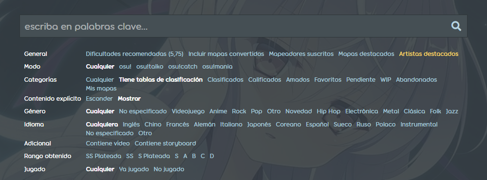
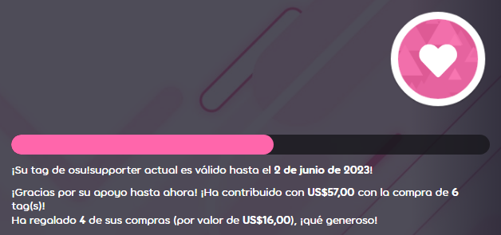

---
tags:
  - supporter tag
  - osu!supporter tag
  - etiqueta de supporter
  - etiqueta osu!supporter
  - etiqueta de osu!supporter
---

# osu!supporter

**osu!supporter** (o la ***etiqueta de osu!supporter***) es un título temporal dado a los jugadores que apoyan a osu! de manera voluntaria con una donación monetaria para ayudarlo a crecer. Los supporters reciben un puñado de beneficios cosméticos y técnicos, la mayoría solo se presentan cuando el título está presente. Las características extras de osu!supporter no dan ningún tipo de ventaja en el juego, rendimiento o puntuación, y nunca lo hará.

La etiqueta de osu!supporter puede obtenerse en la [página de la tienda de osu!](https://osu.ppy.sh/store/products/supporter-tag).

## Características

### Insignia de corazón

::: Infobox

:::

::: Infobox

:::

Los supporters reciben una insignia con corazones en ella, usualmente se encuentra junto a su nombre de usuario en el sitio web. La cantidad de corazones depende en la duración del osu!supporter que el usuario ha adquirido o que haya recibido en total:

- Menos de 1 año: 1 corazón
- De 1 a 5 años: 2 corazones
- Más de 5 años: 3 corazones

### Color de usuario

::: Infobox

:::

Los usuarios con un osu!supporter activo aparecerán de un amarillo brillante en el [chat](/wiki/Client/Interface/Chat_console) para otros usuarios.

### Sección del perfil editable

Los supporters reciben una nueva sección en su perfil llamada `¡yo!`, que a menudo la llaman página de usuario. La página de usuario sirve como un espacio personalizable, donde el formato del texto usa [BBCode](/wiki/BBCode). Esta característica es permanente y se mantiene personalizable después que el osu!suporter expire.

La sección `¡yo!` puede ser un buen lugar para:

- Banners, collabs, e infografías para darle vida al perfil
- Algunos párrafos o artículos que proporcionen información sobre la vida del jugador
- Un catálogo de mapas favoritos, mappers o cualquier otra cosa que consideren importante

### Portada de perfil

Los supporters pueden personalizar aún más su perfil colocando una imagen de portada:

- Haz clic en el icono del lápiz situado en la esquina inferior derecha de la portada del perfil.
- Selecciona una nueva portada a partir de unas cuantas opciones predefinidas o sube una imagen personalizada (sus dimensiones deberán ser de 2400x640).

Una vez que la etiqueta de osu!supporter expire, la portada se mantendrá, pero no podrá cambiarse.

### Color del perfil

Al igual que las portadas de los perfiles, los supporters pueden modificar el color de su perfil:

- Haz clic en el icono del lápiz situado en la esquina inferior derecha de la portada del perfil.
- Al cambiar el color del perfil, se modifica el color de casi todo, incluido el encabezado, los botones, los enlaces y el texto.

Una vez que la etiqueta de osu!supporter expire, los colores personalizados permanecerán, pero solo se podrán volver a cambiar a los predeterminados.

### Cambio de nombre gratis

*Nota: Se pueden solicitar cambios menores de nombre al equipo de soporte de cuentas de forma gratuita, véase [Centro de ayuda/Cuenta § ¿Puedo cambiar el nombre de usuario de mi cuenta?](/wiki/Help_centre/Account#name-changes).*

Obtener un osu!supporter viene con la habilidad de cambiar tu nombre de usuario por primera vez de manera gratuita, siguiendo las [condiciones usuales](/wiki/Help_centre/Account#name-changes).

### osu!direct

osu!direct es el motor de búsqueda y descarga de beatmaps disponible para supporters. Podrás acceder desde el menú principal al hacer clic en el letrero vertical de `osu!direct` en la parte derecha de la pantalla. Además de contener un listado de beatmaps incorporado, osu!direct ofrece otras maneras de obtener nuevos beatmaps sin salir del juego:

- Enlaces de beatmaps en el chat, que te dirigen al sitio web de osu!, ahora activan el aviso de descarga dentro del juego
- Descargas automáticas de beatmaps mientras juegas en una sala [multijugador](/wiki/Client/Interface/Multiplayer) o te encuentres [observando](/wiki/Gameplay/Spectating) a otro usuario, como una [configuración opcional](/wiki/Client/Options#en-línea)
- Enlaces automáticos a los beatmaps que se están jugando en la pestaña `#spectator` del chat para los espectadores, como una [configuración opcional](/wiki/Client/Options#en-línea)

### Tablas de clasificación extendidas

Los supporters tienen acceso a varias [tablas de clasificación](/wiki/Beatmap#tablas-de-clasificación) específicas por beatmap disponibles en el juego y en el sitio web:

- Clasificación mundial para cada combinación de los [modificadores de juego](/wiki/Gameplay/Game_modifier)
- Clasificación nacional para jugadores que comparten la misma bandera
- Clasificación entre amigos que muestra la posición del jugador en cualquier mapa comparado con sus amigos

### Límites incrementados

osu! ofrece a los supporters límites incrementados en varias funciones en línea:

| Valor | Límite regular | Límite de osu!supporter |
| :-- | :-: | :-: |
| [Beatmaps pendientes](/wiki/Beatmap/Category#wip-and-pending) | `4 + min(beatmaps clasificados, 4)`, hasta **8**[^pending-beatmaps-ref] | `8 + min(beatmaps clasificados, 12)`, hasta **20**[^pending-beatmaps-ref] |
| Tamaño de los equipos | 8 | `8 + 4 * supporters en el equipo` hasta **256** |
| Beatmaps favoritos | 100 | 1000 |
| Amigos | 500 | 1000 |

Adicionalmente, los usuarios con osu!supporter tienen límites de descarga de beatmaps menos estrictos.

### Elementos skineables extra

Después de obtener una etiqueta de osu!supporter, algunos elementos visuales y auditivos de la interfaz de osu! serán personalizables:

| Archivo | Descripción |
| :-- | :-- |
| `menu-background.jpg` | El fondo del menú principal |
| `welcome_text.png` | El texto de «welcome» que aparece cuando el juego se inicia |
| `welcome.wav` | El sonido de «welcome to osu!» que suena cuando el juego se inicia |
| `seeya.wav` | El sonido de «see ya next time» que suena cuando el juego se cierra |

Para más detalles, véase [Skinning/Interfaz § Menú principal](/wiki/Skinning/Interface#menú-principal) y [Skinning/Sonidos § Menú principal](/wiki/Skinning/Sounds#sonidos-en-el-menú-principal).

### Búsqueda extendida

::: Infobox

:::

Los supporters tienen acceso a un conjunto ampliado de filtros para la [búsqueda de beatmaps](https://osu.ppy.sh/beatmapsets)

- Beatmaps que fueron (o no) jugados
- Beatmaps donde consiguió una puntuación con cierto [grado](/wiki/Gameplay/Grade)

### Multijugador en versiones experimentales de osu!

Los supporters pueden acceder al modo multijugador desde la versión de acceso anticipado «cutting edge».

## Duración restante

::: Infobox

:::

La duración restante del osu!supporter, así mismo como la cantidad total de contribuciones, compras del mismo, y regalos, están disponibles en la parte superior de la [página de osu!supporter](https://osu.ppy.sh/home/support).

## Conseguir osu!supporter

Para conseguir un osu!supporter, visita la [tienda de osu!supporter](https://osu.ppy.sh/store/products/supporter-tag) y ajusta la duración usando el control deslizante o con los botones inferiores con el número de meses. Todos los precios están en dólares estadounidenses (USD) y no incluyen posibles cargos del sistema de pago.

Después, haz clic en `Añadir al carrito` para añadir tu etiqueta de osu!supporter al carrito de la osu!store. Para finalizar la compra, ve al [carrito](https://osu.ppy.sh/store/cart) y haz clic en `Pagar`, luego sigue las indicaciones de la pantalla.

### Regalar osu!supporter

::: Infobox

:::

El osu!supporter se puede regalar a otro jugador introduciendo su usuario bajo la tarjeta de usuario o haciendo clic en `Regalar etiqueta de supporter` en su página de perfil. Se podrán añadir más jugadores al regresar a la página de la tienda o yendo al perfil de otro usuario y repetiendo el proceso.

No se notifica al destinatario quién le dio la etiqueta, pero al regalar un osu!supporter, se puede adjuntar un mensaje opcional para enviarlo junto con el correo electrónico de notificación.

### Confirmación

Después que la transacción sea completada, habrá un nuevo evento en la sección `Reciente` en el perfil tanto del remitente como del destinatario:

- `{nombre de usuario} ha apoyado a osu! - ¡gracias por tu generosidad!` si es la primera vez que el usuario obtiene osu!supporter o se lo regala a otra persona.
- `{nombre de usuario} ha elegido apoyar a osu! una vez más - ¡gracias por tu generosidad!` si el usuario ha sido osu!supporter o lo ha regalado antes.
- `¡{nombre de usuario} ha recibido el regalo de osu!supporter!` en caso de que la etiqueta haya sido regalada.

El donante también puede ocultar este evento de su propio perfil marcando `Ocultar todas las etiquetas osu!supporter en esta orden de mi actividad` durante el pago. Esto es útil para hacer regalos de forma anónima porque evita que el destinatario verifique la actividad del perfil.

Adicionalmente, tanto el remitente y el destinatario recibirán notificaciones vía correo electrónico mencionando la compra.

## Referencias

[^pending-beatmaps-ref]: [Publicación del foro por peppy (14/9/2021) en «Increase the number of pending beatmap slots»](https://osu.ppy.sh/community/forums/posts/8294132)
