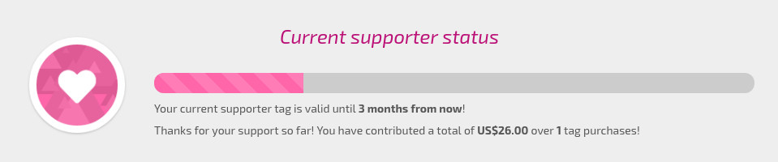

# osu!supporter

Consulte el enlace: [Supporting osu!](https://osu.ppy.sh/home/support "osu!supporter en inglés")

En resumen: las donaciones son usadas en su totalidad para mantener osu!

## Ventajas del osu!supporter

- osu!direct (Descargas directas dentro del juego)
- Acceso al multijugador usando osu!cuttingedge.
- [Chat](/wiki/Chat_Console): Nombre en _Amarillo brillante_ (para los demás, te seguirás viendo con el nombre blanco, como siempre).
- [Listado de Beatmaps](https://osu.ppy.sh/beatmapsets): Filtrado de búsqueda de beatmaps por mapas jugados y no jugadas.
- [Skinning](/wiki/Skinning): Algunos elementos adicionales que pueden ser utilizados, tales como un fondo de pantalla en el [menú principal](https://osu.ppy.sh/community/forums/topics/96949), en las partidas multijugador y acceso a osu!direct.
  - Específicamente, `menu-background.jpg` (Menú Principal); `matchsetup-background.png` (Multi); `search-background.png` (osu!direct); `triangle.jpg` (Triángulos); `welcome.wav` (Sonido de Bienvenida); `seeya.wav` (Sonido de Despedida).
- [Solicitudes de características](https://osu.ppy.sh/community/forums/4): Votos extra en las [solicitudes de caracterísiticas](https://osu.ppy.sh/community/forums/4) (2 por mes en vez de 1 por mes).
- [Selección de Canción](/wiki/Interface): La posibilidad de ver en el juego entre el ranking nacional / amigos / por mods-específicos de los beatmaps.
- En tu perfil: `https://osu.ppy.sh/users/`
  - Puedes agregar una página de usuario a tu perfil.
    - Tu página de usuario no será borrado cuando tu osu!supporter expire.
  - La posibilidad de cambiar tu nombre de usuario (una vez por cuenta. No podrás volver a utilizarlos una vez cambiado, puede haber algunas excepciones).
  - Incremento en la cantidad de mapas que puedes subir (hasta un total de 10 mapas pendientes).
- [*Performance Ranking*](https://osu.ppy.sh/rankings/osu/performance): Permite utilizar el comando de "filtrar por amigos".
- *Más características serán implementadas en un futuro!*

## Pago

### Costo

[Usa este convertidor de divisas](http://www.oanda.com/currency/converter/) o [utiliza Google](https://www.google.com.my/#q=usd+exchange+rate) para verificar el precio del dolar en tu país. El costo del mismo utiliza el "USD$ dólar".

| Meses | Costo {USD$} (relación con costes reales) |
| :-: | :-- |
| 1 | 4 |
| 2 | 8 |
| 4 | 12 (-25%) |
| 6 | 16 (-33%) |
| 8 | 20 (-38%) |
| 9 | 22 (-39%) |
| 10 | 24 (-40%) |
| 12 | 26 (-46% máx.) |
| 24 | 52 (-46% máx.) |

- Los costos son por cuenta individual. No hay promociones para regalos en grupo.

### Decide

Por defecto, tu cuenta será mostrada con osu!supporter. Si no quieres el osu!supporter, haz clic en "Gift another player" y escribe el nombre de usuario de dicha persona. Si quieres regalar a más de una cuenta, haz clic en el botón "Add another tag" al lado del botón "Checkout". Luego de confirmar las cuentas, desliza el botón blanco en una cuenta para determinar la cantidad de tiempo y cuánto tendrás que pagar en total. Puedes configurar la duración y el costo para las distintas cuentas. Luego de confirmar la duración y las cuentas, haz clic en "Checkout".

## Pago

Luego de confirmar la duración de las cuentas, haz clic en "Checkout". Aquí, vas a contar con múltiples opciones. Es recomendable usar [PayPal](https://www.paypal.com) o cualquier servicio de tarjeta de crédito. Hay otros métodos de pago (como por SMS o servicios de proveedores locales como [Cherry Credits](http://www.cherrycredits.com/)) pero suelen contar con un cargo extra por su servicio. Si pagas menos que el "Costo Total" en "dorrah" (incluyendo el costo adicional si no utilizas PayPal), no recibirás el/los tag(s) correspondiente(s).

### Duración

Una vez completes el pago, en tu actividad reciente en tu perfil dirá "{Tu cuenta} has become an osu! supporter - thanks for your generosity!" si es la primera vez que tu cuenta obtiene osu!supporter o bien "{Tu cuenta} has once again chosen to donate to the osu! cause - thanks for your generosity!" si tu cuenta ya había sido osu!supporter anteriormente. Si compraste una para tu cuenta, podrás ver el título de osu!support abajo de tu imagen de perfil. Para verificar cuándo tu osu!supporter expirará, [vuelve al mismo lugar donde lo compraste](https://osu.ppy.sh/home/support).
