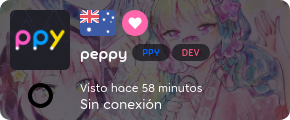

---
tags:
  - supporter tag
  - osu!supporter tag
outdated_translation: true
outdated_since: 4d8cf437cadc19ef38923c11bf958399886062bb
---

# osu!supporter

**osu!supporter** (o la ***etiqueta de osu!supporter***) es un título temporal dado a los jugadores que han apoyado a osu!, de manera voluntaria, con una donación monetaria para ayudarlo a crecer. Los supporters reciben un puñado de beneficios cosméticos y técnicos, la mayoría solo se presentan cuando el titulo está presente. Las características extras de osu!supporter no dan ningún tipo de ventaja en la jugabilidad, desempeño o puntaje y nunca lo hará.

La etiqueta osu!supporter podrá ser obtenida desde la [página de la tienda de osu!supporter](https://osu.ppy.sh/store/products/supporter-tag).

## Características

### Placa de corazón

::: Infobox

:::

::: Infobox

:::

Los supporters reciben una placa con corazones en ella, usualmente se encuentra junto a su nombre de usuario en el sitio web. La cantidad de corazones depende en la duración del osu!supporter que el usuario ha adquirido o que haya recibido en total:

- Menos de 1 año: 1 corazón
- De 1 a 5 años: 2 corazones
- Más de 5 años: 3 corazones

### Color de usuario

::: Infobox

:::

Usuarios con un osu!supporter activo aparecerán de un amarillo brillante en el [chat](/wiki/Client/Interface/Chat_console) para otros usuarios.

### Sección del perfil editable

Los supporters reciben una nueva sección en su perfil llamada `¡yo!`, que a menudo se denomina como página de usuario. La página de usuario sirve como un espacio personalizable, donde el formato del texto utiliza el [BBCode](/wiki/BBCode). Esta característica es permanente y se mantiene personalizable después que el osu!suporter expire.

La sección `¡yo!` puede ser un buen lugar para:

- Banners, colaboraciones, e infografías para realzar el perfil
- Algunos párrafos o artículos que proporcionen información sobre la vida del jugador
- Un catálogo de mapas favoritos, mappers, o cualquier otra cosa que consideren importante

### Portada de perfil

Los supporters pueden personalizar aún más su perfil colocando una imagen de portada:

- Haz clic en el icono de lápiz situado en la esquina inferior derecha de la portada.
- Seleccione una nueva portada a partir de unas cuantas opciones predefinidas, o suba su propia imagen (sus dimensiones deberán ser de 2400x640).

Una vez que el osu!supporter expire, la portada se mantendrá, pero no podrá cambiarse. 

### Cambio de nombre gratis

*Nota: Se pueden solicitar cambios menores de nombre al equipo de soporte de la cuenta de forma gratuita. Véase [Centro de ayuda/Cuenta § ¿Puedo cambiar el nombre de usuario de mi cuenta?](/wiki/Help_centre/Account#name-changes).*

Al obtener un osu!supporter viene con la habilidad de cambiar su nombre de usuario por primera vez de manera gratuita, siguiendo las [condiciones usuales](/wiki/Help_centre/Account#name-changes).

### osu!direct

osu!direct es el motor de búsqueda y descarga de mapas disponible para supporters. Podrás acceder desde el menú principal al hacer clic en la pestaña de `osu!direct` en la parte derecha de la pantalla. Además de contener un listado de beatmaps incorporado, osu!direct ofrece otras maneras de obtener nuevos beatmaps sin salir del juego:

- Enlaces de beatmaps en el chat, que te dirigen al sitio web de osu!, ahora activan el aviso de descarga dentro del juego
- Descargas automáticas de beatmaps mientras juegas en una sala [multijugador](/wiki/Client/Interface/Multiplayer) o te encuentras [espectando](/wiki/Gameplay/Spectating) a otro usuario, como una [configuración opcional](/wiki/Client/Options#online)
- Enlace automático de los beatmaps que se están jugando en la pestaña de chat `#spectator` para los espectadores, como una [configuración opcional](/wiki/Client/Options#online)

### Tablas de clasificación extendidas

Los supporters tienen acceso a varias [tablas de clasificación](/wiki/Beatmap#tablas-de-clasificación) específicas por beatmap disponibles en el juego y en el sitio web:

- Clasificación mundial para cada combinación de [modificadores de juego](/wiki/Gameplay/Game_modifier)
- Clasificación nacional para jugadores que comparten la misma bandera
- Clasificación entre amigos que muestra la posición del jugador en cualquier mapa comparado a sus amigos

### Limites incrementados

osu! ofrece a los supporters límites incrementados en varias funciones en línea:

| Valor | Limite regular | Limite de osu!supporter |
| :-- | :-: | :-: |
| [Beatmaps pendientes](/wiki/Beatmap/Category#trabajos-en-progreso-y-pendientes) | `4 + min(beatmaps clasificados, 4)`, hasta **8**[^pending-beatmaps-ref] | `8 + min(beatmaps clasificados, 12)`, hasta **20**[^pending-beatmaps-ref] |
| Beatmaps favoritos | 100 | 1000 |
| Amigos | 500 | 1000 |

Adicionalmente, los usuarios con osu!supporter tienen límites de descarga de beatmaps menos estrictos.

### Elementos extra para la Skin

Después de obtener un osu!supporter, algunos elementos visuales y auditivos de la interfaz de osu! serán personalizables:

| Archivo | Descripción |
| :-- | :-- |
| `menu-background.jpg` | El fondo del menú principal |
| `welcome_text.png` | El texto de «welcome» que aparece cuando el juego se inicia |
| `welcome.wav` | El sonido de "welcome to osu!" que suena cuando el juego se inicia |
| `seeya.wav` | El sonido de «see ya next time» que suena cuando el juego se cierra |

Para más detalles, véase [Skinning/Interfaz § Menú principal](/wiki/Skinning/Interface#main-menu) y [Skinning/Sonidos § Menú principal](/wiki/Skinning/Sounds#main-menu).

### Búsqueda extendida

::: Infobox

:::

Los supporters tienen acceso a un conjunto ampliado de filtros de [búsqueda de beatmaps](https://osu.ppy.sh/beatmapsets)

- Beatmaps que fueron (o no) jugados
- Beatmaps donde consiguió una puntuación con cierto [rango](/wiki/Gameplay/Grade)

### Multijugador en versiones experimentales de osu!

Los supporters pueden acceder al multijugador desde la versión de acceso anticipado «cutting edge».

## Duración restante

::: Infobox

:::

La duración restante de osu!supporter, así mismo como la cantidad total de contribuciones, compras del mismo y regalos, están disponibles en la parte superior de la [página de osu!supporter](https://osu.ppy.sh/home/support).

## Conseguir un osu!supporter

::: Infobox

:::

Para conseguir un osu!supporter visite la [tienda de osu!supporter](https://osu.ppy.sh/store/products/supporter-tag) y ajuste la duración utilizando el control deslizante, o con los botones inferiores con el número de meses. Todos los precios están en dólares estadounidenses (USD) y no incluyen posibles cargos del sistema de pago.

Después, haz clic en `Añadir al carrito` para agregar su tag de osu!supporter al carrito de la osu!store. Para finalizar la compra, ve al [carrito](https://osu.ppy.sh/store/cart) y haga clic en `Pagar`, y siga las indicaciones de la pantalla.

### Obsequiar un osu!supporter

El osu!supporter puede ser obsequiado a otro jugador introduciendo su usuario en el recuadro gris debajo de la tarjeta de usuario. Más jugadores podrán ser añadidos al regresar a la página de la tienda y repetir el proceso.

### Conclusión

Después que la transacción es completada, habrá un nuevo evento en la sección de `Reciente` en el perfil tanto del remitente como del destinatario:

- `{nombre de usuario} ha apoyado a osu! - ¡gracias por tu generosidad!` si es la primera vez que el usuario obtiene osu!supporter o se lo regala a otra persona.
- `{nombre de usuario} ha elegido apoyar osu! una vez más - ¡gracias por tu generosidad!` si el usuario ha sido osu!supporter o lo ha regalado antes. 
- `¡{nombre de usuario} ha recibido el regalo de osu!supporter!` en caso de que el tag haya sido regalado.

Adicionalmente, tanto el remitente y el destinatario recibirán notificaciones vía correo electrónico mencionando la compra.

## Referencias

[^pending-beatmaps-ref]: [Aumentar el número de ranuras de beatmaps pendientes](https://osu.ppy.sh/community/forums/posts/8294132)
