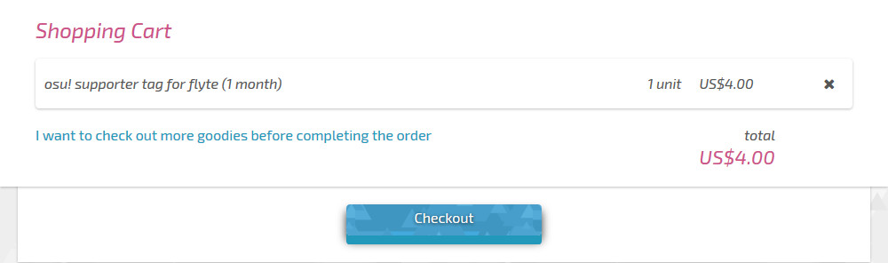
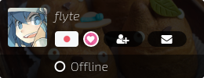

# osu!supporter

*Untuk halaman osu!supporter dari situs web osu!, lihat [dukung permainan ini](https://osu.ppy.sh/home/support).*

## Keuntungan

*Daftar keuntungan yang didapat dari memiliki osu!supporter, lihat [dukung permainan ini](https://osu.ppy.sh/home/support).*

Secara umum, dengan membeli osu!supporter tag, Anda secara langsung telah mendukung pengembangan game dan saat itu juga mendapatkan beberapa fitur tambahan. Perlu diketahui bahwa fitur tambahan dari osu!supporter tidak akan pernah mempengaruhi permainan, kinerja, atau skor yang dapat menguntungkan Anda.

## Dapatkan osu!supporter

Untuk mendapatkan osu!supporter, masuk (atau [daftar](/wiki/sign_up)). Lalu pergi ke [halaman toko](https://osu.ppy.sh/store/products/supporter-tag). Gunakan slider atau tombol bulan (terletak di bawah slider) untuk memilih durasi osu!supporter. Durasi yang berbeda akan mengubah harga yang harus Anda bayar. Mata uang yang digunakan adalah Dolar Amerika Serikat (USD). Jika negara Anda menggunakan mata uang yang berbeda, mohon gunakan konverter mata uang seperti [OANDA](https://www.oanda.com/currency/converter/) atau [Google](https://www.google.com/search?q=usd+exchange+rate) untuk memeriksa harga. Harga yang ditampilkan di halaman osu!store adalah per akun.

### Memilih durasi

Kartu pengguna yang ditampilkan di atas slider adalah pengguna yang akan membeli osu!supporter. Secara default, kartu pengguna ini akan berisi nama pengguna Anda. Untuk menghadiahkanya kepada teman, masukkan nama pengguna teman Anda (bukan ID pengguna) ke dalam kotak abu-abu di bawah kartu pengguna. Setelah tahap ini selesai, kartu pengguna akan berubah sesuai dengan nama pengguna yang Anda masukkan. Dari sini, Anda dapat memilih durasi osu!supporter yang ingin Anda berikan, tetapi perlu diingat bahwa tidak ada promosi untuk pemberian hadiah secara grup.

Anda hanya dapat membeli atau menghadiahkan osu!supporter kepada satu pengguna tiap pembelian di halaman ini. Untuk menghadiahkan kepada pengguna lain, Anda harus kembali ke [halaman toko osu!supporter](https://osu.ppy.sh/store/products/supporter-tag) dan mengulangi kembali langkah-langkah pembelian untuk menghadiahkan pengguna lain.

### Pembayaran

Setelah selesai, klik `Tambahkan ke Keranjang` untuk memasukannya ke keranjang belanja osu!store.

Saat Anda siap melakukan pembayaran, buka [keranjang belanja](https://osu.ppy.sh/store/cart) Anda dan klik `Checkout`. Kemudian ikuti instruksi yang diberikan untuk melakukan pembayaran Anda.

## Kesimpulan

Setelah transaksi selesai, bagian Aktivitas Terkini di akun Anda (jika Anda membelinya untuk diri sendiri) atau akun Yang anda hadiahkan akan mengatakan:

- `{username} telah menjadi osu!supporter - terima kasih atas kemurahan hati Anda!` jika ini adalah pertama kalinya akun itu memiliki osu!supporter.
- `{username} telah sekali lagi memutuskan untuk mendukung osu! - terima kasih atas kemurahan hati Anda!` jika akun telah memiliki osu!supporter sebelumnya.

### Halaman pengguna dan kartu pengguna

Di web osu!, lencana osu!supporter dapat ditemukan di sebelah avatar pengguna dan di kartu pengguna di samping bendera negara Anda.

### Memeriksa status osu!supporter Anda

*Catatan: Bagian ini hanya ditampilkan setelah Anda memiliki osu!supporter.*

Untuk memeriksa status osu!supporter tag Anda yang tersisa, total kontribusi, dan pembelian tag, buka halaman [dukung permainan ini](https://osu.ppy.sh/home/support) dan scroll ke bawah untuk melihat bagian yang serupa dengan gambar di atas.
