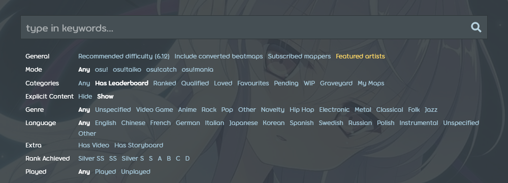

<!--The strings regarding gifting on the website have been updated as of https://github.com/ppy/osu-web/pull/9820. To update this page, also check if the corresponding strings on crowdin need to be updated. Furthermore, this text should have the same structure as the English article.-->

# osu!supporter

## Introductie

**osu!supporter** (of de ***osu!supporter tag***) is een tijdelijke titel gegeven aan spelers die osu! ondersteunen door middel van een vrijwillige donatie. Supporters krijgen een aantal cosmetische en technische voordelen waarvan de meeste alleen actief zijn tijdens het hebben van de osu!supporter title. De extra voordelen van osu!supporter geven geen voordeel in gameplay, prestatie of score, en dat zal ook nooit gebeuren.

De osu!supporter tag kan je verkrijgen in de [osu!supporter winkelpagina](https://osu.ppy.sh/store/products/supporter-tag).

## Voordelen

### Hartinsigne

::: Infobox

:::

::: Infobox

:::

Supporters krijgen een insigne met harten erop, gebruikelijk naast hun gebruikersnaam op de website.
Het aantal harten ligt aan de totale duur van de osu!supporter die de gebruiker heeft aangeschaft of heeft ontvangen.

- Minder dan 1 jaar: 1 hart
- Van 1 tot 5 jaren: 2 harten
- Meer dan 5 jaren: 3 harten

### Kleur van je gebruikersnaam

::: Infobox

:::

Gebruikersnamen van actieve supporters zijn felgeel in de chat voor andere gebruikers.

### Bewerkbare profielsectie

Supporters krijgen een niew profielsectie genaamd `ik!`, ook wel "userpage" genoemd. De userpage dient als een persoonlijke gedeelte op je profiel, waar tekst geformatteerd wordt met [BBCode](/wiki/BBCode).

De `ik!` sectie kan een goede plek zijn voor:

- Banners, samenwerkingen en/of informatie om je profiel leuker te maken
- Een paar paragrafen of dingen die inzicht geven in een spelers leven
- Een showcase van favoriete mappen, mappers of iets dergelijks dat de speler belangrijk vindt

### Omslagafbeelding

Supporters kunnen hun profiel nog verder personaliseren door een omslagafbeelding toe te voegen:

- Druk op het potlood-icoon rechtsonder de huidige omslagafbeelding
- Kies een nieuwe omslag tussen een paar voorgedefinieerde opties, of upload je eigen foto (De dimensies horen 2400x640 te zijn).

Zodra je osu!supporter afloopt hou je je omslagfoto maar kun je deze niet weer veranderen.

### Eén gratis wijziging van je gebruikersnaam

*Opmerking: kleinere naamwijzigingen kunnen gratis aangevraagd worden bij het account support team. — zie [Help centre/Account § Can I change my account's username?](/wiki/Help_centre/Account#name-changes).*

Bij het hebben gekregen van osu!supporter krijg je de mogelijkheid om je naam eenmalig gratis te veranderen, [onder normale omstandigheden](/wiki/Help_centre/Account#name-changes).

### osu!direct

osu!direct is de ingame beatmap zoeker en download engine die alleen beschikbaar is voor supporters. Je kunt er gebruik van maken door op de verticale `osu!direct` label te klikken die zich bevindt aan de rechterkant in het hoofdmenu. osu!direct zorgt voor de mogelijkheid om nieuwe beatmaps te downloaden zonder het spel te hoeven verlaten:

- Beatmap links in chat openen nu het osu!direct dialoogvenster in plaats van de osu! website.
- Automatische beatmap downloads tijdens een multiplayer lobby of het toeschouwen van andere spelers.
- Het automatisch linken van de gespeelde beatmaps in het #spectators chat tabblad voor toeschouwers.

### Uitgebreide ranking

Supporters hebben toegang tot meerdere beatmap-specifieke rankings toegankelijk in zowel als in-game als op de website.

- Globale rankings voor elke mod-combinatie
- Landelijke rankings van spelers die dezelfde vlag bezitten
- Een vriendenranking die de speler's behaalde ranking laat zien vergeleken met vrienden op een map.

### Vergrote limieten

osu! biedt meer gerelaxte limieten van online functies voor supporters:

| Waarde | Normaal limiet | osu!supporter limiet |
| :-- | :-: | :-: |
| [Beatmaps in behandeling](/wiki/Beatmap/Category#wip-and-pending) | `4 + min(ranked beatmaps, 4)`, tot en met **8**[^pending-beatmaps-ref] | `8 + min(ranked beatmaps, 12)`, tot en met **20**[^pending-beatmaps-ref] |
| Online beatmap favorieten | 100 | 1000 |
| Aantal vrienden | 500 | 1000 |

### Extra skinnable elementen

Na het verkrijgen van osu!supporter, worden sommige visuele en auditieve elementen van de osu! interface skinnable:

| Element | Description |
| :-- | :-- |
| `menu-background.jpg` | De achtergrond van het hoofdmenu |
| `welcome_text.png` | Het "welkom" tekst dat wordt weergeven wanneer het spel opstart |
| `welcome.wav` | Het "welcome to osu!" sample dat speelt wanneer het spel opstart |
| `seeya.wav` | Het "see ya next time" sample dat speelt wanneer het spel afsluit |

Voor meer details, zie [Skinning/Interface § Main menu](/wiki/Skinning/Interface#main-menu) and [Skinning/Sounds § Main menu](/wiki/Skinning/Sounds#main-menu).

### Uitgebreide zoekopdrachten

::: Infobox

:::

Supporters hebben toegang tot een uitgebreide set van beatmap zoekfilters:

- Beatmaps die wel (of niet) gespeeld zijn
- Beatmaps met een bepaald behaalde Rank

## Het zakelijke gedeelte

### Prijzen

[Gebruik deze valuta converter](http://www.oanda.com/currency/converter/) of [vraag Google](https://www.google.com.my/#q=usd+exchange+rate) om de prijs in omgerekend naar euro te zien. De prijzen zijn in "USD$ dollar".

| Maanden | Kosten {USD$} (ten opzicht van totaal) |
| :-: | :-- |
| 1 | 4 |
| 2 | 8 |
| 4 | 12 (-25%) |
| 6 | 16 (-33%) |
| 8 | 20 (-38%) |
| 9 | 22 (-39%) |
| 10 | 24 (-40%) |
| 12 | 26 (-46% max) |
| 24 | 52 (-46% max) |

- Prijs is per account. Er zijn geen kortingen voor groepsaankopen.

### Een keuze

Standaard staat de supporter die je wil gaan kopen op jouw naam. Als je de osu!supporter niet hoeft, klik je op 'Gift another player' en daar vul je de naam van het account in. Wil je meer dan een account osu!supporter geven, klik dan op de 'Add another tag' knop, naast de 'Checkout' knop. Na de accounts bevestigd te hebben sleep je de witte knop daaronder om de lengte van de supporter-tag en de hoeveelheid die je daarvoor moet betalen vast te stellen. Je kan een verschillende lengte per account kiezen, wat gepaard gaat met verschillende kosten. Nadat je besloten hebt voor hoe lang je wilt kopen klik je op 'Checkout'.

### Betaling

Na de lengte en accounts gecheckt te hebben, klik je op 'Checkout'. Hier krijg je een aantal opties. Aangeraden is om [PayPal](https://www.paypal.com) of Credit Card services te gebruiken. Er zijn andere betaalwijzen (bijvoorbeeld SMS of lokale service providers als [Cherry Credits](http://www.cherrycredits.com/)) maar dan kunnen er extra vergoedingen gevraagd worden voor hun service. Als je minder betaalt dan je "Total Cost" in "dorrah" (inclusief eventuele extra kosten als je niet met Paypal betaalt) zal je je supporter-tag(s) niet ontvangen.

### Duur

Nadat je transactie voltooid is, zal onder het kopje 'Recent Activity' op je profiel het volgende woorden weergegeven: "{Accountnaam} has become an osu! supporter - thanks for your generosity!" als het de eerste keer is dat je account osu!supporter krijgt, "{Accountnaam} has once again chosen to donate to the osu! cause - thanks for your generosity!" als je al eerder supporter hebt gehad en "{Accountnaam} has received the gift of osu! supporter!" als je osu!supporter van iemand anders krijgt. Als je supporter op je eigen account hebt, zie je onder je profielfoto de osu!supporter badge staan. Om te kijken wanneer je osu!supporter afloopt, keer je terug naar [keer je terug naar de plek waar je het gekocht hebt](https://osu.ppy.sh/home/support).
