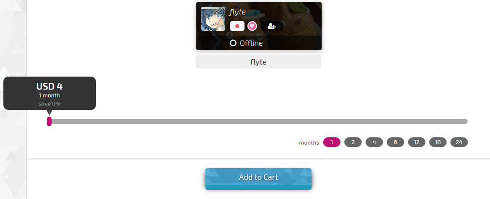

# osu!supporter

## Introductie

Verwijzing naar de link: <https://osu.ppy.sh/home/support>

In het kort: Donaties worden gebruikt om osu! draaiend te houden.

## Voordelen van osu!supporter

- osu!direct (Directe downloads in-game)
- Toegang tot multiplayer als je in de osu!cuttingedge mode zit.
- [Chat Console](/wiki/Chat_Console): Helder gele naam (voor anderen, jij ziet je eigen naam nog steeds wit).
- [Beatmap listing](https://osu.ppy.sh/beatmapsets) (?): Filter beatmap zoekopdrachten op gespeelde en niet gespeelde beatmaps.
- [Skinning](/wiki/Skinning): Toegang tot iets meer skin elementen zoals [main menu](https://osu.ppy.sh/community/forums/topics/96949), osu!direct or multi's achtergronden.
  - Iets specifieker; `menu-background.jpg` (Main Menu); `matchsetup-background.png` (Multi); `search-background.png` (osu!direct); `triangle.jpg` (Triangles); `welcome.wav` (Welcome Sound); `seeya.wav` (Exiting Sound)
- [Feature Requests](https://osu.ppy.sh/community/forums/4): Extra stemmen voor Feature Requests (2 per maand).
- [Song Selection](/wiki/Interface): De mogelijkheid om de rankings van een beatmap van jouw land / vrienden / mods te bekijken in-game.
- Your Profile: `https://osu.ppy.sh/users/`
  - Je kan een userpage aan je profiel toevoegen.
    - Je userpage verdwijnt niet als je osu!supporter is afgelopen.
  - De eenmalige mogelijkheid om je username te veranderen (één keer per account. Je kan je username hierna niet meer veranderen, uitzonderingen worden zeer zelden gemaakt).
  - Je kan meer beatmaps submitten (10 pending beatmaps in totaal).
- [Performance Ranking](https://osu.ppy.sh/rankings/osu/performance): Staat het "filter to friends" command toe.
- *Komt nog*

## Het zakelijke gedeelte

### Prijzen

[Gebruik deze valuta converter](http://www.oanda.com/currency/converter/) of [vraag Google](https://www.google.com.my/#q=usd+exchange+rate) om de prijs in omgerekend naar euro te zien. De prijzen zijn in "USD$ dollar".

| Maanden | Kosten {USD$} (ten opzicht van totaal) |
| :-: | :-- |
| 1 | 4 |
| 2 | 8 |
| 4 | 12 (-25%) |
| 6 | 16 (-33%) |
| 8 | 20 (-38%) |
| 9 | 22 (-39%) |
| 10 | 24 (-40%) |
| 12 | 26 (-46% max) |
| 24 | 52 (-46% max) |

- Prijs is per account. Er zijn geen kortingen voor groepsaankopen.

### Een keuze

Standaard staat de supporter die je wil gaan kopen op jouw naam. Als je de osu!supporter niet hoeft, klik je op 'Gift another player' en daar vul je de naam van het account in. Wil je meer dan een account osu!supporter geven, klik dan op de 'Add another tag' knop, naast de 'Checkout' knop. Na de accounts bevestigd te hebben sleep je de witte knop daaronder om de lengte van de supporter-tag en de hoeveelheid die je daarvoor moet betalen vast te stellen. Je kan een verschillende lengte per account kiezen, wat gepaard gaat met verschillende kosten. Nadat je besloten hebt voor hoe lang je wilt kopen klik je op 'Checkout'.

### Betaling

Na de lengte en accounts gecheckt te hebben, klik je op 'Checkout'. Hier krijg je een aantal opties. Aangeraden is om [PayPal](https://www.paypal.com) of Credit Card services te gebruiken. Er zijn andere betaalwijzen (bijvoorbeeld SMS of lokale service providers als [Cherry Credits](http://www.cherrycredits.com/)) maar dan kunnen er extra vergoedingen gevraagd worden voor hun service. Als je minder betaalt dan je "Total Cost" in "dorrah" (inclusief eventuele extra kosten als je niet met Paypal betaalt) zal je je supporter-tag(s) niet ontvangen.

### Duur

Nadat je transactie voltooid is, zal onder het kopje 'Recent Activity' op je profiel het volgende woorden weergegeven: "{Accountnaam} has become an osu! supporter - thanks for your generosity!" als het de eerste keer is dat je account osu!supporter krijgt, "{Accountnaam} has once again chosen to donate to the osu! cause - thanks for your generosity!" als je al eerder supporter hebt gehad en "{Accountnaam} has received the gift of osu! supporter!" als je osu!supporter van iemand anders krijgt. Als je supporter op je eigen account hebt, zie je onder je profielfoto de osu!supporter badge staan. Om te kijken wanneer je osu!supporter afloopt, keer je terug naar [keer je terug naar de plek waar je het gekocht hebt](https://osu.ppy.sh/home/support).
