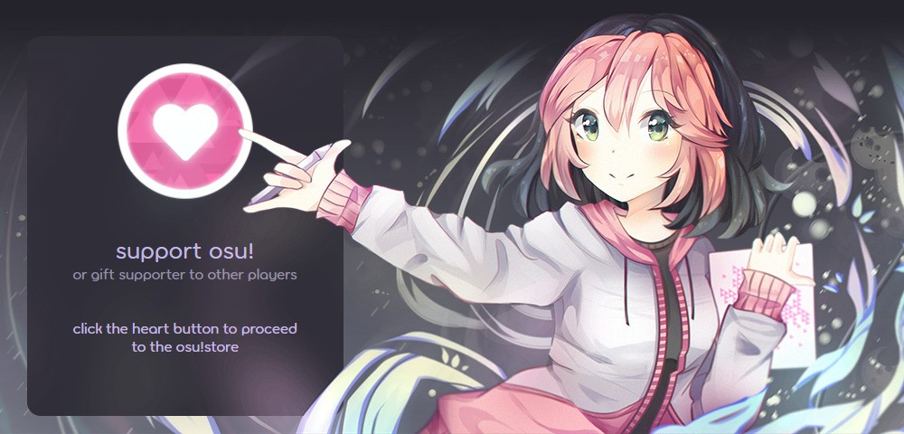
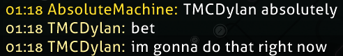
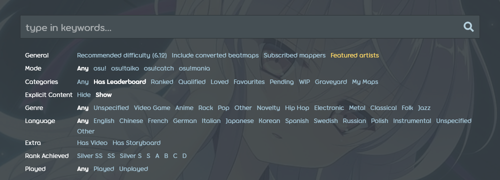
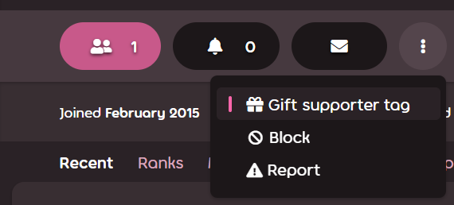

---
tags:
  - supporter tag
  - osu!supporter tag
  - supporter
  - donator osu!
  - status donatora osu!
---

# osu!supporter

**osu!supporter** (znany po polsku jako ***donator osu!***) to tymczasowy tytuł przyznawany graczom, którzy dobrowolnie wsparli finansowo rozwój gry. Donatorzy otrzymują szereg korzyści kosmetycznych i technicznych. Większość z nich jest aktywna tylko w momencie posiadania tytułu. Korzyści oferowane przez osu!supporter nie dają i nigdy nie będą dawać przewagi w rozgrywce.

Tytuł donatora osu! można zakupić w [sklepie osu!](https://osu.ppy.sh/store/products/supporter-tag).

## Korzyści

### Odznaka serca

::: Infobox

:::

::: Infobox

:::

Donatorzy otrzymują odznakę z sercami, zwykle widoczną obok ich nazwy na stronie internetowej. Liczba serc zależy od łącznego czasu posiadania statusu donatora przez użytkownika:

- Mniej niż 1 rok: 1 serce
- Od 1 do 5 lat: 2 serca
- Ponad 5 lat: 3 serca

### Kolor nazwy użytkownika

::: Infobox

:::

Nazwy użytkowników z aktywnym statusem donatora osu! mają na [czacie](/wiki/Client/Interface/Chat_console) złoty kolor.

### Edytowalna sekcja na profilu

Donatorzy otrzymują dostęp do nowej sekcji na profilu `O mnie` (często nazywanej po angielsku "userpage"), którą można dowolnie modyfikować za pomocą [BBCode](/wiki/BBCode). Użytkownicy zachowują do niej pełny dostęp, nawet jeśli utracą status donatora osu!.

Sekcja `O mnie` może być dobrym miejscem na:

- Bannery, collaby i infografiki upiększające profil
- Kilka akapitów lub innych elementów mówiących coś o graczu
- Listę ulubionych beatmap, mapperów lub innych rzeczy, które gracz uważa za ważne

### Tło profilu

Donatorzy mogą dodatkowo spersonalizować swój profil ustawiając własne tło profilu:

- Kliknij ikonę ołówka znajdującą się w prawym dolnym rogu tymczasowego tła.
- Wybierz nowe tło spośród dostępnych opcji lub prześlij własną grafikę (powinna mieć wymiary 2400x640).

Wybrane tło pozostanie na profilu po wygaśnięciu statusu donatora, jednak jego zmiana nie będzie możliwa.

### Kolor profilu

Podobnie jak w przypadku tła, donatorzy mogą zmienić również kolor swojego profilu:

- Kliknij ikonę ołówka w prawym dolnym rogu tła profilu.
- Zmiana koloru profilu spowoduje zmianę koloru niemal wszystkich jego elementów, w tym bannera, przycisków, linków oraz tekstu.

Wybrany kolor pozostanie na profilu po wygaśnięciu statusu donatora, jednak będzie można go zmienić jedynie na domyślny.

### Jedna darmowa zmiana nazwy

::: alert-notice
O drobne zmiany nazwy można bezpłatnie poprosić zespół obsługi kont — zobacz [Centrum pomocy/Konto § Czy mogę zmienić nazwę użytkownika?](/wiki/Help_centre/Account#name-changes).
:::

Zakup osu!supportera daje możliwość jednej darmowej zmiany nazwy użytkownika, o ile jest to pierwsza zmiana nazwy, zgodnie z [zasadami dotyczącymi zmiany nazwy](/wiki/Help_centre/Account#name-changes).

### osu!direct

osu!direct pozwala na szukanie i pobieranie beatmap bezpośrednio w kliencie gry. Można je otworzyć w menu głównym poprzez kliknięcie przycisku `osu!direct`, który znajduje się po prawej stronie ekranu. osu!direct oferuje również inne sposoby pobierania map bez wychodzenia z gry:

- Linki, które normalnie przekierowują do strony beatmapy w internecie, teraz od razu rozpoczynają pobieranie mapy
- Automatyczne pobieranie beatmap w poczekalniach [trybu wieloosobowego](/wiki/Client/Interface/Multiplayer) oraz podczas [obserwowania](/wiki/Gameplay/Spectating) innych graczy. Można wyłączyć w [opcjach](/wiki/Client/Options#integracja)
- Automatyczne zamieszczanie linku do obecnie granej beatmapy na czacie `#spectator`. Można wyłączyć w [opcjach](/wiki/Client/Options#powiadomienia-i-prywatność)

### Rozszerzone tabele wyników

Donatorzy otrzymują dostęp do kilku nowych [tabel wyników](/wiki/Beatmap#tabele-wyników) na beatmapie, zarówno w grze, jak i na stronie internetowej:

- Ranking globalny dla wybranej kombinacji [modów](/wiki/Gameplay/Game_modifier)
- Ranking krajowy, pokazujący jedynie wyniki graczy posiadających tę samą flagę
- Ranking znajomych, porównujący wynik gracza z wynikami jego znajomych

### Zwiększone limity

osu! oferuje donatorom zwiększone limity różnych funkcji online:

| Limit | Normalny limit | Limit ze statusem donatora osu! |
| :-- | :-: | :-: |
| Liczba miejsc na [oczekujące beatmapy](/wiki/Beatmap/Category#wip-and-pending) | `4 + min(liczba rankingowych map, 4)`, aż do **8**[^pending-beatmaps-ref] | `8 + min(liczba rankingowych map, 12)`, aż do **20**[^pending-beatmaps-ref] |
| Rozmiar zespołu | 8 | `8 + 4 * liczba donatorów w zespole`, aż do **256** |
| Liczba ulubionych beatmap | 100 | 1000 |
| Liczba znajomych | 500 | 1000 |

Dodatkowo donatorzy osu! zyskują dostęp do większej szybkości pobierania beatmap.

### Dodatkowe elementy, które można zmienić skórką

Posiadanie status donatora osu! daje graczowi możliwość modyfikacji niektórych elementów interfejsu za pomocą skórki:

| Element | Opis |
| :-- | :-- |
| `menu-background.jpg` | Tło menu głównego |
| `welcome_text.png` | Napis "welcome" pojawiający się po uruchomieniu gry |
| `welcome.wav` | Dźwięk "welcome to osu!" odtwarzany po uruchomieniu gry |
| `seeya.wav` | Dźwięk "see ya next time" odtwarzany przy zamykaniu gry |

Więcej informacji można znaleźć w artykułach [Tworzenie skórek/Interfejs § Menu główne](/wiki/Skinning/Interface#main-menu) oraz [Tworzenie skórek/Dźwięki § Menu główne](/wiki/Skinning/Sounds#main-menu).

### Rozszerzenie wyszukiwarki beatmap

::: Infobox

:::

Donatorzy zyskują dostęp do dodatkowych filtrów w [wyszukiwarce beatmap](https://osu.ppy.sh/beatmapsets):

- Zagrane/niezagrane beatmapy
- Beatmapy, na których uzyskano określoną [ocenę](/wiki/Gameplay/Grade)

### Tryb wieloosobowy w eksperymentalnej wersji osu!

Donatorzy mogą grać w trybie wieloosobowym w wersji wczesnego dostępu ("cutting edge").

## Pozostały czas trwania

::: Infobox

:::

Pozostały czas trwania statusu donatora osu!, a także łączną kwotę wydatków, historię zakupów oraz prezentów można znaleźć na samej górze [strony promocyjnej osu!supporter](https://osu.ppy.sh/home/support).

## Kupno statusu donatora

Aby uzyskać status donatora osu!, odwiedź [jego stronę w sklepie](https://osu.ppy.sh/store/products/supporter-tag). Użyj suwaka lub przycisków pod nim, aby wybrać długość trwania. Wszystkie ceny są podane w dolarach amerykańskich (USD) i nie zawierają dodatkowych opłat, które mogą zostać naliczone przez pośrednika płatności.

Po wybraniu długości trwania kliknij `Add to Cart`, aby dodać osu!supporter do koszyka. Aby sfinalizować zakup, wejdź do [koszyka](https://osu.ppy.sh/store/cart) i kliknij `Checkout`, a następnie postępuj zgodnie z instrukcjami wyświetlanymi na ekranie.

### Podarowanie statusu donatora

::: Infobox

:::

Status donatora osu! można również podarować innemu użytkownikowi, wpisując w sklepie jego nazwę w polu znajdującym się pod kartą użytkownika lub klikając na jego profilu przycisk `Podaruj status donatora`. Proces ten można wielokrotnie powtórzyć, aby za jednym razem podarować status donatora więcej niż jednej osobie.

Użytkownik nie zostanie poinformowany o tym, kto mu podarował status donatora, jednak kupujący może załączyć opcjonalną wiadomość do e-maila powiadamiającego o otrzymanym prezencie.

### Potwierdzenie

Po zakończeniu płatności na profilu zarówno kupującego, jak i otrzymującego status donatora w sekcji `Ostatnie` pojawi się jedna z poniższych informacji:

- `{nazwa użytkownika} zdecydował się wesprzeć osu! - dziękujemy za szczodrość!` - jeśli użytkownik po raz pierwszy kupił status donatora lub podarował go komuś innemu.
- `{nazwa użytkownika} zdecydował się ponownie wesprzeć osu! - dziękujemy za szczodrość!` - jeśli użytkownik posiadał już wcześniej status donatora lub podarował go kiedyś komuś innemu.
- `{nazwa użytkownika} otrzymuje prezent w postaci statusu donatora!` - jeśli status donatora został podarowany użytkownikowi

Kupujący może wyłączyć wyświetlanie tej informacji na swoim profilu zaznaczając `Ukryj zakup wszystkich statusów donatora osu! z tego zamówienia w mojej aktywności` przy zakupie. Jest to przydatne, jeżeli użytkownik chce pozostać anonimowy, gdyż uniemożliwia odbiorcy sprawdzenie aktywności w celu identyfikacji osoby, od której otrzymał prezent.

Zarówno kupujący, jak i odbiorca otrzymają dodatkowo powiadomienie w formie e-maila o dokonanym zakupie.

## Przypisy

[^pending-beatmaps-ref]: [Post na forum autorstwa peppy (14.09.2021) w wątku "Increase the number of pending beatmap slots"](https://osu.ppy.sh/community/forums/posts/8294132)
