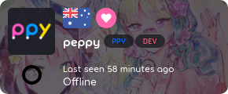

<!-- TODO: website updates, needs a review on the writing style -->

# osu!supporter

*Siteden osu!supporter sayfasına gitmek için, bakınız: [oyunu destekle](https://osu.ppy.sh/home/support)*

## Ayrıcalıklar

*osu!supporter olarak aldığınız ayrıcalıkların listesi için, bakınız: [oyunu destekle](https://osu.ppy.sh/home/support)*

Kısacası, osu!supporter tagı satın alarak, fazladan ayrıcalıklara sahip olunmasının yanı sıra oyunun geliştirilmesini direk olarak desteklemiş olacaksınız. Osu!supporter sayesinde elde edeceğiniz fazladan ayrıcalıkların oyunun oynayışına, performansına, ya da skora herhangi bir şekilde etki göstermeyeceği aklınızda bulunmalı.

## osu!supporter elde etmek

osu!supporter elde etmek için, giriş yapın (ya da [üye olun](/wiki/sign_up)), ve ardından [mağaza sayfası](https://osu.ppy.sh/store/products/supporter-tag)'na gidin. Kaydırıcıyı ya da aylık tuşları (kaydırıcının altında) kullanarak osu!supporter tagınızın süresini seçiniz. Farklı bir süre ödeyeceğiniz miktarı değiştirecektir. Kullanılan para birimi Amerika Birleşik Devletleri dolarıdır (USD). Eğer ülkeniz farklı bir para birimi kullanıyor ise, lütfen, [OANDA](https://www.oanda.com/currency/converter/) ya da [Google](https://www.google.com/search?q=usd+exchange+rate) gibi para birimi dönüştürücülerini kullanarak ödeyeceğiniz ücrete bakın. osu!store sayfasında sunulan ücretler tekil bireysel hesaplar içindir.

### Süreyi seçmek

Kaydırıcının üzerinde bulunan kullanıcı kartı osu!supporter'ı aldığınız kullanıcıyı gösterir. Varsayılan olarak, bu sizin kullanıcı kartınız olmalı. Bir arkadaşınıza hediye etmek için, arkadaşınızın kullanıcı ismini (ID'sini değil) kullanıcı kartının altındaki gri kutuya girin. Bu yapıldıktan sonra, kullanıcı kartı girilen kullanıcı isminin hesabıyla değiştirilecektir. Buradan sonra, hediye etmek istediğiniz osu!supporter süresini seçebilirsiniz. Ancak, birden fazla kişiye yapılan hediyelerde bir promosyon yapılmamaktadır.

osu!supporter'ı bu ekrandan sadece bir kişiye hediye edebilirsiniz. Başka bir kullanıcıya hediye etmek için, [osu!supporter mağaza sayfası](https://osu.ppy.sh/store/products/supporter-tag)'na geri gidip başka bir kullanıcıyı ekleme adımlarını tekrar yapmalısınız.

### Ödeme yapmak

İşiniz bittiği zaman, `Sepete ekle` tuşuna basarak osu!store mağaza sepetinize ekleyin.

Satın alımı yapmak için hazır olduğunuz zaman, [mağaza sepeti](https://osu.ppy.sh/store/cart)'nize gidin ve `Ödeme` tuşuna basın. Ardından adımları takip ederek ödemenizi gerçekleştirin.

## Sonuç

Ödeme tamamlandıktan sonra, hesabınızdaki (eğer kendinize aldıysanız) ya da hediye ettiğiniz hesabın Son Etkinlik bölümünde bunu göreceksiniz:

- `{kullanıcı adı} bir osu!supporter oldu - cömertliğiniz için teşekkürler!` eğer o hesap ilk kez osu!supporter olduysa.
- `{kullanıcı adı} tekrardan osu!'yu desteklemeyi seçti! - cömertliğiniz için teşekkürler!` eğer hesap daha önceden osu!supporter olduysa.

### Kullanıcı sayfası ve kullanıcı kartı

osu!web'de, osu!supporter rozeti avatarınızın yanında ve kullanıcı kartınızda ülkenizin bayrağının yanında yer alır.

### Supporter durumunuzu kontrol etmek

*Not: Bu bölüm sadece osu!supporter elde ettiğinizde gözükür.*

Geriye kalan osu!supporter durumunuza, toplam katkınıza ve tag satın alımlarınıza bakmak için, [oyunu destekle](https://osu.ppy.sh/home/support) sayfasına gidin ve aşağı inerek yukarıda ki resimdekine benzer bir bölüm göreceksiniz.
