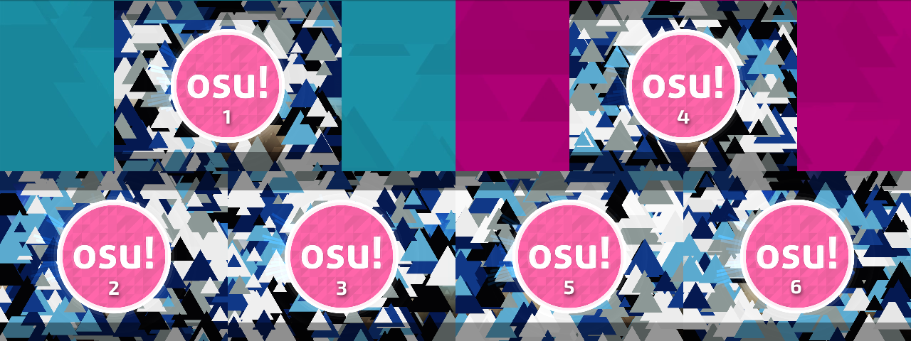

# 멀티플레이 사용법

## 매치 생성

멀티플레이 방의 이름은 클라이언트 하단의 제어판에 적혀있는 양식을 바탕으로 지어져야 합니다.

양식은 다음을 따릅니다:  
`Acronym_in_tournament.cfg: (Team Name 1) vs (Team Name 2)`

`Acronym_in_tournament.cfg` 파일 값은 [setup guide](/wiki/osu!tourney/Setup) 에 따라 `tournament.cfg` 내에 있는 `acronym` 항목에 따릅니다. .
만약 그 값이 `Test Tourney` 라면, 양식은 `Test Tourney: (Team Name 1) vs (Team Name 2)` 와 같이 표시될 것입니다.

팀의 이름은 (`Team Name 1` 과 `Team Name 2`) 어떠한 팀명으로도 대체될 수 있지만, **반드시 괄호 `()` 사이에 있어야 합니다**.

## 방 관리

### 토너먼트 관리 명령어

*메인 페이지: [Tournament Management Commands](/wiki/osu!tourney/Tournament_Management_Commands "Tournament Management Commands")*

알맞는 플레이어에게 알맞는 슬롯을 배정하기 위해 `!mp move` 와 `!mp team` 명령어를 활용하세요.

[관전자용 가이드](/wiki/osu!tourney/Spectator_Usage) 에서 설명했던 바와 같이, 각 클라이언트의 윈도우는 슬롯의 번호대로 지정됩니다. `tournament.cfg` 파일 내의 `TeamSize` 항목을 알맞게 수정하였다면, 블루팀은 `TeamSize` 개 만큼의 슬롯을 차지하며 레드팀은 하단 `TeamSize` 개 만큼의 슬롯을 차지합니다. 

예를 들어 `TeamSize = 4` 라면, 첫째부터 넷째 슬롯까지를 블루팀이 사용하며, 다섯째부터 여덟째 슬롯까지를 레드팀이 사용합니다. `TeamSize = 3` 이라면, 첫째부터 셋째 슬롯 까지를 블루팀이, 넷째부터 여섯째 슬롯까지를 레드팀이 사용합니다.

**osu!tourney ignores team colours in slot assignment** - it only considers the slot which players in the multiplayer room occupy. Below are examples of osu!tourney with different team sizes. The numbers on the screen indicate the assigned slot in the multiplayer lobby. The numbers are not visible during normal operation and are only here for descriptional purposes:

