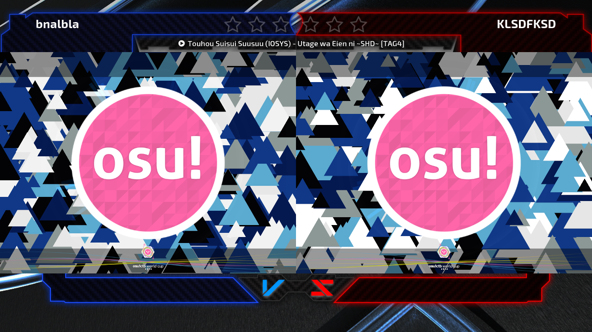

# Skinning

_Main page: [osu!tourney](/wiki/osu!tourney)_

osu!tourney supports various modifications you can apply to design the client suitable for your tournament.
For that, you need to create a `Skin` folder into your fresh osu! install you intend to use as osu!tourney.

The path of the folder must be `/osu!/Skins/User/tournament`.
The skin elements can be placed in this folder and support `.jpg` and `.png` file extensions.
To skin them properly, name your elements accordingly:

- `background` - this is the background sprite used by osu!tourney during the entire time. The default background for osu!tourney can be found [here](https://s.ppy.sh/images/tournament/default.png).
- `background-win1` (optional) - the background sprite will be fade over to this sprite in Results Screen when the left team won.
   It will fade back to `background` when leaving Results Screen.
   If this element is not placed, it will stay on `background`.
- `background-win2` (optional) - the background sprite will be fade over to this sprite in Results Screen when the right team won.
   It will fade back to `background` when leaving Results Screen.
   If this element is not placed, it will stay on `background`.
- `tourney-title` (optional) - this image will be placed placed on top of your background sprites and will be located at the bottom of your osu!tourney screen.
   This can be used to put a static image, e.g. a logo of your tournament.

It is possible to create team icons (e.g. country flags or user avatars) in the skin folder.
These icons must be placed at the path `/osu!/Skins/User/tournament/icons`.

All icons must be named exactly like the Team name.
If your match is called `Test Tourney: (Team 1) vs (Team 2)`, your icons must be called `Team 1 and Team 2`.
Icons can be in `.jpg` or `.png` format and have an optimal resolution of `50x50px`.

[Download the skin template](https://s.ppy.sh/images/tournament/template.zip) for an easier creation of your personal skin.