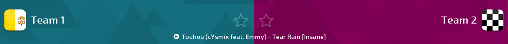

# osu!tourney 皮肤

osu!tourney 支持使用皮肤来为你的比赛进行自定义。为此，你需要在你的 osu!tourney 目录下创建 `/Skins/User/tournament`。皮肤可以放在该文件夹里，支持 `.jpg` 或 `.png` 文件扩展名。

以下元素可以被替换：

- `background` - 这是 osu!tourney 使用的背景。默认背景可以在 [这里](https://s.ppy.sh/images/tournament/default.png) 找到。
- `background-win1`（可选） - 当蓝队获胜时，结果页面上的 `background` 元素会渐变为这个元素。
- `background-win2`（可选） - 当红队获胜时，结果页面上的 `background` 元素会渐变为这个元素。
- `tourney-title`（可选） - 显示在 `background` 元素上方并在 osu!tourney 屏幕的底部的普通
  - 这可以用于放置静态图像，例如你的比赛标志。

客户端可以在队名旁显示放在 `/Skins/User/tournament/icons` 路径里的图片。它们可以是玩家头像、队伍队标或是国家旗帜。

所有图片文件的命名必须与队名完全相同。比如你的比赛房间叫做 `OCLRS4: (A) vs (B)`，则你的图标必须被命名为 `A.jpg` 和 `B.jpg`。图标可以使用 `.jpg` 或 `.png` 格式和 `50x50px` 的最佳分辨率。

你可以 [下载皮肤模板](https://s.ppy.sh/images/tournament/template.zip) 来定制你的客户端皮肤。
