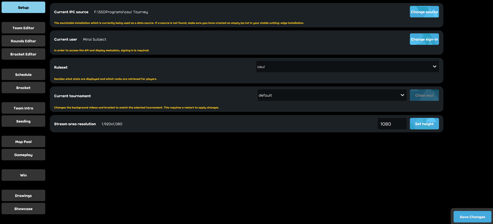

# osu!lazer tournament client

**osu!lazer tournament client** is the official client that overlays osu!tourney.

Users encountering problems with the client may [create an issue](https://github.com/ppy/osu/issues) or send an email to [tournaments@ppy.sh](mailto:tournaments@ppy.sh).

## Setup

To start the osu!lazer tournament client, you need to specify a launch argument to the executable.

To do this, create a new shortcut on the desktop and set the location for it to `%LOCALAPPDATA%\osulazer\osu!.exe --tournament`. This will make that specific shortcut start up osu!lazer in the tournament client mode.

Because the osu!lazer tournament client is only an overlay for osu!tourney, it will need to be set up as well. To make sure osu!tourney will work with osu!lazer you will need to set the Release stream in osu!tourney to Cutting Edge (Experimental) and create an empty file called `ipc.txt` inside the installation folder of osu!tourney. After that follow the [osu!tourney setup](/wiki/osu!tourney/Setup).

Open the osu!lazer tournament client using the shortcut and you will see this setup screen.

- Make sure the Current IPC Source matches the location of the osu!tourney instance that you will be using.
- Login to osu!lazer by clicking on Change login.
- Set the correct ruleset using the dropdown menu.
- Change the height to match the `Height` you had set in the `tournament.cfg` file of osu!tourney.

## Customisation

The osu!lazer tournament client can be customised by providing it with custom flags, mod icons and video files. These will get displayed in the respective scenes as needed.

### Flags

For custom flags `.jpg` and `.png` files are accepted. These flags have to be at a resolution of 140x94 to be displayed correctly.

An example of a flag using the correct specifications is this flag of Australia:

![][flag_AU]

Flags have to be placed in `%APPDATA%\osu\tournament\flags`. The flags can then be referenced in the Team Editor by their filenames without the file extension.

### Mods

For custom mod icons `.jpg` and `.png` files are accepted. The resolution can be anything and the client will try to auto fit it in the beatmap panel. For reference, a beatmap panel at 1920x1080 is 563x60 pixels.

Mod icons have to be placed in `%APPDATA%\osu\tournament\mods`. The mods can then be referenced by their filenames without the file extension in the Rounds Editor and in the Seeding Results Editor.

### Videos

Video files in the background of scenes visible to the stream can be displayed. These will automatically be looped in the client once the end of the file is reached.

The files have to adhere to the following specifications:

- 16:9 aspect ratio, for example 1280x720 or 1920x1080
- The file extension is `mp4`, `m4v`, or `avi`.

The video files have to placed in `%APPDATA%\osu\tournament\videos` and specific names are required for the correct functionality.

| Scene | File(s) |
| :-- | :-- |
| Schedule | `schedule` |
| TeamIntro | `teamintro` |
| Seeding | `seeding` |
| MapPool | `mappool` |
| Gameplay | `gameplay` |
| Win | `teamwin-red` (if team red is the winner) / `teamwin-blue` (if team blue is the winner) |
| Drawings | `main` |
| Showcase | `showcase` |

[flag_AU]: /wiki/shared/flag/AU.gif "Australia"
