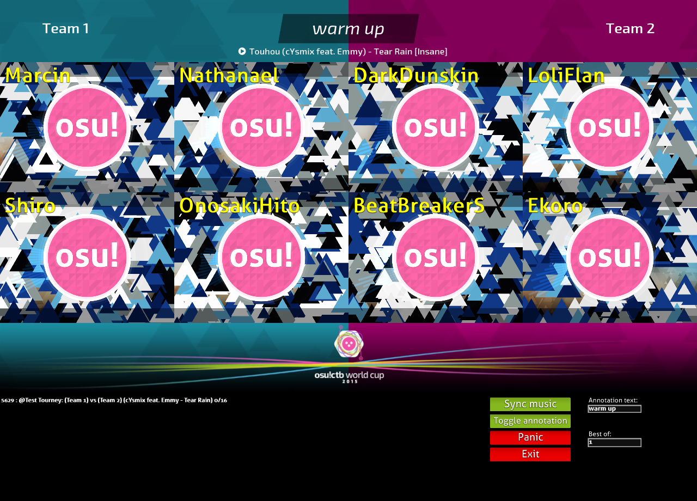

# osu!tourney

**osu!tourney** 是 osu! 的官方多人旁观客户端，它可以被用于观看或直播全部可用的多人游戏房间。

如果您遇到问题，可以阅读下面的 **故障排除** 部分，也可以发送邮件至 [tournaments@ppy.sh](mailto:tournaments@ppy.sh)。

## 什么是 osu!tourney？

osu!tourney 客户端是用于旁观在多人房间里所有玩家的官方直播客户端，支持 2 个团队，最多 8 人的直播。

由于 osu!tourney 当前是为世界杯设计的，其它用途的使用可能会受到限制。

## 设置

**注意：** 要使用 osu!tourney，您需要成为 osu!supporter。

只需几个步骤即可设置 osu!tourney 客户端。

首先，**建议安装一个全新的 osu! 客户端**！这是因为歌曲数据库极有可能被破坏。

您可以同时安装多个 osu! 客户端，只需要将它们存放在不同的文件夹即可。
您只需将需要的歌曲添加至您的 `/Songs/` 文件夹中，客户端就会自动开始下载缺失的谱面。
osu!tourney 客户端只支持已经提交的谱面。

1. 安装一个新的 osu!
   如果您要这么做，请先将目录下的 `osu!.exe` 复制到一个新的空文件夹，然后运行它即可。
   它应该会自动开始更新和安装。
2. 打开安装完毕的 osu! 并登录。
   不要忘记选择 **记住用户名** 和 **记住密码**
3. 切换更新版本到 **测试版**。
4. 在这个新的文件夹里创建一个文件名为 `tournament.cfg` 的文件。
5. (重新)启动您的 osu! 客户端，osu!tourney 应该会启动。
   这可能需要一段时间，请耐心等待。
   它将会自动生成 `tournament.cfg` 文件的内容，它将包含以下行：
   
  ```
  TeamSize = 4
  privateserver =
  acronym = Your tournament name
  BufferTotalTime = 3000
  BufferDangerTime = 1000
  BufferTimeoutTime = 20000
  ```

关闭 osu! 然后编辑或添加您的比赛所需选项，下面列出了全部选项。如果没有明确说明，时间均以毫秒为单位：

- `TeamSize` 定义您的团队大小，osu!tourney 可以为每个团队打开 1-8 个窗口，最大值是8。
- `ClientNameSize` 改变黄色玩家的名字大小 (通常是Staff)。
- `privateserver` 不要改变这个选项，这和您没关系。
- `acronym` 将您的比赛缩写放在这里，例如 OWC 2013。
  您可以在 **多人房间创建和处理** 找到更多的细节。
- `BufferTimeoutTime` 定义超时等待时间，如果超出该时间仍无法缓冲其中某个客户端，客户端将试图继续缓冲，并同步其它客户端继续播放。
- `BufferTotalTime` 定义客户端缓冲的时间以减少等待缓冲的频率，不建议改变这个。
- `BufferDangerTime` 定义客户端暂停之前的缓冲等待时间，为了等待更多的回放帧。
   不建议改变这个。
- `RankingChatDelay` 当xx结束后隐藏分数并在排名屏幕上再次显示聊天的延迟。
- `Height` 客户端高度
  osu!tourney 将自动计算客户端宽度 (16:9比例)
  黑色控制面板不包括在高度内，所以您其实需要 1440p 的屏幕来使用 1080p 直播您的比赛。
  默认：720，允许范围：568-1440

如果您修改了 `tournament.cfg` 文件，请重启 osu!tourney，它将更新当前设置。

### 使用 osu!tourney


_osu!tourney 客户端的基本界面_

这是 osu!tourney 客户端的界面。
客户端本身的使用非常的简单，屏幕顶部被分为两部分，分别代表了多人房间的两个团队，每个 osu! 被分配到多人房间的一个格子。
这意味着玩家将在房间相应位置的窗口上。

---


_基于玩家所在的格子，他们被分配到对应的窗口位置_


为了使客户端能正常工作，请确保玩家在多人房间里占据适当的格子。
有关更多正确使用的细节，您可以在 **多人房间创建和处理** 中找到。
在客户端的底部，您将看到控制面板。

---


---


它将显示您需要遵循的多人房间命名模板。
它由您在 `tournament.cfg` 里定义的比赛缩写和 2 个团队名称组成。
阅读 **多人房间创建和处理** 以了解更多信息。

控制面板将列出所有正确创建的多人房间，点击您创建的多人房间，osu!tourney将会自动开始旁观。

当谱面结束后，osu!tourney 将给获胜队伍加一颗星以增加队伍得分。
**您还可以通过左键单击以增加得分，右键反之。**



如果要显示自定义信息，可以单击 annotation 按钮来切换。
当处于激活状态时，相应信息将显示在屏幕顶部，谱面结束后的得分将保持不变。

底部控制面板描述：

- `Sync music`: 如果音乐处于不同步的状态，您可以试图单击此按钮，osu!tourney 将尝试将音乐重新和击打音效同步。
- `Toggle annotation`: 激活/取消激活自定义信息的显示，这将影响队伍得分计算。
- `Panic`: 出现问题时请试图单击此按钮，例如：一个窗口没有观察到用户或窗口崩溃，这将重新初始化所有窗口。
- `Exit`: 关闭 osu!tourney。

底部控制面板文本框描述：

- `Annotation text`: 自定义信息的文本。
- `Best Of`: 每个队伍需要赢得的谱面数量。

## 多人房间创建和处理

### 创建房间

要使 osu!tourney 能正常的在您创建的房间运作，您必须注意几件事情。

您必须根据 osu!tourney 控制面板列出的模板创建一个多人房间。
此模板包括：

`Your_acronym_in_tournament.cfg: (Team Name 1) vs (Team Name 2)`

`Your_acronym_in_tournament.cfg` 您可以在 `tournaments.cfg` 里改变比赛的简称。
在我们的例子中，这个简称为 "Test Tourney"。

`Test Tourney: (Team Name 1) vs (Team Name 2)`

您可以使用您的队伍名称替换 "Team Name 1" 和 "Team Name 2"，不过请在其周围保留括号。

### 房间管理

阅读[比赛管理指令](/wiki/Tournament_Management_Commands "比赛管理指令")。

osu!tourney 客户端将成功识别房间。
确保使用 !mp move 和 !mp team 命令为玩家分配合适的队伍和格子。

正如 **使用 osu!tourney** 所述，客户端的每个窗口都分配给相应位置的格子。
根据您在 `TeamSize` 中定义的值，左侧的队伍会被被分配前面的格子，右侧的队伍会紧跟其后被分配到后面的格子。


_相应的格子在 osu!tourney 对应到的窗口_

在例子里，如果您设置了 `TeamSize = 4`，第 1/2/3/4 个格子将在左侧的队伍。
第 5/6/7/8 个格子将在右侧的队伍。

如果您设置了 `TeamSize = 3`，第 1/2/3 个格子将在左侧的队伍。
第 4/5/6 个格子将在右侧的队伍。

**提示：为了更容易参考，总是让左侧的队伍变蓝，右侧的队伍变红。**

请记住，osu!tourney 忽略每个团队的颜色。
唯一有关的仅仅是多人房间的格子。

为了让每个玩家都能在 osu!tourney 的正确队伍内进行，玩家必须占据多人房间内的正确位置。以下是不同团队规模的 osu!tourney 的图片，屏幕上的数字表示多人房间里为玩家分配的格子，这些数字在 osu!tourney 中是不可见的，仅仅是因为描述而放在这里。


---


---


---


### 皮肤


osu!tourney 支持使用皮肤进行自定义修改，您可以设计并应用适合您的比赛的客户端。
为此，您需要在您的 osu!tourney 目录下创建 `Skin` 文件夹。

皮肤的放置路径必须是 `/osu!/Skins/User/tournament`。
皮肤可以放在该文件夹里，支持 .jpg 或 .png 文件扩展名。
要正确应用您的皮肤，请相应的命名这些文件：

- `background` - 这是 osu!tourney 使用的背景。默认背景可以在 [这里](https://s.ppy.sh/images/tournament/default.png) 找到。
- `background-win1` (可选) - 当左边的队伍获胜时，结果页面上的 background 元素会渐变为这个元素。
   当离开结果页面时会渐变回 `background` 元素。
   如果没有设置这个元素，则会使用 `backgound` 元素。
- `background-win2` (可选) - 当右边的队伍获胜时，结果页面上的背景元素会渐变为这个元素。
   当离开结果页面时会渐变回 `background` 元素。
   如果没有设置这个元素，则会使用 `backgound` 元素。
- `tourney-title` (可选) - 这个图片会放在您的背景元素的顶部，并会放在您的 osu!tourney 屏幕的底部。
   这可以用于放置静态图像，例如您的比赛标志。


您可以在皮肤文件夹创建您的团队图标(国家图标或玩家头像)。
这些图标必须放置在该路径：`/osu!/Skins/User/tournament/icons`.

所有图标必须与队伍名称完全相同。
如果您的房间叫 `Test Tourney: (Team 1) vs (Team 2)`，则您的图标必须命名为 `Team 1 和 Team 2`。
图标可以使用 `.jpg` 或 `.png` 格式和 `50x50px` 的最佳分辨率。

[下载皮肤模板](https://s.ppy.sh/images/tournament/template.zip)以快速创建您的皮肤。

### 奖品

我们可以奖励profile badges给比赛符合以下标准的冠军队队员们：
- 该比赛至少是第二届。
- 比赛 Staff 不参与自己管理的比赛。
- 比赛每年举办次数不超过四次。

如果您的比赛符合这个标准，请发送邮件至 [tournaments@ppy.sh](mailto:tournaments@ppy.sh)。

## 故障排除

### 如何不卸载当前的游戏创建一个全新的 osu! ？

复制 `osu!.exe` 到一个空文件夹然后运行它。

### 我的 osu! 窗口不正确对齐！

关闭任何 **副显示器** ！
osu!tourney 只能在主显示器内运行。尝试关闭任何可用的副显示器，确保主显示器的分辨率大于客户端的分辨率 (默认：1280x720)。

确保您 **没有使用管理员权限** 运行 osu! (除非 osu! 请求以管理员身份运行).
确保您的 osu! 更新到最新的测试版！

### osu!tourney 无法打开，出现错误提示后就关闭了！

- 确保您的 osu! 使用最新的测试版直播。
- 确保您已经登录osu!，如果没有，请以普通模式运行 osu!，选择 **记住用户名** 和 **记住密码** 并登录，然后重新进入 osu!tourney。
- 确保没有设置 `tournament.cfg` 里 `privateserver` 选项的值。

### 我的 osu! 歌曲数据库在启动时崩溃了！

安装并使用全新的osu!。

### osu!tourney 的背景没有显示！

确保您的背景正确放置在路径 `/osu!/Skins/User/tournament/background.png` 下。
阅读 **皮肤** 以了解更多信息。

### 如何使 osu! 再次以普通模式运行？

删除或重命名 `tournament.cfg` 文件。

### 我的 osu! 没法旁观！

确保您已经 **加入房间**。

点击底部控制面板的多人房间名称，直到其变为粗体。
如果客户端仍然无法旁观，点击 `Panic` 按钮。

### 房间没有出现！

这可能是因为您的多人房间名称不正确或者您在 `tournament.cfg` 填入了错误的缩写。
确保您使用正确的多人房间名称 (阅读 **创建房间**)，重命名现有的房间将不起作用。
如果这仍然不起作用，请遵循 **创建房间** 重新建立您的房间。

如果您需要进一步的帮助，请发送邮件至 [tournaments@ppy.sh](mailto:tournaments@ppy.sh)。

### 队伍名称不显示！
看看以前的回答。

### 如何直播我的比赛？

要开始直播, 我们推荐使用 [Open Broadcaster Software](https://obsproject.com/)，但您也可以使用您喜欢的直播软件。
osu!tourney 顶部的分辨率可以修改，默认是 `1280x720`，请确保您的显示器分辨率大于此值。有关如何更改分辨率的信息，请阅读 **设置** 部分。
不要忘记裁剪移除黑色控制面板！

### 我的问题没有列在这里！我该怎么办？

如果您有一个没有列在此处的问题，请发送邮件至 [tournaments@ppy.sh](mailto:tournaments@ppy.sh) 并确保描述清晰，最好提供问题截图。
