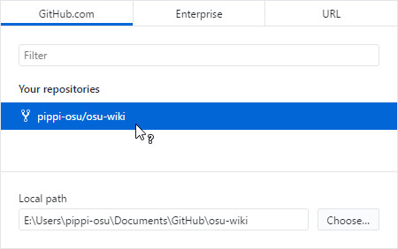
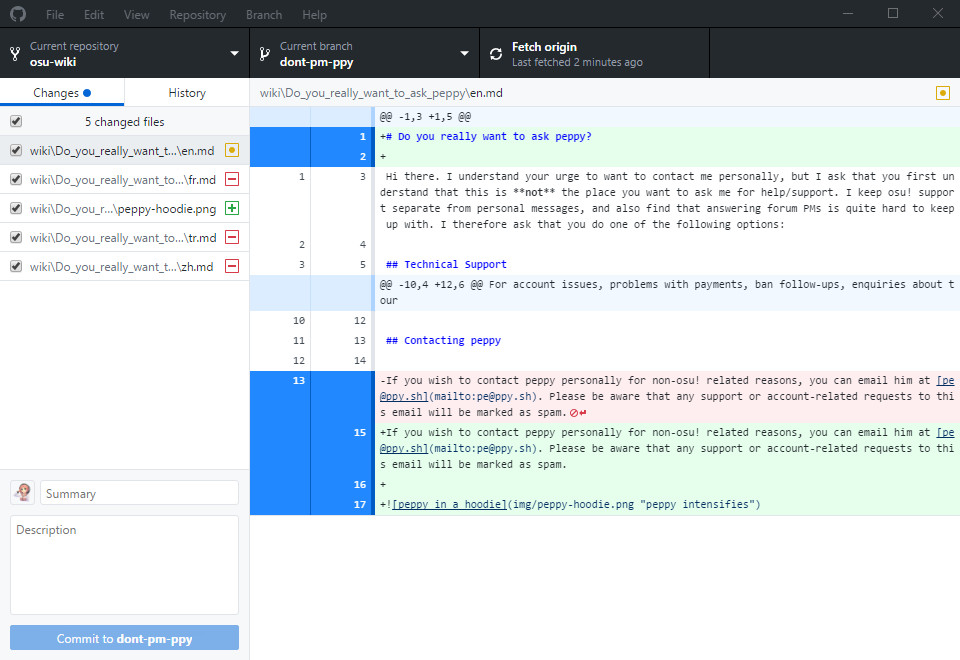
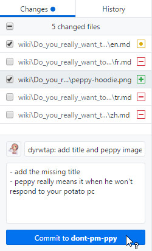
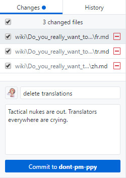

# GitHub Desktop

*Main page: [osu!wiki Contribution Guide](/wiki/owcg).*

*This article continues from the main page* and assumes that you will be using [GitHub Desktop](https://desktop.github.com). You may use other git clients on your own terms. Even if you do work locally, you will still need to access GitHub to create pull requests to make your changes happen.

## Installing GitHub Desktop

1\. Install [GitHub Desktop](https://desktop.github.com) if you don't have it installed already. See [Getting Started with GitHub Desktop](https://help.github.com/desktop-classic/guides/getting-started/) for help.

2\. When the installer is completed, GitHub Desktop will prompt you to login, click on the `Sign into GitHub.com` link.

3\. Fill in the prompts as they appear.

## Cloning

1\. Click on `Clone a repository`.

2\. This will show a list of your repos; select the `osu-wiki` repo.

3\. Select the clone location. It doesn't matter where you clone the repo to, just remember where you cloned it to.

4\. Click `Clone`. This may take a while depending on your network environment.

## Branching

*Note: This step is technically optional, but is heavily recommended due to reasons that you will need to look up for yourself.*

1\. Click on the `Current branch` dropdown. This is located at the top of the menu.

2\. Enter a name for this branch. It is suggested to use the name of the article you are editing as the branch name followed by a number. For example, editing the `Forums` article may result in the branch being called `forums1`.

## Editing

1\. In the folder you cloned the repo into, navigate to the file you want to edit. The articles are organized by the folder names being the article names and the `.md` files being the locales.

2\. Once you find the correct file, open it using your favorite text editor.

3\. You can now make your changes. When making changes, try to follow the [Article Styling Criteria](/wiki/ASC) as closely as you can.

### Moving existing files

You can use Windows Explorer to move files around.

### Creating new files

You can use Windows Explorer, your favorite image editor, and/or your favorite text editor to create new files.

If you are creating new articles or translations, rename the file to follow the [Locales in the Article Styling Criteria](/wiki/ASC/#locales).

*Caution: If you are going to create article files using Windows Explorer, make sure the `File name extensions` option is enabled.* See [How to show or hide file name extensions in Windows Explorer](https://support.microsoft.com/en-us/help/865219/how-to-show-or-hide-file-name-extensions-in-windows-explorer) for help.

## Committing and pushing

Go back to GitHub Desktop. It should look something similar to this:

By default, GitHub Desktop will automatically select all of your changes.

It is best to separate each "big" action as a single commit. For example, as pictured above, [pippi](/wiki/Mascots/#pippi) had added an image file, modified the `en.md` file to add a title and a link to the image, and deleted the translations. From this, we can have two commits, one for the changes that affected the `en.md` file and one for deleting the translations.

pippi will commit changes for the `en.md` and image files by **selecting the files to be committed**. Followed by **entering the commit summary and a detailed description *in English*** for the changes that took place.

Once completed, click on the `Commit to` *the branch's name* button and, if applicable, repeat for the next set of commits you want to do.

Once you have finished making your commits, click on the `Publish branch` button at the top.

## Finishing

You can now go back to the [osu!wiki Contribution Guide](/wiki/owcg/#finishing) for the last piece of information regarding your pull request and changes.
